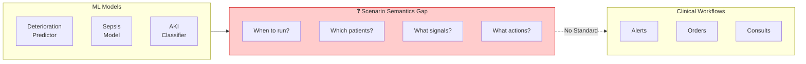
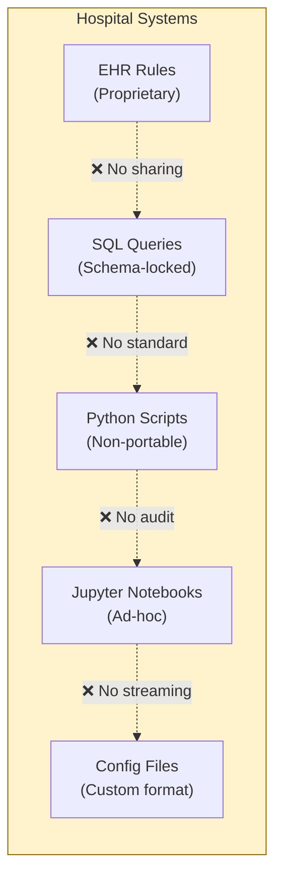
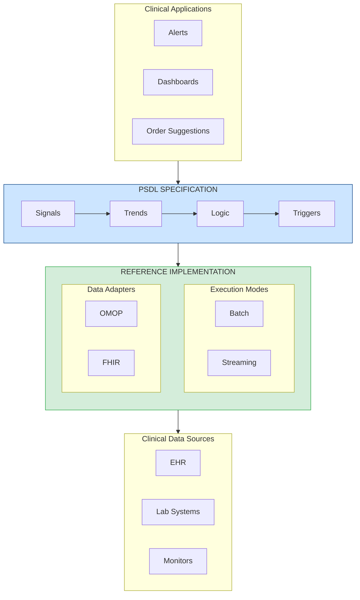
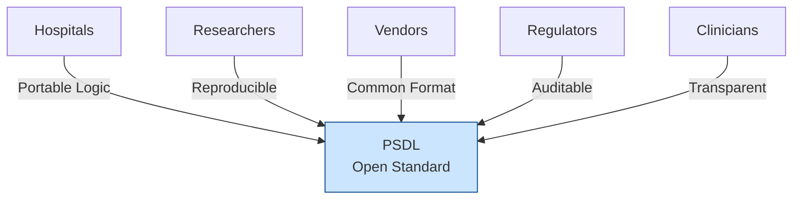
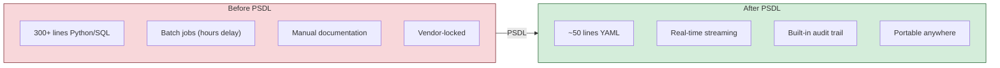
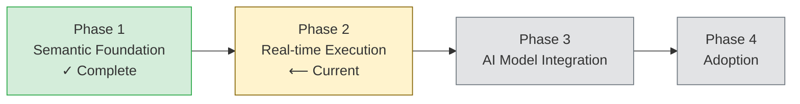

<p align="center">
  
</p>

<h1 align="center">PSDL Whitepaper</h1>
<h3 align="center">Patient Scenario Definition Language</h3>
<h4 align="center">Version 0.1 | December 2025</h4>

<p align="center">
  <em>An Open Standard for Clinical Logic in Healthcare AI</em>
</p>

---

<p align="center">
  <strong>What SQL became for data queries, ONNX became for ML models, and GraphQL became for APIs —<br/>
  PSDL is becoming the <em>semantic layer</em> for clinical AI.</strong>
</p>

---

## Executive Summary

Healthcare AI has a deployment problem. Despite remarkable advances in predictive modeling, the vast majority of clinical AI systems never reach the bedside. The barrier is not model accuracy — it is the absence of a standard way to express *when*, *where*, and *how* these models should operate in **real-time** clinical workflows.

**PSDL (Patient Scenario Definition Language)** is an open, vendor-neutral standard that fills this critical gap. It provides a **streaming-native** declarative language for expressing clinical scenarios — the logic that detects patient conditions as they happen and triggers clinical actions in real-time.

### Key Value Propositions

| Stakeholder | Value |
|-------------|-------|
| **Hospitals** | Real-time detection with portable logic across EHR systems |
| **Researchers** | Reproducible scenarios with streaming execution guarantees |
| **Vendors** | Common format for real-time clinical AI deployment |
| **Regulators** | Auditable, version-controlled detection logic |
| **Clinicians** | Transparent rules with immediate feedback |

---

## The Problem: Why Clinical AI Fails to Deploy


*The gap between ML models and clinical workflows — PSDL bridges this divide*

### The Scenario Semantics Gap

A hospital develops an ML model that predicts patient deterioration with 90% accuracy. Impressive. But then come the questions:

- **When** should this model run? Every hour? On new lab results?
- **On which patients?** All ICU patients? Only those meeting certain criteria?
- **Based on what signals?** Which vitals? Which labs? What time windows?
- **What thresholds trigger action?** Score > 0.7? Combined with other factors?
- **What happens when triggered?** Page a physician? Generate an order?

These are **scenario semantics** — and healthcare has no standard way to express them.

### Current State: Fragmented Clinical Logic


*Clinical logic today is scattered across incompatible systems*

Today, clinical decision logic is scattered across:

| Implementation | Problems |
|----------------|----------|
| Python scripts | Non-portable, batch-only, hard to audit |
| SQL queries | No streaming, no temporal semantics |
| EHR rule editors | Proprietary, vendor-locked, no real-time |
| Jupyter notebooks | Non-reproducible, offline analysis only |
| Configuration files | Ad-hoc formats, no streaming support |

**The result:** Every hospital reinvents the same clinical logic from scratch — usually as batch jobs that run hours behind patient events. Real-time detection requires custom engineering. Research cannot be reproduced. Regulatory audits require manual documentation.

---

## The Solution: PSDL


*PSDL Specification + Reference Implementation architecture*

PSDL introduces a **semantic layer** for clinical AI — like SQL for databases, GraphQL for APIs, or dbt for data transformation. It provides a structured, declarative format that separates *what* to detect from *how* to compute it. Designed from the ground up for both batch analysis and real-time streaming execution with Apache Flink and similar engines.

> **The Semantic Layer Pattern**: Just as SQL abstracts database implementation details, and GraphQL abstracts API complexity, PSDL abstracts the complexity of clinical scenario detection. Write logic once, execute anywhere — from Jupyter notebooks to production streaming systems.

### Core Concepts

```
Scenario = Population + Signals + Trends + Logic + Triggers
```

| Component | Description | Example |
|-----------|-------------|---------|
| **Population** | Which patients the scenario applies to | `age >= 18 AND unit == "ICU"` |
| **Signals** | Time-series data bindings | `Cr: creatinine (mg/dL)` |
| **Trends** | Temporal computations | `delta(Cr, 6h) > 0.3` |
| **Logic** | Boolean combinations | `cr_rising AND cr_high` |
| **Triggers** | Actions when logic fires | `notify_team("ICU")` |

### Example: Early AKI Detection

```yaml
scenario: AKI_Early_Detection
version: "0.1.0"
description: "Detect early acute kidney injury based on creatinine trends"

population:
  include:
    - age >= 18
    - unit == "ICU"

signals:
  Cr:
    source: creatinine
    concept_id: 3016723    # OMOP standard concept
    unit: mg/dL

trends:
  cr_rising:
    expr: delta(Cr, 6h) > 0.3
    description: "Creatinine increased >0.3 mg/dL in 6 hours"

  cr_elevated:
    expr: last(Cr) > 1.5
    description: "Current creatinine above normal"

logic:
  aki_stage1:
    expr: cr_rising AND cr_elevated
    severity: high
    description: "Early AKI - KDIGO Stage 1 criteria"

triggers:
  - when: aki_stage1
    actions:
      - type: notify_team
        target: nephrology_consult
        priority: high
```

This single YAML file replaces hundreds of lines of scattered Python, SQL, and configuration code — and it's portable, auditable, version-controlled, and **executes in real-time** as new clinical events arrive.

---

## Why an Open Standard?

PSDL follows the precedent of successful open standards:

| Standard | Domain | What It Standardized |
|----------|--------|---------------------|
| **SQL** | Data | Query language for databases |
| **ONNX** | ML | Model interchange format |
| **FHIR** | Healthcare | Clinical data exchange |
| **CQL** | Quality | Clinical quality measures |
| **PSDL** | Scenarios | Clinical decision logic |

### Benefits of Openness


*PSDL connects all stakeholders in the clinical AI ecosystem*

| Principle | Benefit |
|-----------|---------|
| **Vendor Neutral** | No lock-in; any hospital can adopt freely |
| **Community Governed** | Evolution driven by real clinical needs |
| **Implementation Freedom** | Multiple runtimes can be conformant |
| **Reproducibility** | Researchers can share exact scenario definitions |
| **Regulatory Clarity** | Standard format enables systematic auditing |

---

## Positioning: PSDL as the Semantic Layer

Every mature technology stack develops a semantic layer — an abstraction that separates *intent* from *implementation*:

```
┌─────────────────────────────────────────────────────────────────┐
│                    THE SEMANTIC LAYER PATTERN                   │
├─────────────────────────────────────────────────────────────────┤
│                                                                 │
│   DATA        SQL         "What data do I need?"               │
│   QUERIES     ────→       (Not: How do I traverse B-trees?)    │
│                                                                 │
│   API         GraphQL     "What shape of data do I want?"      │
│   ACCESS      ────→       (Not: How do I make REST calls?)     │
│                                                                 │
│   DATA        dbt/        "How should data transform?"         │
│   TRANSFORM   Metrics     (Not: How do I write ETL pipelines?) │
│                                                                 │
│   ML          ONNX        "What does my model compute?"        │
│   MODELS      ────→       (Not: How do I run on GPU/CPU?)      │
│                                                                 │
│   CLINICAL    PSDL        "What clinical logic should apply?"  │
│   SCENARIOS   ────→       (Not: How do I query OMOP/FHIR?)     │
│                                                                 │
└─────────────────────────────────────────────────────────────────┘
```

**PSDL is the missing semantic layer for clinical AI.** It allows clinicians and informaticists to express *what* they want to detect without worrying about *how* to query databases, handle streaming, or integrate with specific EHR systems.

### Why Semantic Layers Win

| Benefit | Without Semantic Layer | With PSDL |
|---------|------------------------|-----------|
| **Portability** | Rewrite for each database/EHR | Write once, deploy anywhere |
| **Collaboration** | Only engineers can modify | Clinicians can read and validate |
| **Testing** | Test against live systems | Test against spec with mocked data |
| **Versioning** | Hidden in application code | First-class, auditable definitions |
| **Optimization** | Manual tuning per system | Execution engine optimizes automatically |

PSDL fills a specific gap in the healthcare technology stack. Understanding where it fits — and where it doesn't — is critical.

### The Healthcare AI Stack

| Layer | Existing Solution | PSDL Role |
|-------|-------------------|-----------|
| **Cohort Research** | ATLAS / OMOP | Compatible — PSDL uses OMOP data |
| **Quality Measures** | CQL (HL7) | Complementary — different focus |
| **Real-time Detection** | ❌ No open standard | **PSDL fills this gap** |
| **AI Model Deployment** | Custom code per hospital | **PSDL standardizes this** |

### What PSDL Is

**PSDL = Real-time clinical scenario detection + AI model deployment bridge**

- Streaming-native temporal operators (`delta`, `slope`, `ema`)
- Vendor-neutral scenario definitions
- Standard way to connect ML models to clinical triggers

### What PSDL Is NOT

| PSDL does NOT... | Use instead |
|------------------|-------------|
| Replace OMOP/FHIR data standards | PSDL consumes them |
| Compete with ATLAS for research | Use ATLAS, deploy with PSDL |
| Replace CQL for quality measures | CQL for reporting, PSDL for real-time |
| Train ML models | PSDL deploys trained models |
| Define treatment pathways | Trigger pathway systems from PSDL |

### Historical Context

PSDL builds on [Arden Syntax](https://en.wikipedia.org/wiki/Arden_syntax) (HL7, 1992), which pioneered shareable clinical rules. Arden's Medical Logic Modules (MLMs) introduced event-trigger-action patterns still relevant today.

**PSDL's evolution:** Arden handles individual rules; PSDL handles **composed scenarios** with first-class temporal operators and streaming execution.

### Relationship to CQL

[Clinical Quality Language](https://cql.hl7.org/) (HL7) excels at quality measurement and cohort definition. PSDL complements CQL:

| Aspect | CQL | PSDL |
|--------|-----|------|
| Focus | Quality reporting | Real-time detection |
| Execution | Query-based | Event-driven streaming |
| Temporal | Supported | First-class, streaming-native |
| Syntax | Verbose | Simple YAML |

**Use together:** Define cohorts in CQL/ATLAS → Deploy real-time detection with PSDL.

---

## Vision

PSDL has a focused two-layer architecture:

```
┌─────────────────────────────────────────────────────────────────┐
│  PSDL.Model   │  AI/ML model integration (predict, forecast)    │
├───────────────┼─────────────────────────────────────────────────┤
│  PSDL.Core    │  Real-time scenarios ← CURRENT FOCUS            │
└───────────────┴─────────────────────────────────────────────────┘
        ▲                           ▲
        │                           │
   ┌────┴────┐                 ┌────┴────┐
   │  FHIR   │                 │  ONNX   │
   │  OMOP   │                 │ (models)│
   └─────────┘                 └─────────┘
```

### v1.0 Goal: Real-time Scenario Detection

The streaming backend (RFC-0002) enables:
- Sub-second clinical event processing
- Stateful temporal operators
- Integration with Kafka/Flink infrastructure

### v1.x Goal: AI Model Deployment Bridge

RFC-0001 enables:
- Declare model dependencies in scenarios
- Standard `predict()`, `forecast()` operators
- Timeout and fallback handling for real-time inference

### The Pitch

> **"Use ATLAS for cohort discovery. Use PSDL to deploy that logic in real-time with AI models."**

---

## Technical Architecture

PSDL follows industry-standard patterns established by GraphQL, CQL, and ONNX: a clear separation between **Specification** and **Reference Implementation**.

### Specification vs Implementation

| Project | Specification | Reference Implementation |
|---------|---------------|-------------------------|
| GraphQL | SDL (Schema Definition Language) | Apollo, GraphQL-Java, etc. |
| CQL | CQL Spec + ELM | cql-execution (JavaScript) |
| ONNX | ONNX IR (Intermediate Representation) | ONNX Runtime (separate project) |
| **PSDL** | **YAML Schema + Operator Semantics** | **Python Reference Implementation** |

### The PSDL Architecture

```
┌─────────────────────────────────────────────────────────────────┐
│                    PSDL SPECIFICATION                            │
│                (The Language Definition)                         │
│                                                                  │
│  ┌──────────────────────────────────────────────────────────┐  │
│  │                    YAML Schema                            │  │
│  │                                                           │  │
│  │  Signals      - Time-series data bindings                │  │
│  │  Trends       - Temporal computations                    │  │
│  │  Logic        - Boolean combinations                     │  │
│  │  Population   - Patient criteria                         │  │
│  │  Triggers     - Event-condition-action (v0.2)            │  │
│  └──────────────────────────────────────────────────────────┘  │
│                                                                  │
│  ┌──────────────────────────────────────────────────────────┐  │
│  │              Operator Semantics                           │  │
│  │                                                           │  │
│  │  delta, slope, ema, sma, min, max, count, last, first    │  │
│  │  (Mathematical definitions, not code)                     │  │
│  └──────────────────────────────────────────────────────────┘  │
│                                                                  │
│  Platform-agnostic. Implementation-independent.                 │
└─────────────────────────────────────────────────────────────────┘
                              │
                              ▼
┌─────────────────────────────────────────────────────────────────┐
│              REFERENCE IMPLEMENTATION (Python)                   │
│                                                                  │
│  Core Components:                                                │
│  ┌────────────┐  ┌────────────┐  ┌────────────┐                │
│  │   Parser   │  │  Operators │  │  Evaluator │                │
│  │            │  │            │  │            │                │
│  │ YAML → AST │  │ Math impl  │  │ Execution  │                │
│  └────────────┘  └────────────┘  └────────────┘                │
│                                                                  │
│  Execution Modes:                                                │
│  ┌─────────────────┐    ┌─────────────────┐                    │
│  │      Batch      │    │    Streaming    │                    │
│  │   (Evaluator)   │    │    (Flink)      │                    │
│  └─────────────────┘    └─────────────────┘                    │
│                                                                  │
│  Data Adapters:                                                  │
│  ┌─────────────────┐    ┌─────────────────┐                    │
│  │      OMOP       │    │      FHIR       │                    │
│  │    (SQL)        │    │    (REST)       │                    │
│  └─────────────────┘    └─────────────────┘                    │
│                                                                  │
│  This is ONE implementation. Others can exist (Java, Rust, etc.)│
└─────────────────────────────────────────────────────────────────┘
```

### Key Terminology

| Term | Definition |
|------|------------|
| **Specification** | PSDL language definition (YAML schema + operator semantics) |
| **Reference Implementation** | Python implementation that demonstrates the spec |
| **Parser** | Parses PSDL YAML into internal representation |
| **Operators** | Implementation of temporal operators |
| **Evaluator** | Executes parsed scenarios |
| **Execution Mode** | How scenarios run (Batch vs Streaming) |
| **Data Adapter** | Interface to clinical data (OMOP, FHIR) |

### Streaming-Native Temporal Operators

PSDL provides first-class support for time-series clinical data with operators designed for real-time streaming execution:

| Operator | Description | Example |
|----------|-------------|---------|
| `delta(signal, window)` | Change over time window | `delta(Cr, 6h) > 0.3` |
| `slope(signal, window)` | Linear trend | `slope(lactate, 3h) > 0` |
| `ema(signal, window)` | Exponential moving average | `ema(MAP, 30m) < 65` |
| `sma(signal, window)` | Simple moving average | `sma(HR, 1h) > 100` |
| `min/max(signal, window)` | Extremes in window | `max(temp, 24h) > 38.5` |
| `last(signal)` | Most recent value | `last(SpO2) < 92` |
| `count(signal, window)` | Observation count | `count(Cr, 24h) >= 2` |

### Execution Modes and Data Adapters

The same PSDL scenario can execute in different modes and connect to different data sources:

| Execution Mode | Description | Use Case |
|----------------|-------------|----------|
| **Batch** | Evaluator processes historical data | Development, validation |
| **Streaming** | Flink processes real-time events | Production deployment |

| Data Adapter | Protocol | Use Case |
|--------------|----------|----------|
| **OMOP** | SQL | Research databases, retrospective analysis |
| **FHIR** | REST | EHR integration, clinical systems |
| **In-Memory** | Direct | Testing, development |

**Write once, validate on historical data, deploy in real-time.**

---

## Comparison: Before and After PSDL


*PSDL dramatically simplifies clinical logic management*

| Aspect | Before PSDL | After PSDL |
|--------|-------------|------------|
| **Execution** | Batch jobs (hours delay) | Real-time streaming |
| **Lines of Code** | ~300+ Python/SQL | ~50 lines YAML |
| **Portability** | Tied to specific systems | Runs anywhere with mapping |
| **Auditability** | Manual documentation | Built-in, version-controlled |
| **Reproducibility** | "Works on my machine" | Deterministic execution |
| **Regulatory** | Ad-hoc compliance | Systematic audit support |

---

## Regulatory Alignment

PSDL is designed with regulatory requirements in mind:

| Requirement | FDA | EU MDR | NIST AI RMF | PSDL Support |
|-------------|:---:|:------:|:-----------:|:------------:|
| Deterministic Execution | ✓ | ✓ | ✓ | Built-in |
| Explainability | ✓ | ✓ | ✓ | Declarative logic |
| Auditability | ✓ | ✓ | ✓ | Version control |
| Traceability | ✓ | ✓ | ✓ | Audit primitives |
| Reproducibility | ✓ | ✓ | ✓ | Portable definitions |

---

## Roadmap


*PSDL development phases*

### Phase 1: Semantic Foundation ✓
- Type system and operator specification
- YAML schema definition
- Python reference implementation
- OMOP CDM and FHIR R4 backends
- Clinical validation test suite (204 tests)

### Phase 2: Real-time Execution [Current]
- **Streaming backend (Apache Flink)** — RFC-0002
- Trigger/Action system (v0.2)
- Event-time watermarks and late data handling
- Performance benchmarking

### Phase 3: AI Model Integration
- **Model deployment bridge** — RFC-0001
- `predict()`, `forecast()` operators
- Timeout and fallback handling
- ONNX model integration

### Phase 4: Adoption
- Hospital streaming pilots
- Standards body engagement (OHDSI, HL7)
- Vendor partnerships

---

## Get Involved

PSDL is an open, community-driven project. We welcome contributions from:

- **Clinical Informaticists** — Define real-world scenarios and requirements
- **Software Engineers** — Build runtimes, tools, and integrations
- **Researchers** — Validate portability and reproducibility
- **Healthcare Organizations** — Pilot implementations and provide feedback
- **Standards Bodies** — Help align with existing healthcare standards

### Quick Links

| Resource | Link |
|----------|------|
| GitHub Repository | [github.com/Chesterguan/PSDL](https://github.com/Chesterguan/PSDL) |
| Documentation | [Getting Started Guide](./getting-started.md) |
| Examples | [Example Scenarios](../examples/) |
| RFCs | [Proposals](../rfcs/) |

---

## Conclusion

Healthcare AI deployment is blocked not by model quality, but by the absence of a **semantic layer** for clinical logic. Just as SQL unlocked database portability and GraphQL simplified API integration, PSDL unlocks clinical AI portability.

PSDL provides:

- **A true semantic layer** — abstract clinical logic from implementation details
- **Write once, run anywhere** — batch development, streaming production
- **Vendor-neutral portability** — across institutions, EHRs, and data formats
- **Built-in auditability** — version-controlled, traceable decisions
- **AI model integration** — bridge from research to real-time deployment

The modern AI stack has semantic layers for data (SQL), APIs (GraphQL), ML models (ONNX), and data transformation (dbt). Clinical AI deserves the same. **PSDL is that semantic layer.**

---

<p align="center">
  <strong>Clinical AI doesn't fail because models are weak.<br/>
  It fails because there's no semantic layer to express clinical logic portably.</strong>
</p>

<p align="center">
  <em>PSDL is the semantic layer for clinical AI — like SQL for databases.</em>
</p>

---

<p align="center">
  <strong>Join us in building the standard for clinical decision logic.</strong>
  <br/><br/>
  <a href="https://github.com/Chesterguan/PSDL">GitHub</a> ·
  <a href="./getting-started.md">Get Started</a> ·
  <a href="../CONTRIBUTING.md">Contribute</a>
</p>

---

## Appendix A: Full Scenario Example

```yaml
# ICU Deterioration Detection Scenario
# PSDL v0.1.0

scenario: ICU_Deterioration_Detection
version: "0.1.0"
description: |
  Comprehensive monitoring for early signs of clinical deterioration
  in adult ICU patients. Combines kidney function, lactate trends,
  and hemodynamic stability markers.

metadata:
  author: Clinical Informatics Team
  institution: Example Health System
  created: 2025-12-01
  references:
    - "KDIGO AKI Guidelines 2012"
    - "Surviving Sepsis Campaign 2021"

population:
  include:
    - age >= 18
    - unit IN ["MICU", "SICU", "CCU"]
    - admission_type == "inpatient"
  exclude:
    - status == "comfort_care_only"
    - dnr_dni == true

signals:
  # Renal markers
  Cr:
    source: creatinine
    concept_id: 3016723
    unit: mg/dL
    domain: measurement

  BUN:
    source: blood_urea_nitrogen
    concept_id: 3013682
    unit: mg/dL

  # Metabolic markers
  Lactate:
    source: lactate
    concept_id: 3047181
    unit: mmol/L

  # Hemodynamic markers
  MAP:
    source: mean_arterial_pressure
    concept_id: 3027598
    unit: mmHg

  HR:
    source: heart_rate
    concept_id: 3027018
    unit: bpm

trends:
  # Renal trends
  cr_rising:
    expr: delta(Cr, 6h) > 0.3
    description: "Creatinine increase >0.3 mg/dL over 6 hours"

  cr_elevated:
    expr: last(Cr) > 1.5
    description: "Current creatinine above normal range"

  # Metabolic trends
  lactate_rising:
    expr: slope(Lactate, 3h) > 0
    description: "Positive lactate trajectory"

  lactate_elevated:
    expr: last(Lactate) > 2.0
    description: "Lactate above normal (>2 mmol/L)"

  # Hemodynamic trends
  hypotension:
    expr: ema(MAP, 30m) < 65
    description: "Sustained MAP below 65 mmHg"

  tachycardia:
    expr: sma(HR, 1h) > 100
    description: "Sustained heart rate >100 bpm"

logic:
  # Renal deterioration
  aki_risk:
    expr: cr_rising AND cr_elevated
    severity: high
    description: "Acute kidney injury risk - KDIGO Stage 1"

  # Metabolic deterioration
  metabolic_stress:
    expr: lactate_rising AND lactate_elevated
    severity: high
    description: "Metabolic stress with rising lactate"

  # Hemodynamic instability
  hemodynamic_instability:
    expr: hypotension OR (tachycardia AND NOT hypotension)
    severity: medium
    description: "Hemodynamic instability"

  # Combined deterioration
  deterioration:
    expr: aki_risk OR metabolic_stress
    severity: high
    description: "Clinical deterioration detected"

  # Critical state
  shock_risk:
    expr: deterioration AND hemodynamic_instability
    severity: critical
    description: "High risk of shock - immediate attention required"

triggers:
  - when: deterioration
    actions:
      - type: notify_team
        target: primary_team
        priority: high
        message: "Patient showing signs of clinical deterioration"
      - type: log_event
        category: clinical_alert

  - when: shock_risk
    actions:
      - type: page_physician
        target: attending
        escalation: immediate
      - type: order_suggestion
        protocol: sepsis_bundle
        reason: "Shock risk detected - consider sepsis workup"

audit:
  enabled: true
  retention: 7y
  include_patient_context: false
  log_all_evaluations: true
```

---

## Appendix B: Glossary

| Term | Definition |
|------|------------|
| **Specification** | The PSDL language definition (YAML schema + operator semantics) |
| **Reference Implementation** | A conformant implementation that demonstrates the spec (Python) |
| **Signal** | A binding between a logical name and a clinical data source |
| **Trend** | A temporal computation over a signal (e.g., delta, slope) |
| **Logic** | A boolean expression combining trends |
| **Trigger** | An event-condition-action rule |
| **Scenario** | A complete PSDL definition combining all components |
| **Parser** | Component that parses PSDL YAML into internal representation |
| **Evaluator** | Component that executes parsed scenarios |
| **Execution Mode** | How scenarios run (Batch vs Streaming) |
| **Data Adapter** | Interface to clinical data sources (OMOP, FHIR) |
| **Mapping** | Configuration that adapts a scenario to a specific data source |

---

*PSDL Whitepaper v0.1 | December 2025 | Apache 2.0 License*
