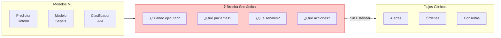
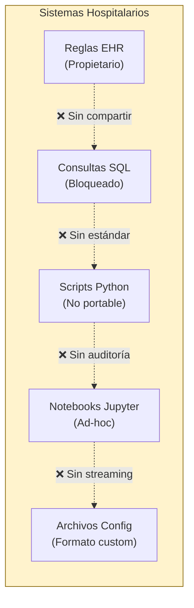
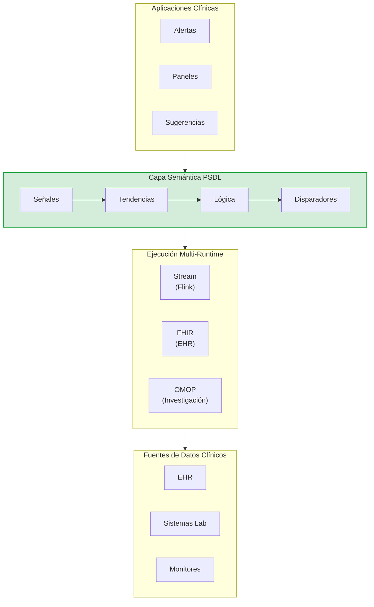
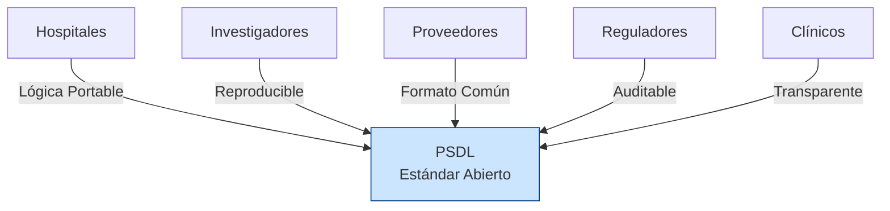
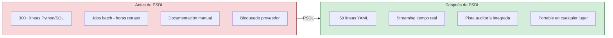
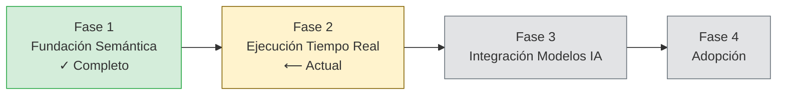

<p align="center">
  
</p>

<h1 align="center">Libro Blanco de PSDL</h1>
<h3 align="center">Lenguaje de Definición de Escenarios del Paciente</h3>
<h4 align="center">Versión 0.1 | Diciembre 2025</h4>

<p align="center">
  <em>Un Estándar Abierto para la Lógica Clínica en IA Sanitaria</em>
</p>

---

<p align="center">
  <strong>Lo que SQL se convirtió para las consultas de datos, y ONNX para los modelos de ML —<br/>
  PSDL aspira a convertirse para la lógica de escenarios clínicos.</strong>
</p>

---

## Resumen Ejecutivo

La IA sanitaria tiene un problema de implementación. A pesar de los notables avances en modelado predictivo, la gran mayoría de los sistemas de IA clínica nunca llegan a la cabecera del paciente. La barrera no es la precisión del modelo — es la ausencia de una forma estándar de expresar *cuándo*, *dónde* y *cómo* estos modelos deben operar en los flujos de trabajo clínicos.

**PSDL (Patient Scenario Definition Language)** es un estándar abierto y neutral en cuanto a proveedores que llena este vacío crítico. Proporciona un lenguaje declarativo para expresar escenarios clínicos — la lógica que conecta los datos del paciente con las acciones clínicas.

### Propuestas de Valor Clave

| Parte Interesada | Valor |
|------------------|-------|
| **Hospitales** | Lógica clínica portable que funciona en todos los sistemas EHR |
| **Investigadores** | Escenarios reproducibles que pueden compartirse y validarse |
| **Proveedores** | Formato común que reduce la complejidad de integración |
| **Reguladores** | Lógica de decisión auditable y con control de versiones |
| **Clínicos** | Reglas transparentes que pueden revisarse y comprenderse |

---

## El Problema: Por Qué la IA Clínica No Se Implementa


*La brecha entre los modelos de ML y los flujos de trabajo clínicos — PSDL tiende este puente*

### La Brecha de Semántica de Escenarios

Un hospital desarrolla un modelo de ML que predice el deterioro del paciente con un 90% de precisión. Impresionante. Pero luego vienen las preguntas:

- **¿Cuándo** debe ejecutarse este modelo? ¿Cada hora? ¿Con nuevos resultados de laboratorio?
- **¿En qué pacientes?** ¿Todos los pacientes de UCI? ¿Solo los que cumplen ciertos criterios?
- **¿Basándose en qué señales?** ¿Qué signos vitales? ¿Qué laboratorios? ¿Qué ventanas de tiempo?
- **¿Qué umbrales activan la acción?** ¿Puntuación > 0.7? ¿Combinado con otros factores?
- **¿Qué sucede cuando se activa?** ¿Avisar a un médico? ¿Generar una orden?

Estas son **semánticas de escenario** — y la sanidad no tiene una forma estándar de expresarlas.

### Estado Actual: Lógica Clínica Fragmentada


*La lógica clínica hoy está dispersa en sistemas incompatibles*

Hoy, la lógica de decisión clínica está dispersa en:

| Implementación | Problemas |
|----------------|-----------|
| Scripts Python | No portables, dependencias implícitas, difíciles de auditar |
| Consultas SQL | Sin semántica temporal, estrechamente acopladas al esquema |
| Editores de reglas EHR | Propietarios, bloqueados por el proveedor, no exportables |
| Notebooks Jupyter | No reproducibles, sin semántica de control de versiones |
| Archivos de configuración | Formatos ad-hoc, sin estandarización |

**El resultado:** Cada hospital reinventa la misma lógica clínica desde cero. La investigación no puede reproducirse. Las auditorías regulatorias requieren documentación manual. Las transiciones de proveedores significan reescribir todo.

---

## La Solución: PSDL


*PSDL como la capa semántica en la pila de IA sanitaria*

PSDL introduce una **capa semántica** para escenarios clínicos — un formato estructurado y declarativo que separa *qué* detectar de *cómo* calcularlo.

### Conceptos Básicos

```
Escenario = Población + Señales + Tendencias + Lógica + Disparadores
```

| Componente | Descripción | Ejemplo |
|------------|-------------|---------|
| **Población** | A qué pacientes aplica el escenario | `age >= 18 AND unit == "ICU"` |
| **Señales** | Vinculaciones de datos de series temporales | `Cr: creatinine (mg/dL)` |
| **Tendencias** | Cálculos temporales | `delta(Cr, 6h) > 0.3` |
| **Lógica** | Combinaciones booleanas | `cr_rising AND cr_high` |
| **Disparadores** | Acciones cuando se activa la lógica | `notify_team("ICU")` |

### Ejemplo: Detección Temprana de AKI

```yaml
scenario: AKI_Early_Detection
version: "0.1.0"
description: "Detectar lesión renal aguda temprana basada en tendencias de creatinina"

population:
  include:
    - age >= 18
    - unit == "ICU"

signals:
  Cr:
    source: creatinine
    concept_id: 3016723    # Concepto estándar OMOP
    unit: mg/dL

trends:
  cr_rising:
    expr: delta(Cr, 6h) > 0.3
    description: "Creatinina aumentó >0.3 mg/dL en 6 horas"

  cr_elevated:
    expr: last(Cr) > 1.5
    description: "Creatinina actual por encima de lo normal"

logic:
  aki_stage1:
    expr: cr_rising AND cr_elevated
    severity: high
    description: "AKI temprano - Criterios KDIGO Etapa 1"

triggers:
  - when: aki_stage1
    actions:
      - type: notify_team
        target: nephrology_consult
        priority: high
```

Este único archivo YAML reemplaza cientos de líneas de código Python, SQL y configuración dispersos — y es portable, auditable y con control de versiones.

---

## ¿Por Qué un Estándar Abierto?

PSDL sigue el precedente de estándares abiertos exitosos:

| Estándar | Dominio | Qué Estandarizó |
|----------|---------|-----------------|
| **SQL** | Datos | Lenguaje de consulta para bases de datos |
| **ONNX** | ML | Formato de intercambio de modelos |
| **FHIR** | Sanidad | Intercambio de datos clínicos |
| **CQL** | Calidad | Medidas de calidad clínica |
| **PSDL** | Escenarios | Lógica de decisión clínica |

### Beneficios de la Apertura


*PSDL conecta a todas las partes interesadas en el ecosistema de IA clínica*

| Principio | Beneficio |
|-----------|-----------|
| **Neutral al Proveedor** | Sin bloqueo; cualquier hospital puede adoptar libremente |
| **Gobernado por la Comunidad** | Evolución impulsada por necesidades clínicas reales |
| **Libertad de Implementación** | Múltiples runtimes pueden ser conformes |
| **Reproducibilidad** | Los investigadores pueden compartir definiciones exactas de escenarios |
| **Claridad Regulatoria** | El formato estándar permite auditorías sistemáticas |

---

## Posicionamiento

PSDL llena un vacío específico en la pila tecnológica sanitaria. Comprender dónde encaja — y dónde no — es fundamental.

### La Pila de IA Sanitaria

| Capa | Solución Existente | Rol de PSDL |
|------|-------------------|-------------|
| **Investigación de Cohortes** | ATLAS / OMOP | Compatible — PSDL usa datos de OMOP |
| **Medidas de Calidad** | CQL (HL7) | Complementario — enfoque diferente |
| **Detección en Tiempo Real** | ❌ Sin estándar abierto | **PSDL llena este vacío** |
| **Despliegue de Modelos IA** | Código personalizado por hospital | **PSDL lo estandariza** |

### Qué Es PSDL

**PSDL = Detección de escenarios clínicos en tiempo real + Puente de despliegue de modelos IA**

- Operadores temporales nativos de streaming (`delta`, `slope`, `ema`)
- Definiciones de escenarios neutrales al proveedor
- Forma estándar de conectar modelos ML a disparadores clínicos

### Qué NO Es PSDL

| PSDL NO... | Usa en su lugar |
|------------|-----------------|
| Reemplaza los estándares de datos OMOP/FHIR | PSDL los consume |
| Compite con ATLAS para investigación | Usa ATLAS, despliega con PSDL |
| Reemplaza CQL para medidas de calidad | CQL para informes, PSDL para tiempo real |
| Entrena modelos de ML | PSDL despliega modelos entrenados |
| Define rutas de tratamiento | Dispara sistemas de rutas desde PSDL |

### Contexto Histórico

PSDL se basa en [Arden Syntax](https://en.wikipedia.org/wiki/Arden_syntax) (HL7, 1992), que fue pionero en reglas clínicas compartibles. Los Medical Logic Modules (MLMs) de Arden introdujeron patrones evento-disparador-acción que siguen siendo relevantes hoy.

**La evolución de PSDL:** Arden maneja reglas individuales; PSDL maneja **escenarios compuestos** con operadores temporales de primera clase y ejecución en streaming.

### Relación con CQL

[Clinical Quality Language](https://cql.hl7.org/) (HL7) destaca en medición de calidad y definición de cohortes. PSDL complementa a CQL:

| Aspecto | CQL | PSDL |
|---------|-----|------|
| Enfoque | Informes de calidad | Detección tiempo real |
| Ejecución | Basada en consultas | Streaming por eventos |
| Temporal | Soportado | Primera clase, nativo streaming |
| Sintaxis | Verboso | YAML simple |

**Usar juntos:** Definir cohortes en CQL/ATLAS → Desplegar detección en tiempo real con PSDL.

---

## Visión

PSDL tiene una arquitectura enfocada de dos capas:

```
┌─────────────────────────────────────────────────────────────────┐
│  PSDL.Model   │  Integración modelos IA/ML (predict, forecast)  │
├───────────────┼─────────────────────────────────────────────────┤
│  PSDL.Core    │  Escenarios tiempo real ← ENFOQUE ACTUAL        │
└───────────────┴─────────────────────────────────────────────────┘
        ▲                           ▲
        │                           │
   ┌────┴────┐                 ┌────┴────┐
   │  FHIR   │                 │  ONNX   │
   │  OMOP   │                 │(modelos)│
   └─────────┘                 └─────────┘
```

### Objetivo v1.0: Detección de Escenarios en Tiempo Real

El backend de streaming (RFC-0002) permite:
- Procesamiento de eventos clínicos en menos de un segundo
- Operadores temporales con estado
- Integración con infraestructura Kafka/Flink

### Objetivo v1.x: Puente de Despliegue de Modelos IA

RFC-0001 permite:
- Declarar dependencias de modelos en escenarios
- Operadores estándar `predict()`, `forecast()`
- Manejo de timeouts y fallbacks para inferencia en tiempo real

### El Pitch

> **«Usa ATLAS para el descubrimiento de cohortes. Usa PSDL para desplegar esa lógica en tiempo real con modelos de IA.»**

---

## Arquitectura Técnica

### La Pila PSDL

```
┌─────────────────────────────────────────────────────────────┐
│                    APLICACIONES CLÍNICAS                     │
│          (Alertas, Dashboards, Sugerencias de Órdenes)       │
└─────────────────────────────────────────────────────────────┘
                              ▲
                              │
┌─────────────────────────────────────────────────────────────┐
│                     CAPA SEMÁNTICA PSDL                      │
│  ┌─────────┐  ┌─────────┐  ┌─────────┐  ┌───────────┐      │
│  │ Señales │→ │Tendencias│→ │ Lógica  │→ │Disparadores│     │
│  └─────────┘  └─────────┘  └─────────┘  └───────────┘      │
└─────────────────────────────────────────────────────────────┘
                              ▲
          ┌───────────────────┼───────────────────┐
          ▼                   ▼                   ▼
    ┌──────────┐        ┌──────────┐        ┌──────────┐
    │   OMOP   │        │   FHIR   │        │  Stream  │
    │  Runtime │        │  Runtime │        │  Runtime │
    └──────────┘        └──────────┘        └──────────┘
```

### Operadores Temporales

PSDL proporciona soporte de primera clase para datos clínicos de series temporales:

| Operador | Descripción | Ejemplo |
|----------|-------------|---------|
| `delta(signal, window)` | Cambio en ventana de tiempo | `delta(Cr, 6h) > 0.3` |
| `slope(signal, window)` | Tendencia lineal | `slope(lactate, 3h) > 0` |
| `ema(signal, window)` | Media móvil exponencial | `ema(MAP, 30m) < 65` |
| `sma(signal, window)` | Media móvil simple | `sma(HR, 1h) > 100` |
| `min/max(signal, window)` | Extremos en ventana | `max(temp, 24h) > 38.5` |
| `last(signal)` | Valor más reciente | `last(SpO2) < 92` |
| `count(signal, window)` | Conteo de observaciones | `count(Cr, 24h) >= 2` |

---

## Comparación: Antes y Después de PSDL


*PSDL simplifica dramáticamente la gestión de lógica clínica*

| Aspecto | Antes de PSDL | Después de PSDL |
|---------|---------------|-----------------|
| **Líneas de Código** | ~300+ Python/SQL | ~50 líneas YAML |
| **Portabilidad** | Atado a sistemas específicos | Funciona en cualquier lugar con mapeo |
| **Auditabilidad** | Documentación manual | Integrada, con control de versiones |
| **Reproducibilidad** | "Funciona en mi máquina" | Ejecución determinista |
| **Compartir** | Copiar y pegar con modificaciones | Publicar definiciones exactas |
| **Regulatorio** | Cumplimiento ad-hoc | Soporte de auditoría sistemática |

---

## Hoja de Ruta


*Fases de desarrollo de PSDL*

### Fase 1: Fundamento Semántico [Actual]
- Sistema de tipos y especificación de operadores
- Definición del esquema YAML
- Implementación de referencia en Python
- Escenarios clínicos de ejemplo
- Suite de pruebas de conformidad

### Fase 2: Runtime Mejorado
- Backend SQL OMOP CDM
- Runtime FHIR R4
- Sistema de Disparadores/Acciones (v0.2)
- Optimización de rendimiento

### Fase 3: Construcción de Comunidad
- Documentación técnica
- Presentaciones en conferencias
- Infraestructura comunitaria (Discord, foros)
- Implementaciones de terceros

### Fase 4: Adopción
- Programas piloto en hospitales
- Compromiso con organismos de estándares (OHDSI, HL7)
- Asociaciones con proveedores
- Programa de certificación

---

## Involúcrate

PSDL es un proyecto abierto e impulsado por la comunidad. Damos la bienvenida a contribuciones de:

- **Informaticistas Clínicos** — Definir escenarios y requisitos del mundo real
- **Ingenieros de Software** — Construir runtimes, herramientas e integraciones
- **Investigadores** — Validar portabilidad y reproducibilidad
- **Organizaciones de Salud** — Implementaciones piloto y retroalimentación
- **Organismos de Estándares** — Ayudar a alinear con estándares sanitarios existentes

---

## Conclusión

La implementación de IA sanitaria está bloqueada no por la calidad del modelo, sino por la ausencia de semántica de escenarios. PSDL llena este vacío con:

- **Un lenguaje declarativo** para expresar escenarios clínicos
- **Portabilidad neutral al proveedor** entre instituciones y sistemas
- **Auditabilidad integrada** para cumplimiento regulatorio
- **Gobernanza comunitaria** asegurando que el estándar evolucione con necesidades reales

El camino desde el modelo de ML hasta el impacto en la cabecera del paciente requiere una capa semántica. PSDL la proporciona.

---

<p align="center">
  <strong>La IA clínica no falla porque los modelos sean débiles.<br/>
  Falla porque la semántica de escenarios no está formalizada.</strong>
</p>

<p align="center">
  <em>PSDL cambia eso.</em>
</p>

---

<p align="center">
  <strong>Únete a nosotros en la construcción del estándar para la lógica de decisión clínica.</strong>
  <br/><br/>
  <a href="https://github.com/Chesterguan/PSDL">GitHub</a> ·
  <a href="./getting-started.md">Comenzar</a> ·
  <a href="../CONTRIBUTING.md">Contribuir</a>
</p>

---

*Libro Blanco PSDL v0.1 | Diciembre 2025 | Licencia Apache 2.0*
