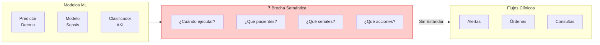
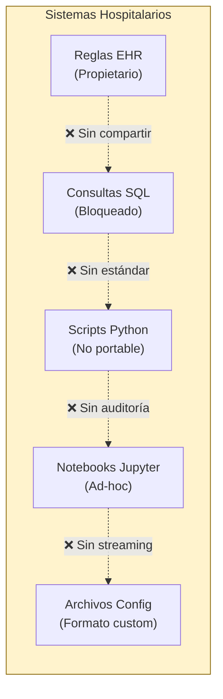
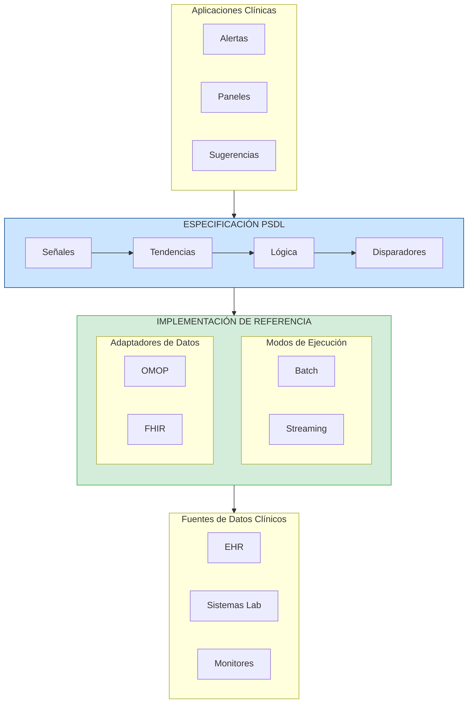
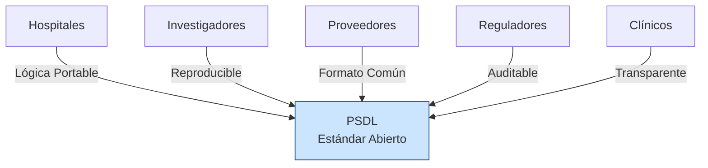
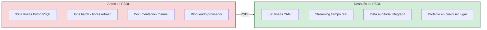
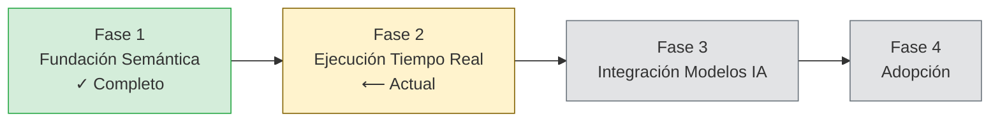

<p align="center">
  
</p>

<h1 align="center">Libro Blanco de PSDL</h1>
<h3 align="center">Lenguaje de Definición de Escenarios del Paciente</h3>
<h4 align="center">Versión 0.1 | Diciembre 2025</h4>

<p align="center">
  <em>Un Estándar Abierto para la Lógica Clínica en IA Sanitaria</em>
</p>

---

<p align="center">
  <strong>Lo que SQL se convirtió para las consultas de datos, ONNX para los modelos de ML, y GraphQL para las APIs —<br/>
  PSDL se está convirtiendo en la <em>capa semántica</em> para la IA clínica.</strong>
</p>

---

## Resumen Ejecutivo

La IA sanitaria tiene un problema de implementación. A pesar de los notables avances en modelado predictivo, la gran mayoría de los sistemas de IA clínica nunca llegan a la cabecera del paciente. La barrera no es la precisión del modelo — es la ausencia de una forma estándar de expresar *cuándo*, *dónde* y *cómo* estos modelos deben operar en los flujos de trabajo clínicos.

**PSDL (Patient Scenario Definition Language)** es un estándar abierto y neutral en cuanto a proveedores que llena este vacío crítico. Proporciona un lenguaje declarativo para expresar escenarios clínicos — la lógica que conecta los datos del paciente con las acciones clínicas.

### Propuestas de Valor Clave

| Parte Interesada | Valor |
|------------------|-------|
| **Hospitales** | Lógica clínica portable que funciona en todos los sistemas EHR |
| **Investigadores** | Escenarios reproducibles que pueden compartirse y validarse |
| **Proveedores** | Formato común que reduce la complejidad de integración |
| **Reguladores** | Lógica de decisión auditable y con control de versiones |
| **Clínicos** | Reglas transparentes que pueden revisarse y comprenderse |

---

## Principios de PSDL

> Para la referencia autoritativa completa, consulte [PRINCIPLES.md](../PRINCIPLES.md)

### La Ley Fundamental

**PSDL define QUÉ detectar, no CÓMO recopilar o ejecutar.**

### Primeros Principios

| # | Principio | Declaración |
|---|-----------|-------------|
| **P1** | Especificación Primero | PSDL es una especificación, no software. Las implementaciones de referencia la demuestran. |
| **P2** | Los Datos Existen | PSDL opera sobre datos que existen. No crea ni recopila datos. |
| **P3** | Intención vs Implementación | Los escenarios expresan intención clínica (QUÉ). Los runtimes manejan la ejecución (CÓMO). |
| **P4** | Determinista | Mismo escenario + mismos datos = mismo resultado. Siempre. |
| **P5** | Neutral al Proveedor | Sin dependencias propietarias. Gobernado por la comunidad. |

### Leyes de Alcance

| PSDL HACE | PSDL NO HACE |
|-----------|--------------|
| **S1** Definir señales (enlaces de datos) | **N1** Recopilar datos de pacientes |
| **S2** Definir tendencias (cálculos temporales) | **N2** Ejecutar modelos ML/IA |
| **S3** Definir lógica (combinaciones booleanas) | **N3** Orquestar flujos de trabajo clínicos |
| **S4** Definir disparadores (qué acciones) | **N4** Definir almacenamiento de datos |
| **S5** Definir poblaciones (criterios de pacientes) | **N5** Reemplazar OMOP o FHIR |
| **S6** Definir semántica de operadores | **N6** Definir cómo se ejecutan los disparadores |

---

## El Problema: Por Qué la IA Clínica No Se Implementa


*La brecha entre los modelos de ML y los flujos de trabajo clínicos — PSDL tiende este puente*

### La Brecha de Semántica de Escenarios

Un hospital desarrolla un modelo de ML que predice el deterioro del paciente con un 90% de precisión. Impresionante. Pero luego vienen las preguntas:

- **¿Cuándo** debe ejecutarse este modelo? ¿Cada hora? ¿Con nuevos resultados de laboratorio?
- **¿En qué pacientes?** ¿Todos los pacientes de UCI? ¿Solo los que cumplen ciertos criterios?
- **¿Basándose en qué señales?** ¿Qué signos vitales? ¿Qué laboratorios? ¿Qué ventanas de tiempo?
- **¿Qué umbrales activan la acción?** ¿Puntuación > 0.7? ¿Combinado con otros factores?
- **¿Qué sucede cuando se activa?** ¿Avisar a un médico? ¿Generar una orden?

Estas son **semánticas de escenario** — y la sanidad no tiene una forma estándar de expresarlas.

### Estado Actual: Lógica Clínica Fragmentada


*La lógica clínica hoy está dispersa en sistemas incompatibles*

Hoy, la lógica de decisión clínica está dispersa en:

| Implementación | Problemas |
|----------------|-----------|
| Scripts Python | No portables, dependencias implícitas, difíciles de auditar |
| Consultas SQL | Sin semántica temporal, estrechamente acopladas al esquema |
| Editores de reglas EHR | Propietarios, bloqueados por el proveedor, no exportables |
| Notebooks Jupyter | No reproducibles, sin semántica de control de versiones |
| Archivos de configuración | Formatos ad-hoc, sin estandarización |

**El resultado:** Cada hospital reinventa la misma lógica clínica desde cero. La investigación no puede reproducirse. Las auditorías regulatorias requieren documentación manual. Las transiciones de proveedores significan reescribir todo.

---

## La Solución: PSDL


*Arquitectura Especificación PSDL + Implementación de Referencia*

PSDL introduce una **capa semántica** para la IA clínica — como SQL para las bases de datos, GraphQL para las APIs, o dbt para la transformación de datos. Proporciona un formato estructurado y declarativo que separa *qué* detectar de *cómo* calcularlo. Diseñado desde cero para análisis batch y ejecución de streaming en tiempo real con Apache Flink y motores similares.

> **El Patrón de Capa Semántica**: Así como SQL abstrae los detalles de implementación de las bases de datos, y GraphQL abstrae la complejidad de las APIs, PSDL abstrae la complejidad de la detección de escenarios clínicos. Escribe una vez, ejecuta en cualquier lugar — desde notebooks Jupyter hasta sistemas de streaming en producción.

### Conceptos Básicos

```
Escenario = Población + Señales + Tendencias + Lógica + Disparadores
```

| Componente | Descripción | Ejemplo |
|------------|-------------|---------|
| **Población** | A qué pacientes aplica el escenario | `age >= 18 AND unit == "ICU"` |
| **Señales** | Vinculaciones de datos de series temporales | `Cr: creatinine (mg/dL)` |
| **Tendencias** | Cálculos temporales | `delta(Cr, 6h) > 0.3` |
| **Lógica** | Combinaciones booleanas | `cr_rising AND cr_high` |
| **Disparadores** | Acciones cuando se activa la lógica | `notify_team("ICU")` |

### Ejemplo: Detección Temprana de AKI

```yaml
scenario: AKI_Early_Detection
version: "0.1.0"
description: "Detectar lesión renal aguda temprana basada en tendencias de creatinina"

population:
  include:
    - age >= 18
    - unit == "ICU"

signals:
  Cr:
    source: creatinine
    concept_id: 3016723    # Concepto estándar OMOP
    unit: mg/dL

trends:
  cr_rising:
    expr: delta(Cr, 6h) > 0.3
    description: "Creatinina aumentó >0.3 mg/dL en 6 horas"

  cr_elevated:
    expr: last(Cr) > 1.5
    description: "Creatinina actual por encima de lo normal"

logic:
  aki_stage1:
    expr: cr_rising AND cr_elevated
    severity: high
    description: "AKI temprano - Criterios KDIGO Etapa 1"

triggers:
  - when: aki_stage1
    actions:
      - type: notify_team
        target: nephrology_consult
        priority: high
```

Este único archivo YAML reemplaza cientos de líneas de código Python, SQL y configuración dispersos — y es portable, auditable y con control de versiones.

---

## ¿Por Qué un Estándar Abierto?

PSDL sigue el precedente de estándares abiertos exitosos:

| Estándar | Dominio | Qué Estandarizó |
|----------|---------|-----------------|
| **SQL** | Datos | Lenguaje de consulta para bases de datos |
| **ONNX** | ML | Formato de intercambio de modelos |
| **FHIR** | Sanidad | Intercambio de datos clínicos |
| **CQL** | Calidad | Medidas de calidad clínica |
| **PSDL** | Escenarios | Lógica de decisión clínica |

### Beneficios de la Apertura


*PSDL conecta a todas las partes interesadas en el ecosistema de IA clínica*

| Principio | Beneficio |
|-----------|-----------|
| **Neutral al Proveedor** | Sin bloqueo; cualquier hospital puede adoptar libremente |
| **Gobernado por la Comunidad** | Evolución impulsada por necesidades clínicas reales |
| **Libertad de Implementación** | Múltiples runtimes pueden ser conformes |
| **Reproducibilidad** | Los investigadores pueden compartir definiciones exactas de escenarios |
| **Claridad Regulatoria** | El formato estándar permite auditorías sistemáticas |

---

## Posicionamiento: PSDL como Capa Semántica

Cada pila tecnológica madura desarrolla una capa semántica — una abstracción que separa la *intención* de la *implementación*:

```
┌─────────────────────────────────────────────────────────────────┐
│              EL PATRÓN DE CAPA SEMÁNTICA                        │
├─────────────────────────────────────────────────────────────────┤
│                                                                 │
│   CONSULTAS   SQL         "¿Qué datos necesito?"               │
│   DE DATOS    ────→       (No: ¿Cómo recorro los B-trees?)     │
│                                                                 │
│   ACCESO      GraphQL     "¿Qué forma de datos quiero?"        │
│   API         ────→       (No: ¿Cómo hago llamadas REST?)      │
│                                                                 │
│   TRANSFORM.  dbt/        "¿Cómo deben transformarse los datos?"│
│   DATOS       Metrics     (No: ¿Cómo escribo pipelines ETL?)   │
│                                                                 │
│   MODELOS     ONNX        "¿Qué calcula mi modelo?"            │
│   ML          ────→       (No: ¿Cómo ejecuto en GPU/CPU?)      │
│                                                                 │
│   ESCENARIOS  PSDL        "¿Qué lógica clínica debe aplicarse?"│
│   CLÍNICOS    ────→       (No: ¿Cómo consulto OMOP/FHIR?)      │
│                                                                 │
└─────────────────────────────────────────────────────────────────┘
```

**PSDL es la capa semántica que faltaba para la IA clínica.** Permite a los clínicos e informáticos expresar *qué* quieren detectar sin preocuparse por *cómo* consultar bases de datos, manejar streaming, o integrarse con sistemas EHR específicos.

### Por Qué las Capas Semánticas Ganan

| Beneficio | Sin Capa Semántica | Con PSDL |
|-----------|-------------------|----------|
| **Portabilidad** | Reescribir para cada base de datos/EHR | Escribe una vez, despliega en cualquier lugar |
| **Colaboración** | Solo los ingenieros pueden modificar | Los clínicos pueden leer y validar |
| **Pruebas** | Probar contra sistemas de producción | Probar contra especificaciones con datos simulados |
| **Versionado** | Oculto en el código de la aplicación | Definiciones de primera clase, auditables |
| **Optimización** | Ajuste manual por sistema | El motor de ejecución optimiza automáticamente |

PSDL llena un vacío específico en la pila tecnológica sanitaria. Comprender dónde encaja — y dónde no — es fundamental.

### La Pila de IA Sanitaria

| Capa | Solución Existente | Rol de PSDL |
|------|-------------------|-------------|
| **Investigación de Cohortes** | ATLAS / OMOP | Compatible — PSDL usa datos de OMOP |
| **Medidas de Calidad** | CQL (HL7) | Complementario — enfoque diferente |
| **Detección en Tiempo Real** | ❌ Sin estándar abierto | **PSDL llena este vacío** |
| **Despliegue de Modelos IA** | Código personalizado por hospital | **PSDL lo estandariza** |

### Qué Es PSDL

**PSDL = Detección de escenarios clínicos en tiempo real + Puente de despliegue de modelos IA**

- Operadores temporales nativos de streaming (`delta`, `slope`, `ema`)
- Definiciones de escenarios neutrales al proveedor
- Forma estándar de conectar modelos ML a disparadores clínicos

### Qué NO Es PSDL

| PSDL NO... | Usa en su lugar |
|------------|-----------------|
| Reemplaza los estándares de datos OMOP/FHIR | PSDL los consume |
| Compite con ATLAS para investigación | Usa ATLAS, despliega con PSDL |
| Reemplaza CQL para medidas de calidad | CQL para informes, PSDL para tiempo real |
| Entrena modelos de ML | PSDL despliega modelos entrenados |
| Define rutas de tratamiento | Dispara sistemas de rutas desde PSDL |

---

## Alcance y Limitaciones

> Para la versión concisa de estos principios, consulte [PRINCIPLES.md](../PRINCIPLES.md)

**La honestidad intelectual requiere claridad sobre lo que PSDL puede y no puede hacer.** PSDL es una especificación para expresar lógica de detección clínica — entender sus límites es esencial.

### El Principio Central: QUÉ vs CÓMO

PSDL sigue la misma separación de responsabilidades que SQL, GraphQL y ONNX:

```
┌─────────────────────────────────────────────────────────────────┐
│                    SEPARACIÓN DE RESPONSABILIDADES               │
├─────────────────────────────────────────────────────────────────┤
│                                                                  │
│   Estándar    │  Define QUÉ                │  NO CÓMO           │
│   ──────────  │  ────────────              │  ───────           │
│   SQL         │  Qué datos consultar       │  Cómo almacena DB  │
│   GraphQL     │  Qué forma de respuesta    │  Cómo obtiene srv  │
│   ONNX        │  Qué computa el modelo     │  Cómo ejecuta rt   │
│   PSDL        │  Qué patrón detectar       │  Cómo recolectar   │
│                                                                  │
└─────────────────────────────────────────────────────────────────┘
```

**PSDL define QUÉ detectar, no CÓMO recolectar datos.**

### Qué Define PSDL (La Especificación)

PSDL como lenguaje especifica:

| Componente | Propósito | Ejemplo |
|------------|-----------|---------|
| **Señales** | Qué datos vincular | `Cr: creatinine (mg/dL)` |
| **Tendencias** | Qué patrones temporales | `delta(Cr, 6h) > 0.3` |
| **Lógica** | Qué condiciones detectar | `cr_rising AND cr_elevated` |
| **Disparadores** | Qué acciones al detectar | `notify_team("nephrology")` |

### Qué NO Define PSDL

PSDL no especifica:

| Fuera del Alcance | Por qué | Manejado Por |
|-------------------|---------|--------------|
| Cómo recolectar puntuaciones de dolor | Recolección, no detección | Apps de enfermería |
| Cómo consultar APIs | Detalle de implementación | Implementación de referencia |
| Cómo ejecutar modelos ML | Responsabilidad del runtime | ONNX runtime |
| Cómo ejecutar flujos de trabajo | Trabajo del runtime | Motor de workflows |

### La Clave: Disponibilidad de Datos

**Una vez que los datos existen, PSDL puede usarlos — sin importar la fuente.**

| Escenario | ¿PSDL puede? | Por qué |
|-----------|--------------|---------|
| Tendencias de lab → Alerta | **Sí** | Datos de lab existen en EHR |
| Salida de modelo ML → Alerta | **Sí** | La salida es datos |
| Puntuación dolor (documentada) → Alerta | **Sí** | Ya son datos estructurados |
| Recolectar puntuación de dolor | **No** | Eso es recolección |
| Estado mental (registrado) → Alerta | **Sí** | Son datos documentados |
| Realizar examen mental | **No** | Eso es recolección |

### Especificación vs Implementación de Referencia

Esta distinción importa:

| Aspecto | Especificación PSDL | Implementación Referencia |
|---------|---------------------|---------------------------|
| **Propósito** | Definir el lenguaje | Demostrar una forma de ejecutar |
| **Alcance** | Solo lógica de detección | Puede incluir conveniencias |
| **Disparadores** | Declara QUÉ acción | CÓMO ejecutar es del runtime |

La implementación de referencia puede hacer muchas cosas, pero **la especificación PSDL permanece elegante y enfocada**.

### Filosofía de Diseño

> **PSDL opera sobre datos que existen — no orquesta la recolección de datos.**

### Contexto Histórico

PSDL se basa en [Arden Syntax](https://en.wikipedia.org/wiki/Arden_syntax) (HL7, 1992), que fue pionero en reglas clínicas compartibles. Los Medical Logic Modules (MLMs) de Arden introdujeron patrones evento-disparador-acción que siguen siendo relevantes hoy.

**La evolución de PSDL:** Arden maneja reglas individuales; PSDL maneja **escenarios compuestos** con operadores temporales de primera clase y ejecución en streaming.

### Relación con CQL

[Clinical Quality Language](https://cql.hl7.org/) (HL7) destaca en medición de calidad y definición de cohortes. PSDL complementa a CQL:

| Aspecto | CQL | PSDL |
|---------|-----|------|
| Enfoque | Informes de calidad | Detección tiempo real |
| Ejecución | Basada en consultas | Streaming por eventos |
| Temporal | Soportado | Primera clase, nativo streaming |
| Sintaxis | Verboso | YAML simple |

**Usar juntos:** Definir cohortes en CQL/ATLAS → Desplegar detección en tiempo real con PSDL.

---

## Visión

PSDL tiene una arquitectura enfocada de dos capas:

```
┌─────────────────────────────────────────────────────────────────┐
│  PSDL.Model   │  Integración modelos IA/ML (predict, forecast)  │
├───────────────┼─────────────────────────────────────────────────┤
│  PSDL.Core    │  Escenarios tiempo real ← ENFOQUE ACTUAL        │
└───────────────┴─────────────────────────────────────────────────┘
        ▲                           ▲
        │                           │
   ┌────┴────┐                 ┌────┴────┐
   │  FHIR   │                 │  ONNX   │
   │  OMOP   │                 │(modelos)│
   └─────────┘                 └─────────┘
```

### Objetivo v1.0: Detección de Escenarios en Tiempo Real

El backend de streaming (RFC-0002) permite:
- Procesamiento de eventos clínicos en menos de un segundo
- Operadores temporales con estado
- Integración con infraestructura Kafka/Flink

### Objetivo v1.x: Puente de Despliegue de Modelos IA

RFC-0001 permite:
- Declarar dependencias de modelos en escenarios
- Operadores estándar `predict()`, `forecast()`
- Manejo de timeouts y fallbacks para inferencia en tiempo real

### El Pitch

> **«Usa ATLAS para el descubrimiento de cohortes. Usa PSDL para desplegar esa lógica en tiempo real con modelos de IA.»**

---

## Arquitectura Técnica

PSDL sigue los patrones estándar de la industria establecidos por GraphQL, CQL y ONNX: una clara separación entre **Especificación** e **Implementación de Referencia**.

### Especificación vs Implementación

| Proyecto | Especificación | Implementación de Referencia |
|----------|----------------|------------------------------|
| GraphQL | SDL (Lenguaje de Definición de Esquema) | Apollo, GraphQL-Java, etc. |
| CQL | Especificación CQL + ELM | cql-execution (JavaScript) |
| ONNX | ONNX IR (Representación Intermedia) | ONNX Runtime (proyecto separado) |
| **PSDL** | **Esquema YAML + Semántica de Operadores** | **Implementación de Referencia Python** |

### Arquitectura PSDL

```
┌─────────────────────────────────────────────────────────────────┐
│                      ESPECIFICACIÓN PSDL                         │
│               (Definición del Lenguaje)                          │
│                                                                  │
│  ┌──────────────────────────────────────────────────────────┐  │
│  │                    Esquema YAML                           │  │
│  │                                                           │  │
│  │  Señales     - Vínculos de datos de series temporales    │  │
│  │  Tendencias  - Cálculos temporales                       │  │
│  │  Lógica      - Combinaciones booleanas                   │  │
│  │  Población   - Criterios de pacientes                    │  │
│  │  Disparadores - Evento-condición-acción (v0.2)           │  │
│  └──────────────────────────────────────────────────────────┘  │
│                                                                  │
│  ┌──────────────────────────────────────────────────────────┐  │
│  │              Semántica de Operadores                      │  │
│  │                                                           │  │
│  │  delta, slope, ema, sma, min, max, count, last, first    │  │
│  │  (Definiciones matemáticas, no código)                    │  │
│  └──────────────────────────────────────────────────────────┘  │
│                                                                  │
│  Independiente de plataforma. Independiente de implementación.  │
└─────────────────────────────────────────────────────────────────┘
                              │
                              ▼
┌─────────────────────────────────────────────────────────────────┐
│              IMPLEMENTACIÓN DE REFERENCIA (Python)               │
│                                                                  │
│  Componentes Principales:                                        │
│  ┌────────────┐  ┌────────────┐  ┌────────────┐                │
│  │   Parser   │  │ Operadores │  │ Evaluador  │                │
│  │            │  │            │  │            │                │
│  │ YAML → AST │  │ Impl. mat. │  │ Ejecución  │                │
│  └────────────┘  └────────────┘  └────────────┘                │
│                                                                  │
│  Modos de Ejecución:                                             │
│  ┌─────────────────┐    ┌─────────────────┐                    │
│  │      Batch      │    │    Streaming    │                    │
│  │   (Evaluador)   │    │    (Flink)      │                    │
│  └─────────────────┘    └─────────────────┘                    │
│                                                                  │
│  Adaptadores de Datos:                                           │
│  ┌─────────────────┐    ┌─────────────────┐                    │
│  │      OMOP       │    │      FHIR       │                    │
│  │    (SQL)        │    │    (REST)       │                    │
│  └─────────────────┘    └─────────────────┘                    │
│                                                                  │
│  Esta es UNA implementación. Pueden existir otras (Java, Rust)  │
└─────────────────────────────────────────────────────────────────┘
```

### Terminología Clave

| Término | Definición |
|---------|------------|
| **Especificación** | Definición del lenguaje PSDL (esquema YAML + semántica de operadores) |
| **Implementación de Referencia** | Implementación Python que demuestra la especificación |
| **Parser** | Parsea YAML PSDL a representación interna |
| **Operadores** | Implementación de operadores temporales |
| **Evaluador** | Ejecuta escenarios parseados |
| **Modo de Ejecución** | Cómo se ejecutan los escenarios (Batch vs Streaming) |
| **Adaptador de Datos** | Interfaz a datos clínicos (OMOP, FHIR) |

### Operadores Temporales

PSDL proporciona soporte de primera clase para datos clínicos de series temporales:

| Operador | Descripción | Ejemplo |
|----------|-------------|---------|
| `delta(signal, window)` | Cambio en ventana de tiempo | `delta(Cr, 6h) > 0.3` |
| `slope(signal, window)` | Tendencia lineal | `slope(lactate, 3h) > 0` |
| `ema(signal, window)` | Media móvil exponencial | `ema(MAP, 30m) < 65` |
| `sma(signal, window)` | Media móvil simple | `sma(HR, 1h) > 100` |
| `min/max(signal, window)` | Extremos en ventana | `max(temp, 24h) > 38.5` |
| `last(signal)` | Valor más reciente | `last(SpO2) < 92` |
| `count(signal, window)` | Conteo de observaciones | `count(Cr, 24h) >= 2` |

### Modos de Ejecución y Adaptadores de Datos

El mismo escenario PSDL puede ejecutarse en diferentes modos y conectarse a diferentes fuentes de datos:

| Modo de Ejecución | Descripción | Caso de Uso |
|-------------------|-------------|-------------|
| **Batch** | El evaluador procesa datos históricos | Desarrollo, validación |
| **Streaming** | Flink procesa eventos en tiempo real | Despliegue en producción |

| Adaptador de Datos | Protocolo | Caso de Uso |
|--------------------|-----------|-------------|
| **OMOP** | SQL | Bases de datos de investigación, análisis retrospectivo |
| **FHIR** | REST | Integración EHR, sistemas clínicos |
| **En Memoria** | Directo | Pruebas, desarrollo |

**Escribe una vez, valida con datos históricos, despliega en tiempo real.**

---

## Comparación: Antes y Después de PSDL


*PSDL simplifica dramáticamente la gestión de lógica clínica*

| Aspecto | Antes de PSDL | Después de PSDL |
|---------|---------------|-----------------|
| **Líneas de Código** | ~300+ Python/SQL | ~50 líneas YAML |
| **Portabilidad** | Atado a sistemas específicos | Funciona en cualquier lugar con mapeo |
| **Auditabilidad** | Documentación manual | Integrada, con control de versiones |
| **Reproducibilidad** | "Funciona en mi máquina" | Ejecución determinista |
| **Compartir** | Copiar y pegar con modificaciones | Publicar definiciones exactas |
| **Regulatorio** | Cumplimiento ad-hoc | Soporte de auditoría sistemática |

---

## Hoja de Ruta


*Fases de desarrollo de PSDL*

### Fase 1: Fundamento Semántico [Actual]
- Sistema de tipos y especificación de operadores
- Definición del esquema YAML
- Implementación de referencia en Python
- Escenarios clínicos de ejemplo
- Suite de pruebas de conformidad

### Fase 2: Runtime Mejorado
- Backend SQL OMOP CDM
- Runtime FHIR R4
- Sistema de Disparadores/Acciones (v0.2)
- Optimización de rendimiento

### Fase 3: Construcción de Comunidad
- Documentación técnica
- Presentaciones en conferencias
- Infraestructura comunitaria (Discord, foros)
- Implementaciones de terceros

### Fase 4: Adopción
- Programas piloto en hospitales
- Compromiso con organismos de estándares (OHDSI, HL7)
- Asociaciones con proveedores
- Programa de certificación

---

## Involúcrate

PSDL es un proyecto abierto e impulsado por la comunidad. Damos la bienvenida a contribuciones de:

- **Informaticistas Clínicos** — Definir escenarios y requisitos del mundo real
- **Ingenieros de Software** — Construir runtimes, herramientas e integraciones
- **Investigadores** — Validar portabilidad y reproducibilidad
- **Organizaciones de Salud** — Implementaciones piloto y retroalimentación
- **Organismos de Estándares** — Ayudar a alinear con estándares sanitarios existentes

---

## Conclusión

La implementación de IA sanitaria está bloqueada no por la calidad del modelo, sino por la ausencia de una **capa semántica** para la lógica clínica. Así como SQL liberó la portabilidad de las bases de datos y GraphQL simplificó la integración de APIs, PSDL libera la portabilidad de la IA clínica.

PSDL proporciona:

- **Una verdadera capa semántica** — abstraer la lógica clínica de los detalles de implementación
- **Escribe una vez, ejecuta en cualquier lugar** — desarrollo batch, producción streaming
- **Portabilidad neutral al proveedor** — entre instituciones, EHRs y formatos de datos
- **Auditabilidad integrada** — decisiones versionadas y trazables
- **Integración de modelos IA** — puente de la investigación al despliegue en tiempo real

La pila de IA moderna tiene capas semánticas para datos (SQL), APIs (GraphQL), modelos ML (ONNX) y transformación de datos (dbt). La IA clínica merece lo mismo. **PSDL es esa capa semántica.**

---

<p align="center">
  <strong>La IA clínica no falla porque los modelos sean débiles.<br/>
  Falla porque no hay una capa semántica para expresar la lógica clínica de forma portable.</strong>
</p>

<p align="center">
  <em>PSDL es la capa semántica para la IA clínica — como SQL para las bases de datos.</em>
</p>

---

<p align="center">
  <strong>Únete a nosotros en la construcción del estándar para la lógica de decisión clínica.</strong>
  <br/><br/>
  <a href="https://github.com/Chesterguan/PSDL">GitHub</a> ·
  <a href="./getting-started.md">Comenzar</a> ·
  <a href="../CONTRIBUTING.md">Contribuir</a>
</p>

---

*Libro Blanco PSDL v0.1 | Diciembre 2025 | Licencia Apache 2.0*
