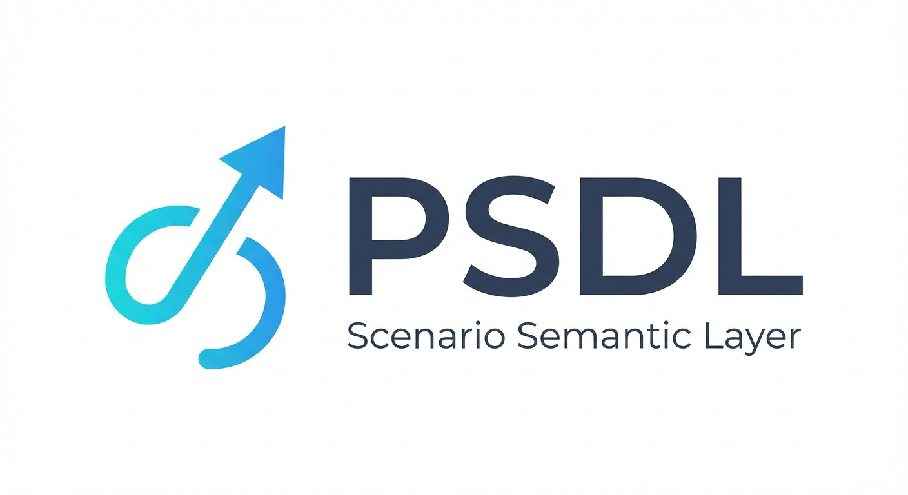
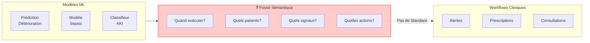
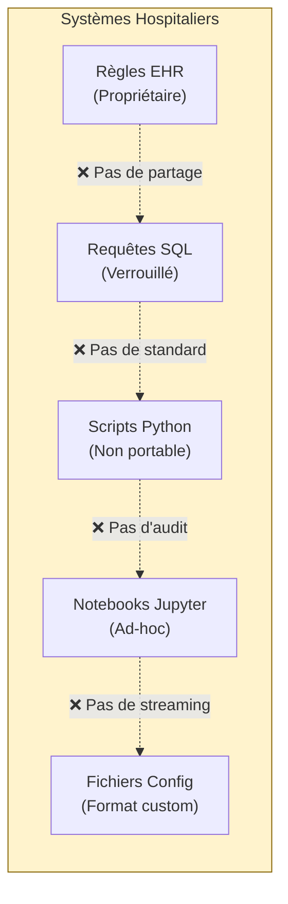
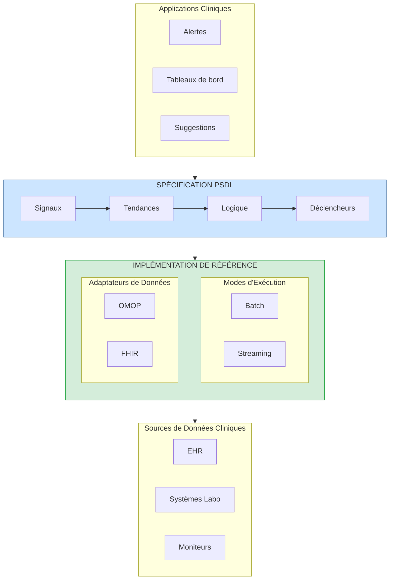
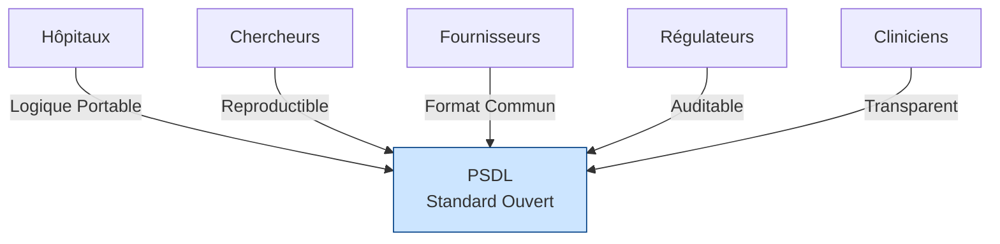
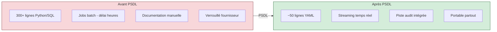
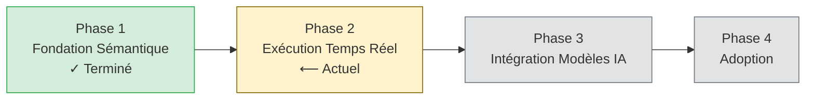

<p align="center">
  
</p>

<h1 align="center">Livre Blanc PSDL</h1>
<h3 align="center">Langage de Définition de Scénarios Patient</h3>
<h4 align="center">Version 0.1 | Décembre 2025</h4>

<p align="center">
  <em>Un Standard Ouvert pour la Logique Clinique en IA de Santé</em>
</p>

---

<p align="center">
  <strong>Ce que SQL est devenu pour les requêtes de données, ONNX pour les modèles ML, et GraphQL pour les API —<br/>
  PSDL devient la <em>couche sémantique</em> pour l'IA clinique.</strong>
</p>

---

## Résumé Exécutif

L'IA de santé a un problème de déploiement. Malgré des avancées remarquables en modélisation prédictive, la grande majorité des systèmes d'IA clinique n'atteignent jamais le chevet du patient. L'obstacle n'est pas la précision des modèles — c'est l'absence d'une façon standard d'exprimer *quand*, *où* et *comment* ces modèles doivent fonctionner dans les workflows cliniques.

**PSDL (Patient Scenario Definition Language)** est un standard ouvert et neutre vis-à-vis des fournisseurs qui comble ce vide critique. Il fournit un langage déclaratif pour exprimer les scénarios cliniques — la logique qui connecte les données patient aux actions cliniques.

### Propositions de Valeur Clés

| Partie Prenante | Valeur |
|-----------------|--------|
| **Hôpitaux** | Logique clinique portable fonctionnant sur tous les systèmes EHR |
| **Chercheurs** | Scénarios reproductibles pouvant être partagés et validés |
| **Fournisseurs** | Format commun réduisant la complexité d'intégration |
| **Régulateurs** | Logique de décision auditable et versionnée |
| **Cliniciens** | Règles transparentes pouvant être examinées et comprises |

---

## Principes PSDL

> Pour la référence autoritaire complète, voir [PRINCIPLES.md](../PRINCIPLES.md)

### La Loi Fondamentale

**PSDL définit CE QU'IL FAUT détecter, pas COMMENT collecter ou exécuter.**

### Premiers Principes

| # | Principe | Déclaration |
|---|----------|-------------|
| **P1** | Spécification d'Abord | PSDL est une spécification, pas un logiciel. Les implémentations de référence la démontrent. |
| **P2** | Les Données Existent | PSDL opère sur des données existantes. Il ne crée ni ne collecte de données. |
| **P3** | Intention vs Implémentation | Les scénarios expriment l'intention clinique (QUOI). Les runtimes gèrent l'exécution (COMMENT). |
| **P4** | Déterministe | Même scénario + mêmes données = même résultat. Toujours. |
| **P5** | Neutre au Fournisseur | Aucune dépendance propriétaire. Gouverné par la communauté. |

### Lois de Portée

| PSDL FAIT | PSDL NE FAIT PAS |
|-----------|------------------|
| **S1** Définir les signaux (liaisons de données) | **N1** Collecter des données des patients |
| **S2** Définir les tendances (calculs temporels) | **N2** Exécuter des modèles ML/IA |
| **S3** Définir la logique (combinaisons booléennes) | **N3** Orchestrer les workflows cliniques |
| **S4** Définir les déclencheurs (quelles actions) | **N4** Définir le stockage des données |
| **S5** Définir les populations (critères patients) | **N5** Remplacer OMOP ou FHIR |
| **S6** Définir la sémantique des opérateurs | **N6** Définir comment les déclencheurs s'exécutent |

---

## Le Problème : Pourquoi l'IA Clinique Échoue à se Déployer


*Le fossé entre les modèles ML et les workflows cliniques — PSDL construit ce pont*

### Le Fossé de Sémantique des Scénarios

Un hôpital développe un modèle ML qui prédit la détérioration du patient avec 90% de précision. Impressionnant. Mais ensuite viennent les questions :

- **Quand** ce modèle doit-il s'exécuter ? Chaque heure ? Sur de nouveaux résultats de laboratoire ?
- **Sur quels patients ?** Tous les patients de réanimation ? Seulement ceux répondant à certains critères ?
- **Basé sur quels signaux ?** Quels signes vitaux ? Quels laboratoires ? Quelles fenêtres temporelles ?
- **Quels seuils déclenchent l'action ?** Score > 0.7 ? Combiné avec d'autres facteurs ?
- **Que se passe-t-il lors du déclenchement ?** Appeler un médecin ? Générer une prescription ?

Ce sont les **sémantiques de scénario** — et la santé n'a pas de façon standard de les exprimer.

### État Actuel : Logique Clinique Fragmentée


*La logique clinique aujourd'hui est dispersée dans des systèmes incompatibles*

Aujourd'hui, la logique de décision clinique est dispersée dans :

| Implémentation | Problèmes |
|----------------|-----------|
| Scripts Python | Non portables, dépendances implicites, difficiles à auditer |
| Requêtes SQL | Pas de sémantique temporelle, couplées au schéma |
| Éditeurs de règles EHR | Propriétaires, verrouillés au fournisseur, non exportables |
| Notebooks Jupyter | Non reproductibles, pas de sémantique de contrôle de version |
| Fichiers de configuration | Formats ad-hoc, pas de standardisation |

**Le résultat :** Chaque hôpital réinvente la même logique clinique à partir de zéro. La recherche ne peut être reproduite. Les audits réglementaires nécessitent une documentation manuelle. Les transitions de fournisseurs signifient tout réécrire.

---

## La Solution : PSDL


*Architecture Spécification PSDL + Implémentation de Référence*

PSDL introduit une **couche sémantique** pour l'IA clinique — comme SQL pour les bases de données, GraphQL pour les API, ou dbt pour la transformation de données. Il fournit un format structuré et déclaratif qui sépare *quoi* détecter de *comment* le calculer. Conçu dès le départ pour l'analyse batch et l'exécution streaming en temps réel avec Apache Flink et des moteurs similaires.

> **Le Pattern Couche Sémantique** : Tout comme SQL abstrait les détails d'implémentation des bases de données, et GraphQL abstrait la complexité des API, PSDL abstrait la complexité de la détection de scénarios cliniques. Écrivez une fois, exécutez partout — des notebooks Jupyter aux systèmes de streaming en production.

### Concepts Fondamentaux

```
Scénario = Population + Signaux + Tendances + Logique + Déclencheurs
```

| Composant | Description | Exemple |
|-----------|-------------|---------|
| **Population** | À quels patients le scénario s'applique | `age >= 18 AND unit == "ICU"` |
| **Signaux** | Liaisons de données de séries temporelles | `Cr: creatinine (mg/dL)` |
| **Tendances** | Calculs temporels | `delta(Cr, 6h) > 0.3` |
| **Logique** | Combinaisons booléennes | `cr_rising AND cr_high` |
| **Déclencheurs** | Actions quand la logique se déclenche | `notify_team("ICU")` |

### Exemple : Détection Précoce de l'AKI

```yaml
scenario: AKI_Early_Detection
version: "0.1.0"
description: "Détecter l'insuffisance rénale aiguë précoce basée sur les tendances de créatinine"

population:
  include:
    - age >= 18
    - unit == "ICU"

signals:
  Cr:
    source: creatinine
    concept_id: 3016723    # Concept standard OMOP
    unit: mg/dL

trends:
  cr_rising:
    expr: delta(Cr, 6h) > 0.3
    description: "Créatinine augmentée >0.3 mg/dL en 6 heures"

  cr_elevated:
    expr: last(Cr) > 1.5
    description: "Créatinine actuelle au-dessus de la normale"

logic:
  aki_stage1:
    expr: cr_rising AND cr_elevated
    severity: high
    description: "AKI précoce - Critères KDIGO Stade 1"

triggers:
  - when: aki_stage1
    actions:
      - type: notify_team
        target: nephrology_consult
        priority: high
```

Ce seul fichier YAML remplace des centaines de lignes de code Python, SQL et de configuration dispersés — et il est portable, auditable et versionné.

---

## Pourquoi un Standard Ouvert ?

PSDL suit le précédent des standards ouverts réussis :

| Standard | Domaine | Ce Qu'il a Standardisé |
|----------|---------|------------------------|
| **SQL** | Données | Langage de requête pour bases de données |
| **ONNX** | ML | Format d'échange de modèles |
| **FHIR** | Santé | Échange de données cliniques |
| **CQL** | Qualité | Mesures de qualité clinique |
| **PSDL** | Scénarios | Logique de décision clinique |

### Bénéfices de l'Ouverture


*PSDL connecte toutes les parties prenantes de l'écosystème de l'IA clinique*

| Principe | Bénéfice |
|----------|----------|
| **Neutre vis-à-vis des Fournisseurs** | Pas de verrouillage ; tout hôpital peut adopter librement |
| **Gouverné par la Communauté** | Évolution guidée par les besoins cliniques réels |
| **Liberté d'Implémentation** | Plusieurs runtimes peuvent être conformes |
| **Reproductibilité** | Les chercheurs peuvent partager des définitions exactes de scénarios |
| **Clarté Réglementaire** | Le format standard permet des audits systématiques |

---

## Positionnement : PSDL comme Couche Sémantique

Chaque pile technologique mature développe une couche sémantique — une abstraction qui sépare l'*intention* de l'*implémentation* :

```
┌─────────────────────────────────────────────────────────────────┐
│                LE PATTERN COUCHE SÉMANTIQUE                     │
├─────────────────────────────────────────────────────────────────┤
│                                                                 │
│   REQUÊTES     SQL         "De quelles données ai-je besoin?"  │
│   DONNÉES      ────→       (Pas : Comment parcourir les B-trees?)│
│                                                                 │
│   ACCÈS        GraphQL     "Quelle forme de données je veux?"   │
│   API          ────→       (Pas : Comment faire des appels REST?)│
│                                                                 │
│   TRANSFORM.   dbt/        "Comment les données doivent-elles se│
│   DONNÉES      Metrics     transformer?" (Pas : Comment écrire  │
│                            des pipelines ETL?)                  │
│                                                                 │
│   MODÈLES      ONNX        "Que calcule mon modèle?"            │
│   ML           ────→       (Pas : Comment exécuter sur GPU/CPU?)│
│                                                                 │
│   SCÉNARIOS    PSDL        "Quelle logique clinique appliquer?" │
│   CLINIQUES    ────→       (Pas : Comment interroger OMOP/FHIR?)│
│                                                                 │
└─────────────────────────────────────────────────────────────────┘
```

**PSDL est la couche sémantique manquante pour l'IA clinique.** Elle permet aux cliniciens et informaticiens d'exprimer *ce qu'ils* veulent détecter sans se soucier de *comment* interroger les bases de données, gérer le streaming, ou s'intégrer à des systèmes EHR spécifiques.

### Pourquoi les Couches Sémantiques Gagnent

| Avantage | Sans Couche Sémantique | Avec PSDL |
|----------|------------------------|-----------|
| **Portabilité** | Réécrire pour chaque base de données/EHR | Écrire une fois, déployer partout |
| **Collaboration** | Seuls les ingénieurs peuvent modifier | Les cliniciens peuvent lire et valider |
| **Tests** | Tester contre les systèmes de production | Tester contre les spécifications avec des données simulées |
| **Versionnement** | Caché dans le code applicatif | Définitions de première classe, auditables |
| **Optimisation** | Réglage manuel par système | Le moteur d'exécution optimise automatiquement |

PSDL comble un vide spécifique dans la pile technologique de la santé. Comprendre où il s'intègre — et où il ne s'intègre pas — est essentiel.

### La Pile de l'IA de Santé

| Couche | Solution Existante | Rôle de PSDL |
|--------|-------------------|--------------|
| **Recherche de Cohortes** | ATLAS / OMOP | Compatible — PSDL utilise les données OMOP |
| **Mesures de Qualité** | CQL (HL7) | Complémentaire — focus différent |
| **Détection Temps Réel** | ❌ Pas de standard ouvert | **PSDL comble ce vide** |
| **Déploiement de Modèles IA** | Code personnalisé par hôpital | **PSDL standardise cela** |

### Ce Qu'est PSDL

**PSDL = Détection de scénarios cliniques en temps réel + Pont de déploiement de modèles IA**

- Opérateurs temporels natifs au streaming (`delta`, `slope`, `ema`)
- Définitions de scénarios neutres vis-à-vis des fournisseurs
- Méthode standard pour connecter les modèles ML aux déclencheurs cliniques

### Ce Que PSDL N'est PAS

| PSDL ne... | Utilisez plutôt |
|------------|-----------------|
| Remplace les standards de données OMOP/FHIR | PSDL les consomme |
| Concurrence ATLAS pour la recherche | Utilisez ATLAS, déployez avec PSDL |
| Remplace CQL pour les mesures de qualité | CQL pour les rapports, PSDL pour le temps réel |
| Entraîne les modèles ML | PSDL déploie les modèles entraînés |
| Définit les parcours de soins | Déclenchez les systèmes de parcours depuis PSDL |

---

## Portée et Limitations

> Pour la version concise de ces principes, voir [PRINCIPLES.md](../PRINCIPLES.md)

**L'honnêteté intellectuelle exige de la clarté sur ce que PSDL peut et ne peut pas faire.** PSDL est une spécification pour exprimer la logique de détection clinique — comprendre ses limites est essentiel.

### Le Principe Central : QUOI vs COMMENT

PSDL suit la même séparation des responsabilités que SQL, GraphQL et ONNX :

```
┌─────────────────────────────────────────────────────────────────┐
│                    SÉPARATION DES RESPONSABILITÉS                │
├─────────────────────────────────────────────────────────────────┤
│                                                                  │
│   Standard    │  Définit QUOI              │  PAS COMMENT        │
│   ──────────  │  ────────────              │  ───────            │
│   SQL         │  Quelles données requêter  │  Comment DB stocke  │
│   GraphQL     │  Quelle forme de réponse   │  Comment srv obtient│
│   ONNX        │  Ce que le modèle calcule  │  Comment rt exécute │
│   PSDL        │  Quel pattern détecter     │  Comment collecter  │
│                                                                  │
└─────────────────────────────────────────────────────────────────┘
```

**PSDL définit QUOI détecter, pas COMMENT collecter les données.**

### Ce Que PSDL Définit (La Spécification)

PSDL comme langage spécifie :

| Composant | But | Exemple |
|-----------|-----|---------|
| **Signaux** | Quelles données lier | `Cr: creatinine (mg/dL)` |
| **Tendances** | Quels patterns temporels | `delta(Cr, 6h) > 0.3` |
| **Logique** | Quelles conditions détecter | `cr_rising AND cr_elevated` |
| **Déclencheurs** | Quelles actions au déclenchement | `notify_team("nephrology")` |

### Ce Que PSDL Ne Définit PAS

PSDL ne spécifie pas :

| Hors Portée | Pourquoi | Géré Par |
|-------------|----------|----------|
| Comment collecter les scores douleur | Collecte, pas détection | Apps infirmières |
| Comment interroger les APIs | Détail d'implémentation | Implémentation de référence |
| Comment exécuter les modèles ML | Responsabilité du runtime | ONNX runtime |
| Comment exécuter les workflows | Travail du runtime | Moteur de workflow |

### L'Insight Clé : Disponibilité des Données

**Une fois que les données existent, PSDL peut les utiliser — quelle que soit la source.**

| Scénario | PSDL peut ? | Pourquoi |
|----------|-------------|----------|
| Tendances labo → Alerte | **Oui** | Données labo existent dans EHR |
| Sortie modèle ML → Alerte | **Oui** | La sortie est des données |
| Score douleur (documenté) → Alerte | **Oui** | Ce sont des données structurées |
| Collecter score douleur | **Non** | C'est de la collecte |
| État mental (enregistré) → Alerte | **Oui** | Ce sont des données documentées |
| Effectuer examen mental | **Non** | C'est de la collecte |

### Spécification vs Implémentation de Référence

Cette distinction compte :

| Aspect | Spécification PSDL | Implémentation Référence |
|--------|-------------------|--------------------------|
| **But** | Définir le langage | Démontrer une façon d'exécuter |
| **Portée** | Logique de détection uniquement | Peut inclure des commodités |
| **Déclencheurs** | Déclare QUELLE action | COMMENT exécuter est du runtime |

L'implémentation de référence peut faire beaucoup de choses, mais **la spécification PSDL reste élégante et focalisée**.

### Philosophie de Conception

> **PSDL opère sur les données qui existent — il n'orchestre pas la collecte de données.**

### Contexte Historique

PSDL s'appuie sur [Arden Syntax](https://en.wikipedia.org/wiki/Arden_syntax) (HL7, 1992), qui a été pionnier des règles cliniques partageables. Les Medical Logic Modules (MLMs) d'Arden ont introduit des patterns événement-déclencheur-action toujours pertinents aujourd'hui.

**L'évolution de PSDL :** Arden gère des règles individuelles ; PSDL gère des **scénarios composés** avec des opérateurs temporels de premier ordre et une exécution en streaming.

### Relation avec CQL

[Clinical Quality Language](https://cql.hl7.org/) (HL7) excelle dans la mesure de qualité et la définition de cohortes. PSDL complète CQL :

| Aspect | CQL | PSDL |
|--------|-----|------|
| Focus | Rapports de qualité | Détection temps réel |
| Exécution | Basée sur les requêtes | Streaming événementiel |
| Temporel | Supporté | Premier ordre, natif streaming |
| Syntaxe | Verbeux | YAML simple |

**Utilisez ensemble :** Définissez des cohortes en CQL/ATLAS → Déployez la détection temps réel avec PSDL.

---

## Vision

PSDL a une architecture à deux couches focalisée :

```
┌─────────────────────────────────────────────────────────────────┐
│  PSDL.Model   │  Intégration modèles IA/ML (predict, forecast)  │
├───────────────┼─────────────────────────────────────────────────┤
│  PSDL.Core    │  Scénarios temps réel ← FOCUS ACTUEL            │
└───────────────┴─────────────────────────────────────────────────┘
        ▲                           ▲
        │                           │
   ┌────┴────┐                 ┌────┴────┐
   │  FHIR   │                 │  ONNX   │
   │  OMOP   │                 │(modèles)│
   └─────────┘                 └─────────┘
```

### Objectif v1.0 : Détection de Scénarios en Temps Réel

Le backend streaming (RFC-0002) permet :
- Traitement d'événements cliniques en moins d'une seconde
- Opérateurs temporels à état
- Intégration avec l'infrastructure Kafka/Flink

### Objectif v1.x : Intégration de Modèles IA

Les sorties de modèles ML sont traitées comme des signaux réguliers via les liaisons Dataset Spec :
- Sorties de modèles liées aux signaux (ex. `sepsis_risk_score`)
- Intégration du registre de modèles via la configuration Dataset Spec
- Cohérent avec la philosophie PSDL « QUOI, pas COMMENT »

### Le Pitch

> **« Utilisez ATLAS pour la découverte de cohortes. Utilisez PSDL pour déployer cette logique en temps réel avec des modèles IA. »**

---

## Architecture Technique

PSDL suit les modèles standard de l'industrie établis par GraphQL, CQL et ONNX : une séparation claire entre **Spécification** et **Implémentation de Référence**.

### Spécification vs Implémentation

| Projet | Spécification | Implémentation de Référence |
|--------|---------------|-----------------------------|
| GraphQL | SDL (Langage de Définition de Schéma) | Apollo, GraphQL-Java, etc. |
| CQL | Spécification CQL + ELM | cql-execution (JavaScript) |
| ONNX | ONNX IR (Représentation Intermédiaire) | ONNX Runtime (projet séparé) |
| **PSDL** | **Schéma YAML + Sémantique des Opérateurs** | **Implémentation de Référence Python** |

### Architecture PSDL

```
┌─────────────────────────────────────────────────────────────────┐
│                      SPÉCIFICATION PSDL                          │
│               (Définition du Langage)                            │
│                                                                  │
│  ┌──────────────────────────────────────────────────────────┐  │
│  │                    Schéma YAML                            │  │
│  │                                                           │  │
│  │  Signaux     - Liaisons de données de séries temporelles │  │
│  │  Tendances   - Calculs temporels                         │  │
│  │  Logique     - Combinaisons booléennes                   │  │
│  │  Population  - Critères de patients                      │  │
│  │  Déclencheurs - Événement-condition-action (v0.2)        │  │
│  └──────────────────────────────────────────────────────────┘  │
│                                                                  │
│  ┌──────────────────────────────────────────────────────────┐  │
│  │              Sémantique des Opérateurs                    │  │
│  │                                                           │  │
│  │  delta, slope, ema, sma, min, max, count, last, first    │  │
│  │  (Définitions mathématiques, pas du code)                 │  │
│  └──────────────────────────────────────────────────────────┘  │
│                                                                  │
│  Indépendant de la plateforme. Indépendant de l'implémentation. │
└─────────────────────────────────────────────────────────────────┘
                              │
                              ▼
┌─────────────────────────────────────────────────────────────────┐
│              IMPLÉMENTATION DE RÉFÉRENCE (Python)                │
│                                                                  │
│  Composants Principaux :                                         │
│  ┌────────────┐  ┌────────────┐  ┌────────────┐                │
│  │  Parseur   │  │ Opérateurs │  │ Évaluateur │                │
│  │            │  │            │  │            │                │
│  │ YAML → AST │  │ Impl. math │  │ Exécution  │                │
│  └────────────┘  └────────────┘  └────────────┘                │
│                                                                  │
│  Modes d'Exécution :                                             │
│  ┌─────────────────┐    ┌─────────────────┐                    │
│  │      Batch      │    │    Streaming    │                    │
│  │   (Évaluateur)  │    │    (Flink)      │                    │
│  └─────────────────┘    └─────────────────┘                    │
│                                                                  │
│  Adaptateurs de Données :                                        │
│  ┌─────────────────┐    ┌─────────────────┐                    │
│  │      OMOP       │    │      FHIR       │                    │
│  │    (SQL)        │    │    (REST)       │                    │
│  └─────────────────┘    └─────────────────┘                    │
│                                                                  │
│  C'est UNE implémentation. D'autres peuvent exister (Java, Rust) │
└─────────────────────────────────────────────────────────────────┘
```

### Terminologie Clé

| Terme | Définition |
|-------|------------|
| **Spécification** | Définition du langage PSDL (schéma YAML + sémantique des opérateurs) |
| **Implémentation de Référence** | Implémentation Python démontrant la spécification |
| **Parseur** | Parse le YAML PSDL en représentation interne |
| **Opérateurs** | Implémentation des opérateurs temporels |
| **Évaluateur** | Exécute les scénarios parsés |
| **Mode d'Exécution** | Comment les scénarios s'exécutent (Batch vs Streaming) |
| **Adaptateur de Données** | Interface vers les données cliniques (OMOP, FHIR) |

### Opérateurs Temporels

PSDL fournit un support de premier ordre pour les données cliniques de séries temporelles :

| Opérateur | Description | Exemple |
|-----------|-------------|---------|
| `delta(signal, window)` | Changement sur une fenêtre de temps | `delta(Cr, 6h) > 0.3` |
| `slope(signal, window)` | Tendance linéaire | `slope(lactate, 3h) > 0` |
| `ema(signal, window)` | Moyenne mobile exponentielle | `ema(MAP, 30m) < 65` |
| `sma(signal, window)` | Moyenne mobile simple | `sma(HR, 1h) > 100` |
| `min/max(signal, window)` | Extrêmes dans la fenêtre | `max(temp, 24h) > 38.5` |
| `last(signal)` | Valeur la plus récente | `last(SpO2) < 92` |
| `count(signal, window)` | Nombre d'observations | `count(Cr, 24h) >= 2` |

### Modes d'Exécution et Adaptateurs de Données

Le même scénario PSDL peut s'exécuter dans différents modes et se connecter à différentes sources de données :

| Mode d'Exécution | Description | Cas d'Usage |
|------------------|-------------|-------------|
| **Batch** | L'évaluateur traite les données historiques | Développement, validation |
| **Streaming** | Flink traite les événements en temps réel | Déploiement en production |

| Adaptateur de Données | Protocole | Cas d'Usage |
|-----------------------|-----------|-------------|
| **OMOP** | SQL | Bases de données de recherche, analyse rétrospective |
| **FHIR** | REST | Intégration EHR, systèmes cliniques |
| **En Mémoire** | Direct | Tests, développement |

**Écrire une fois, valider sur des données historiques, déployer en temps réel.**

---

## Comparaison : Avant et Après PSDL


*PSDL simplifie dramatiquement la gestion de la logique clinique*

| Aspect | Avant PSDL | Après PSDL |
|--------|------------|------------|
| **Lignes de Code** | ~300+ Python/SQL | ~50 lignes YAML |
| **Portabilité** | Lié à des systèmes spécifiques | Fonctionne partout avec mapping |
| **Auditabilité** | Documentation manuelle | Intégrée, versionnée |
| **Reproductibilité** | "Ça marche sur ma machine" | Exécution déterministe |
| **Partage** | Copier-coller avec modifications | Publier des définitions exactes |
| **Réglementaire** | Conformité ad-hoc | Support d'audit systématique |

---

## Feuille de Route


*Phases de développement de PSDL*

### Phase 1 : Fondation Sémantique [Actuelle]
- Système de types et spécification des opérateurs
- Définition du schéma YAML
- Implémentation de référence Python
- Scénarios cliniques d'exemple
- Suite de tests de conformité

### Phase 2 : Runtime Amélioré
- Backend SQL OMOP CDM
- Runtime FHIR R4
- Système de Déclencheurs/Actions (v0.2)
- Optimisation des performances

### Phase 3 : Construction de la Communauté
- Documentation technique
- Présentations en conférences
- Infrastructure communautaire (Discord, forums)
- Implémentations tierces

### Phase 4 : Adoption
- Programmes pilotes hospitaliers
- Engagement avec les organismes de standardisation (OHDSI, HL7)
- Partenariats avec les fournisseurs
- Programme de certification

---

## Impliquez-vous

PSDL est un projet ouvert, piloté par la communauté. Nous accueillons les contributions de :

- **Informaticiens Cliniques** — Définir des scénarios et exigences du monde réel
- **Ingénieurs Logiciels** — Construire des runtimes, outils et intégrations
- **Chercheurs** — Valider la portabilité et la reproductibilité
- **Organisations de Santé** — Implémentations pilotes et retours d'expérience
- **Organismes de Standards** — Aider à aligner avec les standards de santé existants

---

## Conclusion

Le déploiement de l'IA de santé est bloqué non pas par la qualité des modèles, mais par l'absence d'une **couche sémantique** pour la logique clinique. Tout comme SQL a libéré la portabilité des bases de données et GraphQL a simplifié l'intégration des API, PSDL libère la portabilité de l'IA clinique.

PSDL fournit :

- **Une vraie couche sémantique** — abstraire la logique clinique des détails d'implémentation
- **Écrire une fois, exécuter partout** — développement batch, production streaming
- **Portabilité neutre vis-à-vis des fournisseurs** — entre institutions, EHR et formats de données
- **Auditabilité intégrée** — décisions versionnées et traçables
- **Intégration de modèles IA** — pont de la recherche au déploiement temps réel

La pile IA moderne a des couches sémantiques pour les données (SQL), les API (GraphQL), les modèles ML (ONNX) et la transformation de données (dbt). L'IA clinique mérite la même chose. **PSDL est cette couche sémantique.**

---

<p align="center">
  <strong>L'IA clinique n'échoue pas parce que les modèles sont faibles.<br/>
  Elle échoue parce qu'il n'y a pas de couche sémantique pour exprimer la logique clinique de façon portable.</strong>
</p>

<p align="center">
  <em>PSDL est la couche sémantique pour l'IA clinique — comme SQL pour les bases de données.</em>
</p>

---

<p align="center">
  <strong>Rejoignez-nous pour construire le standard de la logique de décision clinique.</strong>
  <br/><br/>
  <a href="https://github.com/Chesterguan/PSDL">GitHub</a> ·
  <a href="./getting-started.md">Commencer</a> ·
  <a href="../CONTRIBUTING.md">Contribuer</a>
</p>

---

*Livre Blanc PSDL v0.1 | Décembre 2025 | Licence Apache 2.0*
