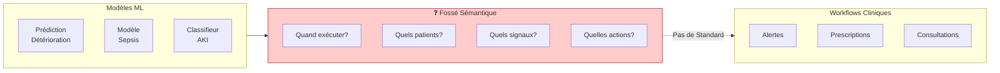
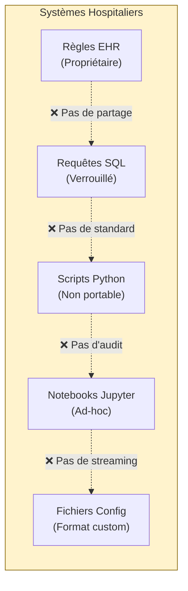
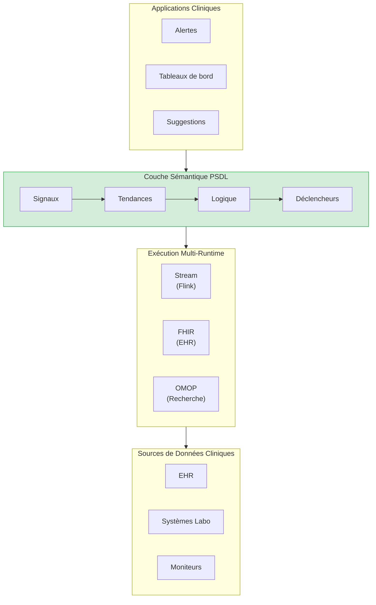
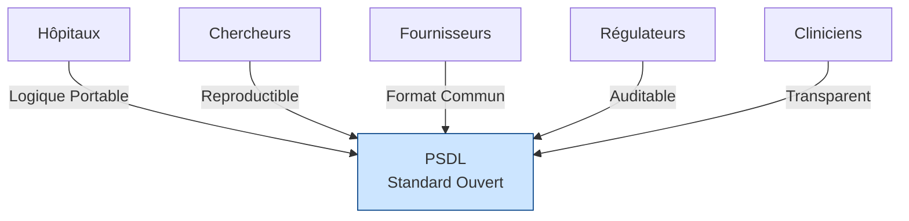
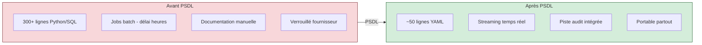
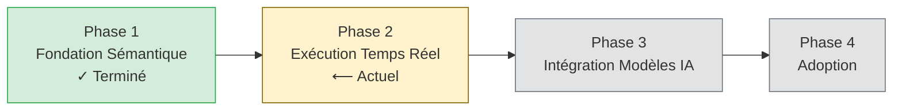

<p align="center">
  
</p>

<h1 align="center">Livre Blanc PSDL</h1>
<h3 align="center">Langage de Définition de Scénarios Patient</h3>
<h4 align="center">Version 0.1 | Décembre 2025</h4>

<p align="center">
  <em>Un Standard Ouvert pour la Logique Clinique en IA de Santé</em>
</p>

---

<p align="center">
  <strong>Ce que SQL est devenu pour les requêtes de données, et ONNX pour les modèles ML —<br/>
  PSDL aspire à le devenir pour la logique des scénarios cliniques.</strong>
</p>

---

## Résumé Exécutif

L'IA de santé a un problème de déploiement. Malgré des avancées remarquables en modélisation prédictive, la grande majorité des systèmes d'IA clinique n'atteignent jamais le chevet du patient. L'obstacle n'est pas la précision des modèles — c'est l'absence d'une façon standard d'exprimer *quand*, *où* et *comment* ces modèles doivent fonctionner dans les workflows cliniques.

**PSDL (Patient Scenario Definition Language)** est un standard ouvert et neutre vis-à-vis des fournisseurs qui comble ce vide critique. Il fournit un langage déclaratif pour exprimer les scénarios cliniques — la logique qui connecte les données patient aux actions cliniques.

### Propositions de Valeur Clés

| Partie Prenante | Valeur |
|-----------------|--------|
| **Hôpitaux** | Logique clinique portable fonctionnant sur tous les systèmes EHR |
| **Chercheurs** | Scénarios reproductibles pouvant être partagés et validés |
| **Fournisseurs** | Format commun réduisant la complexité d'intégration |
| **Régulateurs** | Logique de décision auditable et versionnée |
| **Cliniciens** | Règles transparentes pouvant être examinées et comprises |

---

## Le Problème : Pourquoi l'IA Clinique Échoue à se Déployer


*Le fossé entre les modèles ML et les workflows cliniques — PSDL construit ce pont*

### Le Fossé de Sémantique des Scénarios

Un hôpital développe un modèle ML qui prédit la détérioration du patient avec 90% de précision. Impressionnant. Mais ensuite viennent les questions :

- **Quand** ce modèle doit-il s'exécuter ? Chaque heure ? Sur de nouveaux résultats de laboratoire ?
- **Sur quels patients ?** Tous les patients de réanimation ? Seulement ceux répondant à certains critères ?
- **Basé sur quels signaux ?** Quels signes vitaux ? Quels laboratoires ? Quelles fenêtres temporelles ?
- **Quels seuils déclenchent l'action ?** Score > 0.7 ? Combiné avec d'autres facteurs ?
- **Que se passe-t-il lors du déclenchement ?** Appeler un médecin ? Générer une prescription ?

Ce sont les **sémantiques de scénario** — et la santé n'a pas de façon standard de les exprimer.

### État Actuel : Logique Clinique Fragmentée


*La logique clinique aujourd'hui est dispersée dans des systèmes incompatibles*

Aujourd'hui, la logique de décision clinique est dispersée dans :

| Implémentation | Problèmes |
|----------------|-----------|
| Scripts Python | Non portables, dépendances implicites, difficiles à auditer |
| Requêtes SQL | Pas de sémantique temporelle, couplées au schéma |
| Éditeurs de règles EHR | Propriétaires, verrouillés au fournisseur, non exportables |
| Notebooks Jupyter | Non reproductibles, pas de sémantique de contrôle de version |
| Fichiers de configuration | Formats ad-hoc, pas de standardisation |

**Le résultat :** Chaque hôpital réinvente la même logique clinique à partir de zéro. La recherche ne peut être reproduite. Les audits réglementaires nécessitent une documentation manuelle. Les transitions de fournisseurs signifient tout réécrire.

---

## La Solution : PSDL


*PSDL comme couche sémantique dans la pile de l'IA de santé*

PSDL introduit une **couche sémantique** pour les scénarios cliniques — un format structuré et déclaratif qui sépare *quoi* détecter de *comment* le calculer.

### Concepts Fondamentaux

```
Scénario = Population + Signaux + Tendances + Logique + Déclencheurs
```

| Composant | Description | Exemple |
|-----------|-------------|---------|
| **Population** | À quels patients le scénario s'applique | `age >= 18 AND unit == "ICU"` |
| **Signaux** | Liaisons de données de séries temporelles | `Cr: creatinine (mg/dL)` |
| **Tendances** | Calculs temporels | `delta(Cr, 6h) > 0.3` |
| **Logique** | Combinaisons booléennes | `cr_rising AND cr_high` |
| **Déclencheurs** | Actions quand la logique se déclenche | `notify_team("ICU")` |

### Exemple : Détection Précoce de l'AKI

```yaml
scenario: AKI_Early_Detection
version: "0.1.0"
description: "Détecter l'insuffisance rénale aiguë précoce basée sur les tendances de créatinine"

population:
  include:
    - age >= 18
    - unit == "ICU"

signals:
  Cr:
    source: creatinine
    concept_id: 3016723    # Concept standard OMOP
    unit: mg/dL

trends:
  cr_rising:
    expr: delta(Cr, 6h) > 0.3
    description: "Créatinine augmentée >0.3 mg/dL en 6 heures"

  cr_elevated:
    expr: last(Cr) > 1.5
    description: "Créatinine actuelle au-dessus de la normale"

logic:
  aki_stage1:
    expr: cr_rising AND cr_elevated
    severity: high
    description: "AKI précoce - Critères KDIGO Stade 1"

triggers:
  - when: aki_stage1
    actions:
      - type: notify_team
        target: nephrology_consult
        priority: high
```

Ce seul fichier YAML remplace des centaines de lignes de code Python, SQL et de configuration dispersés — et il est portable, auditable et versionné.

---

## Pourquoi un Standard Ouvert ?

PSDL suit le précédent des standards ouverts réussis :

| Standard | Domaine | Ce Qu'il a Standardisé |
|----------|---------|------------------------|
| **SQL** | Données | Langage de requête pour bases de données |
| **ONNX** | ML | Format d'échange de modèles |
| **FHIR** | Santé | Échange de données cliniques |
| **CQL** | Qualité | Mesures de qualité clinique |
| **PSDL** | Scénarios | Logique de décision clinique |

### Bénéfices de l'Ouverture


*PSDL connecte toutes les parties prenantes de l'écosystème de l'IA clinique*

| Principe | Bénéfice |
|----------|----------|
| **Neutre vis-à-vis des Fournisseurs** | Pas de verrouillage ; tout hôpital peut adopter librement |
| **Gouverné par la Communauté** | Évolution guidée par les besoins cliniques réels |
| **Liberté d'Implémentation** | Plusieurs runtimes peuvent être conformes |
| **Reproductibilité** | Les chercheurs peuvent partager des définitions exactes de scénarios |
| **Clarté Réglementaire** | Le format standard permet des audits systématiques |

---

## Architecture Technique

### La Pile PSDL

```
┌─────────────────────────────────────────────────────────────┐
│                   APPLICATIONS CLINIQUES                     │
│        (Alertes, Tableaux de Bord, Suggestions de Prescriptions)│
└─────────────────────────────────────────────────────────────┘
                              ▲
                              │
┌─────────────────────────────────────────────────────────────┐
│                    COUCHE SÉMANTIQUE PSDL                    │
│  ┌─────────┐  ┌──────────┐  ┌─────────┐  ┌────────────┐    │
│  │ Signaux │→ │Tendances │→ │ Logique │→ │Déclencheurs│    │
│  └─────────┘  └──────────┘  └─────────┘  └────────────┘    │
└─────────────────────────────────────────────────────────────┘
                              ▲
          ┌───────────────────┼───────────────────┐
          ▼                   ▼                   ▼
    ┌──────────┐        ┌──────────┐        ┌──────────┐
    │   OMOP   │        │   FHIR   │        │  Stream  │
    │  Runtime │        │  Runtime │        │  Runtime │
    └──────────┘        └──────────┘        └──────────┘
```

### Opérateurs Temporels

PSDL fournit un support de premier ordre pour les données cliniques de séries temporelles :

| Opérateur | Description | Exemple |
|-----------|-------------|---------|
| `delta(signal, window)` | Changement sur une fenêtre de temps | `delta(Cr, 6h) > 0.3` |
| `slope(signal, window)` | Tendance linéaire | `slope(lactate, 3h) > 0` |
| `ema(signal, window)` | Moyenne mobile exponentielle | `ema(MAP, 30m) < 65` |
| `sma(signal, window)` | Moyenne mobile simple | `sma(HR, 1h) > 100` |
| `min/max(signal, window)` | Extrêmes dans la fenêtre | `max(temp, 24h) > 38.5` |
| `last(signal)` | Valeur la plus récente | `last(SpO2) < 92` |
| `count(signal, window)` | Nombre d'observations | `count(Cr, 24h) >= 2` |

---

## Comparaison : Avant et Après PSDL


*PSDL simplifie dramatiquement la gestion de la logique clinique*

| Aspect | Avant PSDL | Après PSDL |
|--------|------------|------------|
| **Lignes de Code** | ~300+ Python/SQL | ~50 lignes YAML |
| **Portabilité** | Lié à des systèmes spécifiques | Fonctionne partout avec mapping |
| **Auditabilité** | Documentation manuelle | Intégrée, versionnée |
| **Reproductibilité** | "Ça marche sur ma machine" | Exécution déterministe |
| **Partage** | Copier-coller avec modifications | Publier des définitions exactes |
| **Réglementaire** | Conformité ad-hoc | Support d'audit systématique |

---

## Feuille de Route


*Phases de développement de PSDL*

### Phase 1 : Fondation Sémantique [Actuelle]
- Système de types et spécification des opérateurs
- Définition du schéma YAML
- Implémentation de référence Python
- Scénarios cliniques d'exemple
- Suite de tests de conformité

### Phase 2 : Runtime Amélioré
- Backend SQL OMOP CDM
- Runtime FHIR R4
- Système de Déclencheurs/Actions (v0.2)
- Optimisation des performances

### Phase 3 : Construction de la Communauté
- Documentation technique
- Présentations en conférences
- Infrastructure communautaire (Discord, forums)
- Implémentations tierces

### Phase 4 : Adoption
- Programmes pilotes hospitaliers
- Engagement avec les organismes de standardisation (OHDSI, HL7)
- Partenariats avec les fournisseurs
- Programme de certification

---

## Impliquez-vous

PSDL est un projet ouvert, piloté par la communauté. Nous accueillons les contributions de :

- **Informaticiens Cliniques** — Définir des scénarios et exigences du monde réel
- **Ingénieurs Logiciels** — Construire des runtimes, outils et intégrations
- **Chercheurs** — Valider la portabilité et la reproductibilité
- **Organisations de Santé** — Implémentations pilotes et retours d'expérience
- **Organismes de Standards** — Aider à aligner avec les standards de santé existants

---

## Conclusion

Le déploiement de l'IA de santé est bloqué non pas par la qualité des modèles, mais par l'absence de sémantique de scénarios. PSDL comble ce vide avec :

- **Un langage déclaratif** pour exprimer les scénarios cliniques
- **Une portabilité neutre vis-à-vis des fournisseurs** entre institutions et systèmes
- **Une auditabilité intégrée** pour la conformité réglementaire
- **Une gouvernance communautaire** assurant que le standard évolue avec les besoins réels

Le chemin du modèle ML à l'impact au chevet du patient nécessite une couche sémantique. PSDL la fournit.

---

<p align="center">
  <strong>L'IA clinique n'échoue pas parce que les modèles sont faibles.<br/>
  Elle échoue parce que la sémantique des scénarios n'est pas formalisée.</strong>
</p>

<p align="center">
  <em>PSDL change cela.</em>
</p>

---

<p align="center">
  <strong>Rejoignez-nous pour construire le standard de la logique de décision clinique.</strong>
  <br/><br/>
  <a href="https://github.com/Chesterguan/PSDL">GitHub</a> ·
  <a href="./getting-started.md">Commencer</a> ·
  <a href="../CONTRIBUTING.md">Contribuer</a>
</p>

---

*Livre Blanc PSDL v0.1 | Décembre 2025 | Licence Apache 2.0*
