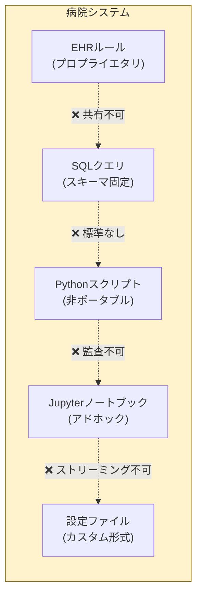
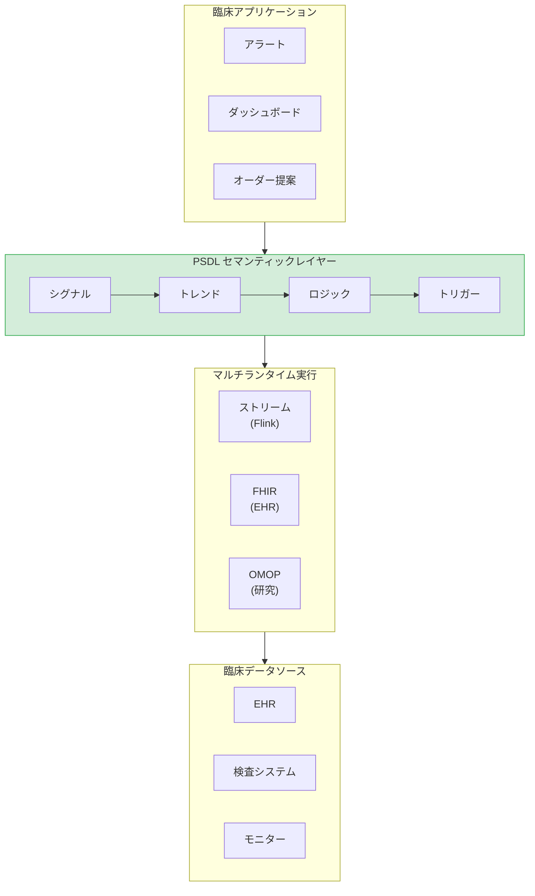
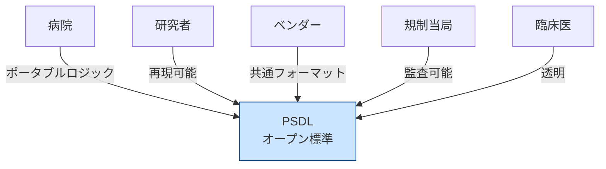
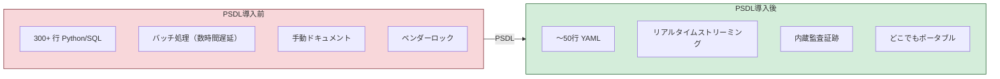
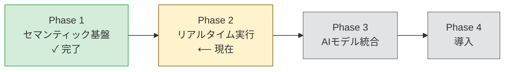

<p align="center">
  
</p>

<h1 align="center">PSDLホワイトペーパー</h1>
<h3 align="center">患者シナリオ定義言語</h3>
<h4 align="center">バージョン 0.1 | 2025年12月</h4>

<p align="center">
  <em>医療AIにおける臨床ロジックのオープンスタンダード</em>
</p>

---

<p align="center">
  <strong>SQLがデータクエリの標準となり、ONNXがMLモデルの標準となったように —<br/>
  PSDLは臨床シナリオロジックの標準を目指します。</strong>
</p>

---

## エグゼクティブサマリー

医療AIには導入の問題があります。予測モデリングの顕著な進歩にもかかわらず、臨床AIシステムの大部分はベッドサイドに到達することがありません。障壁はモデルの精度ではなく、これらのモデルが臨床ワークフローで*いつ*、*どこで*、*どのように*動作すべきかを表現する標準的な方法がないことです。

**PSDL（Patient Scenario Definition Language）**は、この重要なギャップを埋めるオープンでベンダーニュートラルな標準です。患者データを臨床アクションに接続するロジックである臨床シナリオを表現するための宣言型言語を提供します。

### 主要な価値提案

| ステークホルダー | 価値 |
|-----------------|------|
| **病院** | EHRシステム間で動作するポータブルな臨床ロジック |
| **研究者** | 共有・検証可能な再現可能なシナリオ |
| **ベンダー** | 統合の複雑さを軽減する共通フォーマット |
| **規制当局** | 監査可能でバージョン管理された意思決定ロジック |
| **臨床医** | レビュー・理解可能な透明なルール |

---

## 問題：なぜ臨床AIは導入に失敗するのか


*MLモデルと臨床ワークフローの間のギャップ — PSDLがこの橋を架けます*

### シナリオセマンティクスギャップ

ある病院が90%の精度で患者の悪化を予測するMLモデルを開発しました。素晴らしい。しかし、その後に疑問が生じます：

- **いつ**このモデルを実行すべきか？毎時？新しい検査結果が出た時？
- **どの患者に？**すべてのICU患者？特定の基準を満たす患者のみ？
- **どのシグナルに基づいて？**どのバイタルサイン？どの検査？どの時間窓？
- **どの閾値でアクションをトリガーするか？**スコア > 0.7？他の要因との組み合わせ？
- **トリガー時に何が起こるか？**医師に通知？オーダーを生成？

これらは**シナリオセマンティクス**であり、医療にはこれらを表現する標準的な方法がありません。

### 現状：断片化した臨床ロジック


*今日の臨床ロジックは互換性のないシステムに散在しています*

今日、臨床意思決定ロジックは以下に散在しています：

| 実装 | 問題 |
|------|------|
| Pythonスクリプト | ポータブルでない、暗黙の依存関係、監査が困難 |
| SQLクエリ | 時間的セマンティクスがない、スキーマに密結合 |
| EHRルールエディタ | プロプライエタリ、ベンダーロックイン、エクスポート不可 |
| Jupyterノートブック | 再現不可能、バージョン管理セマンティクスがない |
| 設定ファイル | アドホックなフォーマット、標準化なし |

**結果：**すべての病院が同じ臨床ロジックをゼロから再発明しています。研究は再現できません。規制監査には手動ドキュメントが必要です。ベンダー移行はすべてを書き直すことを意味します。

---

## ソリューション：PSDL


*医療AIスタックにおけるセマンティックレイヤーとしてのPSDL*

PSDLは臨床シナリオのための**セマンティックレイヤー**を導入します — *何を*検出するかと*どのように*計算するかを分離する構造化された宣言型フォーマットです。

### コアコンセプト

```
シナリオ = 集団 + シグナル + トレンド + ロジック + トリガー
```

| コンポーネント | 説明 | 例 |
|---------------|------|-----|
| **集団** | シナリオが適用される患者 | `age >= 18 AND unit == "ICU"` |
| **シグナル** | 時系列データバインディング | `Cr: creatinine (mg/dL)` |
| **トレンド** | 時間計算 | `delta(Cr, 6h) > 0.3` |
| **ロジック** | ブール組み合わせ | `cr_rising AND cr_high` |
| **トリガー** | ロジック発火時のアクション | `notify_team("ICU")` |

### 例：早期AKI検出

```yaml
scenario: AKI_Early_Detection
version: "0.1.0"
description: "クレアチニントレンドに基づく早期急性腎障害の検出"

population:
  include:
    - age >= 18
    - unit == "ICU"

signals:
  Cr:
    source: creatinine
    concept_id: 3016723    # OMOP標準コンセプト
    unit: mg/dL

trends:
  cr_rising:
    expr: delta(Cr, 6h) > 0.3
    description: "6時間でクレアチニンが>0.3 mg/dL増加"

  cr_elevated:
    expr: last(Cr) > 1.5
    description: "現在のクレアチニンが正常値以上"

logic:
  aki_stage1:
    expr: cr_rising AND cr_elevated
    severity: high
    description: "早期AKI - KDIGOステージ1基準"

triggers:
  - when: aki_stage1
    actions:
      - type: notify_team
        target: nephrology_consult
        priority: high
```

この単一のYAMLファイルは、散在した数百行のPython、SQL、設定コードを置き換えます — そして、ポータブルで、監査可能で、バージョン管理されています。

---

## なぜオープンスタンダードなのか？

PSDLは成功したオープンスタンダードの先例に従います：

| 標準 | ドメイン | 標準化した内容 |
|------|---------|---------------|
| **SQL** | データ | データベースクエリ言語 |
| **ONNX** | ML | モデル交換フォーマット |
| **FHIR** | 医療 | 臨床データ交換 |
| **CQL** | 品質 | 臨床品質指標 |
| **PSDL** | シナリオ | 臨床意思決定ロジック |

### オープン性のメリット


*PSDLは臨床AIエコシステムのすべてのステークホルダーを接続します*

| 原則 | メリット |
|------|---------|
| **ベンダーニュートラル** | ロックインなし；どの病院も自由に採用可能 |
| **コミュニティガバナンス** | 実際の臨床ニーズによる進化 |
| **実装の自由** | 複数のランタイムが準拠可能 |
| **再現性** | 研究者が正確なシナリオ定義を共有可能 |
| **規制の明確さ** | 標準フォーマットが体系的な監査を可能に |

---

## 技術アーキテクチャ

### PSDLスタック

```
┌─────────────────────────────────────────────────────────────┐
│                      臨床アプリケーション                      │
│           （アラート、ダッシュボード、オーダー提案）              │
└─────────────────────────────────────────────────────────────┘
                              ▲
                              │
┌─────────────────────────────────────────────────────────────┐
│                    PSDLセマンティックレイヤー                   │
│  ┌─────────┐  ┌─────────┐  ┌─────────┐  ┌─────────┐        │
│  │ シグナル │→ │ トレンド │→ │ ロジック │→ │ トリガー │        │
│  └─────────┘  └─────────┘  └─────────┘  └─────────┘        │
└─────────────────────────────────────────────────────────────┘
                              ▲
          ┌───────────────────┼───────────────────┐
          ▼                   ▼                   ▼
    ┌──────────┐        ┌──────────┐        ┌──────────┐
    │   OMOP   │        │   FHIR   │        │ ストリーム │
    │ ランタイム │        │ ランタイム │        │ ランタイム │
    └──────────┘        └──────────┘        └──────────┘
```

### 時間演算子

PSDLは時系列臨床データのファーストクラスサポートを提供します：

| 演算子 | 説明 | 例 |
|--------|------|-----|
| `delta(signal, window)` | 時間窓での変化 | `delta(Cr, 6h) > 0.3` |
| `slope(signal, window)` | 線形トレンド | `slope(lactate, 3h) > 0` |
| `ema(signal, window)` | 指数移動平均 | `ema(MAP, 30m) < 65` |
| `sma(signal, window)` | 単純移動平均 | `sma(HR, 1h) > 100` |
| `min/max(signal, window)` | 窓内の極値 | `max(temp, 24h) > 38.5` |
| `last(signal)` | 最新値 | `last(SpO2) < 92` |
| `count(signal, window)` | 観測回数 | `count(Cr, 24h) >= 2` |

---

## 比較：PSDL導入前と導入後


*PSDLは臨床ロジック管理を劇的に簡素化します*

| 側面 | PSDL導入前 | PSDL導入後 |
|------|-----------|-----------|
| **コード行数** | 〜300+ Python/SQL | 〜50行 YAML |
| **ポータビリティ** | 特定システムに依存 | マッピングでどこでも動作 |
| **監査可能性** | 手動ドキュメント | 組み込み、バージョン管理 |
| **再現性** | "私のマシンでは動く" | 決定論的実行 |
| **共有** | コピペして修正 | 正確な定義を公開 |
| **規制** | アドホックなコンプライアンス | 体系的な監査サポート |

---

## ロードマップ


*PSDL開発フェーズ*

### フェーズ1：セマンティック基盤 [現在]
- 型システムと演算子仕様
- YAMLスキーマ定義
- Python参照実装
- サンプル臨床シナリオ
- 適合性テストスイート

### フェーズ2：拡張ランタイム
- OMOP CDM SQLバックエンド
- FHIR R4ランタイム
- トリガー/アクションシステム (v0.2)
- パフォーマンス最適化

### フェーズ3：コミュニティ構築
- 技術ドキュメント
- カンファレンス発表
- コミュニティインフラ（Discord、フォーラム）
- サードパーティ実装

### フェーズ4：採用
- 病院パイロットプログラム
- 標準化団体との連携（OHDSI、HL7）
- ベンダーパートナーシップ
- 認定プログラム

---

## 参加する

PSDLはオープンでコミュニティ主導のプロジェクトです。以下からの貢献を歓迎します：

- **臨床情報学者** — 実世界のシナリオと要件を定義
- **ソフトウェアエンジニア** — ランタイム、ツール、統合を構築
- **研究者** — ポータビリティと再現性を検証
- **医療機関** — パイロット実装とフィードバック
- **標準化団体** — 既存の医療標準との整合を支援

---

## 結論

医療AIの導入は、モデルの品質ではなく、シナリオセマンティクスの欠如によって阻まれています。PSDLは以下でこのギャップを埋めます：

- **宣言型言語**で臨床シナリオを表現
- **ベンダーニュートラルなポータビリティ**で機関やシステム間で動作
- **組み込みの監査可能性**で規制コンプライアンスに対応
- **コミュニティガバナンス**で標準が実際のニーズに応じて進化

MLモデルからベッドサイドインパクトへの道にはセマンティックレイヤーが必要です。PSDLがそれを提供します。

---

<p align="center">
  <strong>臨床AIが失敗するのはモデルが弱いからではありません。<br/>
  シナリオセマンティクスが形式化されていないからです。</strong>
</p>

<p align="center">
  <em>PSDLがそれを変えます。</em>
</p>

---

<p align="center">
  <strong>臨床意思決定ロジックの標準を一緒に構築しましょう。</strong>
  <br/><br/>
  <a href="https://github.com/Chesterguan/PSDL">GitHub</a> ·
  <a href="./getting-started.md">はじめる</a> ·
  <a href="../CONTRIBUTING.md">貢献する</a>
</p>

---

*PSDLホワイトペーパー v0.1 | 2025年12月 | Apache 2.0ライセンス*
