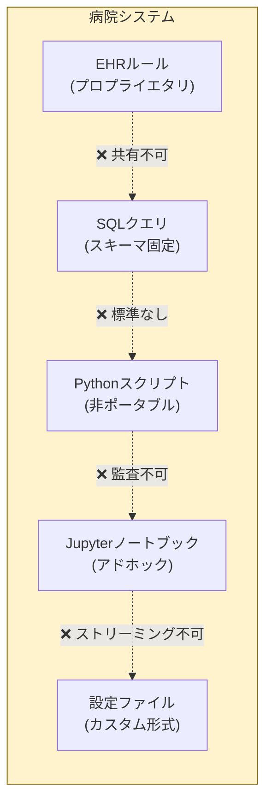
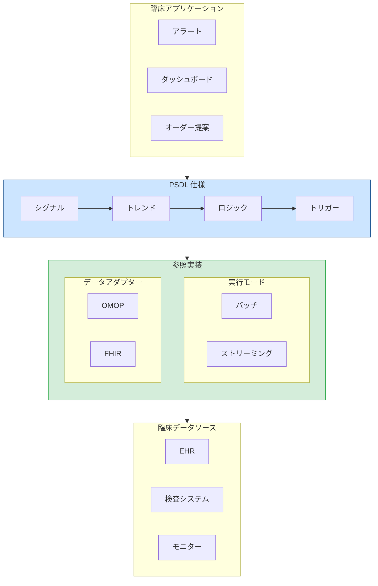
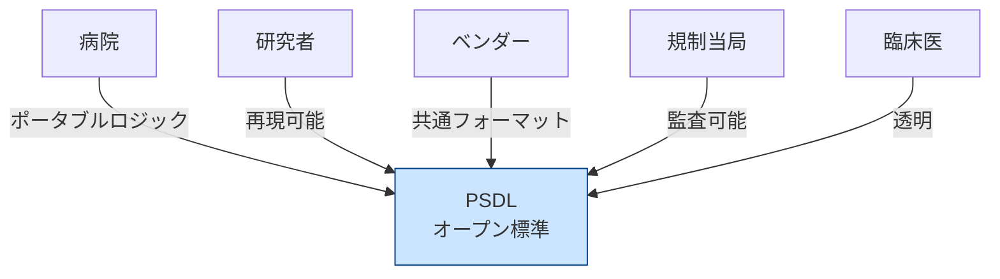
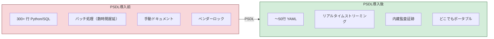
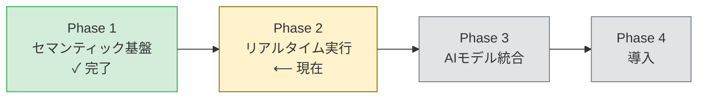

<p align="center">
  
</p>

<h1 align="center">PSDLホワイトペーパー</h1>
<h3 align="center">患者シナリオ定義言語</h3>
<h4 align="center">バージョン 0.1 | 2025年12月</h4>

<p align="center">
  <em>医療AIにおける臨床ロジックのオープンスタンダード</em>
</p>

---

<p align="center">
  <strong>SQLがデータクエリの標準となり、ONNXがMLモデルの標準となり、GraphQLがAPIの標準となったように —<br/>
  PSDLは臨床AIの<em>セマンティックレイヤー</em>になりつつあります。</strong>
</p>

---

## エグゼクティブサマリー

医療AIには導入の問題があります。予測モデリングの顕著な進歩にもかかわらず、臨床AIシステムの大部分はベッドサイドに到達することがありません。障壁はモデルの精度ではなく、これらのモデルが臨床ワークフローで*いつ*、*どこで*、*どのように*動作すべきかを表現する標準的な方法がないことです。

**PSDL（Patient Scenario Definition Language）**は、この重要なギャップを埋めるオープンでベンダーニュートラルな標準です。患者データを臨床アクションに接続するロジックである臨床シナリオを表現するための宣言型言語を提供します。

### 主要な価値提案

| ステークホルダー | 価値 |
|-----------------|------|
| **病院** | EHRシステム間で動作するポータブルな臨床ロジック |
| **研究者** | 共有・検証可能な再現可能なシナリオ |
| **ベンダー** | 統合の複雑さを軽減する共通フォーマット |
| **規制当局** | 監査可能でバージョン管理された意思決定ロジック |
| **臨床医** | レビュー・理解可能な透明なルール |

---

## PSDL原則

> 完全な権威ある参照は [PRINCIPLES.md](../PRINCIPLES.md) をご覧ください

### 核心法則

**PSDLは何を検出するかを定義し、どう収集・実行するかは定義しない。**

### 第一原則

| # | 原則 | 宣言 |
|---|------|------|
| **P1** | 仕様優先 | PSDLは仕様であり、ソフトウェアではない。参照実装はそれを示すもの。 |
| **P2** | データは存在する | PSDLは存在するデータに対して動作する。データを作成・収集しない。 |
| **P3** | 意図と実装の分離 | シナリオは臨床意図（何を）を表現。ランタイムは実行（どのように）を処理。 |
| **P4** | 決定論的 | 同じシナリオ + 同じデータ = 同じ結果。常に。 |
| **P5** | ベンダー中立 | プロプライエタリな依存関係なし。コミュニティ主導。 |

### スコープ法則

| PSDLがすること | PSDLがしないこと |
|---------------|-----------------|
| **S1** シグナルを定義（データバインディング） | **N1** 患者からデータを収集 |
| **S2** トレンドを定義（時系列計算） | **N2** ML/AIモデルを実行 |
| **S3** ロジックを定義（ブール組合せ） | **N3** 臨床ワークフローを編成 |
| **S4** トリガーを定義（どんなアクション） | **N4** データストレージを定義 |
| **S5** 人口を定義（患者基準） | **N5** OMOPやFHIRを置換 |
| **S6** 演算子セマンティクスを定義 | **N6** トリガーの実行方法を定義 |

---

## 問題：なぜ臨床AIは導入に失敗するのか


*MLモデルと臨床ワークフローの間のギャップ — PSDLがこの橋を架けます*

### シナリオセマンティクスギャップ

ある病院が90%の精度で患者の悪化を予測するMLモデルを開発しました。素晴らしい。しかし、その後に疑問が生じます：

- **いつ**このモデルを実行すべきか？毎時？新しい検査結果が出た時？
- **どの患者に？**すべてのICU患者？特定の基準を満たす患者のみ？
- **どのシグナルに基づいて？**どのバイタルサイン？どの検査？どの時間窓？
- **どの閾値でアクションをトリガーするか？**スコア > 0.7？他の要因との組み合わせ？
- **トリガー時に何が起こるか？**医師に通知？オーダーを生成？

これらは**シナリオセマンティクス**であり、医療にはこれらを表現する標準的な方法がありません。

### 現状：断片化した臨床ロジック


*今日の臨床ロジックは互換性のないシステムに散在しています*

今日、臨床意思決定ロジックは以下に散在しています：

| 実装 | 問題 |
|------|------|
| Pythonスクリプト | ポータブルでない、暗黙の依存関係、監査が困難 |
| SQLクエリ | 時間的セマンティクスがない、スキーマに密結合 |
| EHRルールエディタ | プロプライエタリ、ベンダーロックイン、エクスポート不可 |
| Jupyterノートブック | 再現不可能、バージョン管理セマンティクスがない |
| 設定ファイル | アドホックなフォーマット、標準化なし |

**結果：**すべての病院が同じ臨床ロジックをゼロから再発明しています。研究は再現できません。規制監査には手動ドキュメントが必要です。ベンダー移行はすべてを書き直すことを意味します。

---

## ソリューション：PSDL


*PSDL仕様 + 参照実装アーキテクチャ*

PSDLは臨床AIのための**セマンティックレイヤー**を導入します — SQLがデータベースに、GraphQLがAPIに、dbtがデータ変換に対してそうであるように。*何を*検出するかと*どのように*計算するかを分離する構造化された宣言型フォーマットを提供し、バッチ分析とApache Flinkなどのエンジンを使用したリアルタイムストリーミング実行の両方をサポートします。

> **セマンティックレイヤーパターン**：SQLがデータベース実装の詳細を抽象化し、GraphQLがAPI複雑性を抽象化するように、PSDLは臨床シナリオ検出の複雑性を抽象化します。一度書けば、どこでも実行 — Jupyterノートブックからプロダクションストリーミングシステムまで。

### コアコンセプト

```
シナリオ = 集団 + シグナル + トレンド + ロジック + トリガー
```

| コンポーネント | 説明 | 例 |
|---------------|------|-----|
| **集団** | シナリオが適用される患者 | `age >= 18 AND unit == "ICU"` |
| **シグナル** | 時系列データバインディング | `Cr: creatinine (mg/dL)` |
| **トレンド** | 時間計算 | `delta(Cr, 6h) > 0.3` |
| **ロジック** | ブール組み合わせ | `cr_rising AND cr_high` |
| **トリガー** | ロジック発火時のアクション | `notify_team("ICU")` |

### 例：早期AKI検出

```yaml
scenario: AKI_Early_Detection
version: "0.1.0"
description: "クレアチニントレンドに基づく早期急性腎障害の検出"

population:
  include:
    - age >= 18
    - unit == "ICU"

signals:
  Cr:
    source: creatinine
    concept_id: 3016723    # OMOP標準コンセプト
    unit: mg/dL

trends:
  cr_rising:
    expr: delta(Cr, 6h) > 0.3
    description: "6時間でクレアチニンが>0.3 mg/dL増加"

  cr_elevated:
    expr: last(Cr) > 1.5
    description: "現在のクレアチニンが正常値以上"

logic:
  aki_stage1:
    expr: cr_rising AND cr_elevated
    severity: high
    description: "早期AKI - KDIGOステージ1基準"

triggers:
  - when: aki_stage1
    actions:
      - type: notify_team
        target: nephrology_consult
        priority: high
```

この単一のYAMLファイルは、散在した数百行のPython、SQL、設定コードを置き換えます — そして、ポータブルで、監査可能で、バージョン管理されています。

---

## なぜオープンスタンダードなのか？

PSDLは成功したオープンスタンダードの先例に従います：

| 標準 | ドメイン | 標準化した内容 |
|------|---------|---------------|
| **SQL** | データ | データベースクエリ言語 |
| **ONNX** | ML | モデル交換フォーマット |
| **FHIR** | 医療 | 臨床データ交換 |
| **CQL** | 品質 | 臨床品質指標 |
| **PSDL** | シナリオ | 臨床意思決定ロジック |

### オープン性のメリット


*PSDLは臨床AIエコシステムのすべてのステークホルダーを接続します*

| 原則 | メリット |
|------|---------|
| **ベンダーニュートラル** | ロックインなし；どの病院も自由に採用可能 |
| **コミュニティガバナンス** | 実際の臨床ニーズによる進化 |
| **実装の自由** | 複数のランタイムが準拠可能 |
| **再現性** | 研究者が正確なシナリオ定義を共有可能 |
| **規制の明確さ** | 標準フォーマットが体系的な監査を可能に |

---

## ポジショニング：セマンティックレイヤーとしてのPSDL

成熟したすべての技術スタックはセマンティックレイヤーを発展させます — *意図*と*実装*を分離する抽象化：

```
┌─────────────────────────────────────────────────────────────────┐
│                 セマンティックレイヤーパターン                   │
├─────────────────────────────────────────────────────────────────┤
│                                                                 │
│   データ      SQL         「どのデータが必要か？」               │
│   クエリ      ────→       （B木をどう走査するかではなく）       │
│                                                                 │
│   API         GraphQL     「どの形のデータが欲しいか？」         │
│   アクセス    ────→       （RESTコールをどうするかではなく）    │
│                                                                 │
│   データ      dbt/        「データはどう変換すべきか？」         │
│   変換        Metrics     （ETLパイプラインをどう書くかではなく）│
│                                                                 │
│   ML          ONNX        「モデルは何を計算するか？」           │
│   モデル      ────→       （GPU/CPUでどう実行するかではなく）   │
│                                                                 │
│   臨床        PSDL        「どの臨床ロジックを適用すべきか？」   │
│   シナリオ    ────→       （OMOP/FHIRをどうクエリするかではなく）│
│                                                                 │
└─────────────────────────────────────────────────────────────────┘
```

**PSDLは臨床AIに欠けていたセマンティックレイヤーです。** 臨床医と情報学専門家が、データベースのクエリ方法、ストリーミングの処理、特定のEHRシステムとの統合を心配することなく、*何を検出したいか*を表現できるようにします。

### なぜセマンティックレイヤーが勝つのか

| メリット | セマンティックレイヤーなし | PSDLあり |
|----------|---------------------------|----------|
| **移植性** | データベース/EHRごとに書き直し | 一度書いて、どこでもデプロイ |
| **コラボレーション** | エンジニアのみが修正可能 | 臨床医が読んで検証可能 |
| **テスト** | 本番システムに対してテスト | モックデータで仕様に対してテスト |
| **バージョン管理** | アプリケーションコードに隠れている | ファーストクラスの監査可能な定義 |
| **最適化** | システムごとに手動チューニング | 実行エンジンが自動最適化 |

PSDLは医療技術スタックの特定のギャップを埋めます。どこに適合するか — そしてどこに適合しないか — を理解することが重要です。

### 医療AIスタック

| レイヤー | 既存ソリューション | PSDLの役割 |
|---------|-------------------|-----------|
| **コホート研究** | ATLAS / OMOP | 互換 — PSDLはOMOPデータを使用 |
| **品質指標** | CQL (HL7) | 補完的 — 異なる焦点 |
| **リアルタイム検出** | ❌ オープン標準なし | **PSDLがこのギャップを埋める** |
| **AIモデル展開** | 病院ごとにカスタムコード | **PSDLがこれを標準化** |

### PSDLとは何か

**PSDL = リアルタイム臨床シナリオ検出 + AIモデル展開ブリッジ**

- ストリーミングネイティブの時間演算子（`delta`、`slope`、`ema`）
- ベンダーニュートラルなシナリオ定義
- MLモデルを臨床トリガーに接続する標準的な方法

### PSDLでないもの

| PSDLは...しない | 代わりに使用 |
|-----------------|-------------|
| OMOP/FHIRデータ標準を置き換える | PSDLはそれらを消費する |
| ATLASと研究で競合する | ATLASを使い、PSDLで展開 |
| 品質指標のCQLを置き換える | 報告はCQL、リアルタイムはPSDL |
| MLモデルをトレーニングする | PSDLは訓練済みモデルを展開 |
| 治療パスウェイを定義する | PSDLからパスウェイシステムをトリガー |

---

## スコープと制限

> これらの原則の簡潔な法則版は [PRINCIPLES.md](../PRINCIPLES.md) をご覧ください

**知的誠実さは、PSDLができることとできないことについての明確さを必要とします。** PSDLは臨床検出ロジックを表現するための仕様です — その境界を理解することが不可欠です。

### コア原則：「何を」vs「どのように」

PSDLはSQL、GraphQL、ONNXと同じ関心の分離に従います：

```
┌─────────────────────────────────────────────────────────────────┐
│                        関心の分離                                 │
├─────────────────────────────────────────────────────────────────┤
│                                                                  │
│   標準        │  「何を」定義           │  「どのように」は定義しない │
│   ──────────  │  ────────────          │  ───────                   │
│   SQL         │  どのデータをクエリ     │  DBがどう保存             │
│   GraphQL     │  どの形式のレスポンス   │  サーバーがどう取得       │
│   ONNX        │  モデルが何を計算       │  ランタイムがどう実行     │
│   PSDL        │  どのパターンを検出     │  データをどう収集         │
│                                                                  │
└─────────────────────────────────────────────────────────────────┘
```

**PSDLは「何を」検出するかを定義し、データ収集の「どのように」は定義しません。**

### PSDLが定義するもの（仕様）

言語としてのPSDLは以下を規定します：

| コンポーネント | 目的 | 例 |
|--------------|------|-----|
| **シグナル** | どのデータをバインド | `Cr: creatinine (mg/dL)` |
| **トレンド** | どの時間パターン | `delta(Cr, 6h) > 0.3` |
| **ロジック** | どの条件を検出 | `cr_rising AND cr_elevated` |
| **トリガー** | 検出時のアクション | `notify_team("nephrology")` |

### PSDLが定義しないもの

PSDLは以下を規定しません：

| スコープ外 | 理由 | 担当 |
|----------|------|------|
| 疼痛スコアの収集方法 | 収集であり検出ではない | 看護アプリ |
| APIのポーリング方法 | 実装の詳細 | 参照実装 |
| MLモデルの実行方法 | ランタイムの責任 | ONNXランタイム |
| ワークフローの実行方法 | ランタイムの仕事 | ワークフローエンジン |

### 重要な洞察：データの可用性

**データが存在すれば、PSDLはそれを使用できます — ソースに関係なく。**

| シナリオ | PSDLで可能？ | 理由 |
|---------|-------------|------|
| 検査トレンド → アラート | **はい** | 検査データはEHRに存在 |
| MLモデル出力 → アラート | **はい** | 出力はデータ |
| 疼痛スコア（記録後）→ アラート | **はい** | 構造化データになった |
| 患者から疼痛スコアを収集 | **いいえ** | これはデータ収集 |
| 精神状態（記録後）→ アラート | **はい** | 文書化されたデータ |
| 精神状態検査を実施 | **いいえ** | これはデータ収集 |

### 仕様 vs 参照実装

この区別は重要です：

| 側面 | PSDL仕様 | 参照実装 |
|------|---------|----------|
| **目的** | 言語を定義 | 実行方法の一例を示す |
| **スコープ** | 検出ロジックのみ | 便利機能を含む場合あり |
| **トリガー** | 「何の」アクションを宣言 | 「どのように」実行はランタイムの仕事 |

参照実装は多くのことができますが、**PSDL仕様はエレガントで焦点を絞ったまま**です。

### 設計哲学

> **PSDLは存在するデータに対して動作します — データ収集をオーケストレートしません。**

### 歴史的背景

PSDLは[Arden Syntax](https://en.wikipedia.org/wiki/Arden_syntax)（HL7、1992年）を基に構築されており、共有可能な臨床ルールを先駆けました。ArdenのMedical Logic Modules（MLM）は、今日でも関連性のあるイベント-トリガー-アクションパターンを導入しました。

**PSDLの進化：** Ardenは個別のルールを処理しますが、PSDLはファーストクラスの時間演算子とストリーミング実行を備えた**構成されたシナリオ**を処理します。

### CQLとの関係

[Clinical Quality Language](https://cql.hl7.org/)（HL7）は品質測定とコホート定義に優れています。PSDLはCQLを補完します：

| 側面 | CQL | PSDL |
|------|-----|------|
| 焦点 | 品質報告 | リアルタイム検出 |
| 実行 | クエリベース | イベント駆動ストリーミング |
| 時間的 | サポート | ファーストクラス、ストリーミングネイティブ |
| 構文 | 冗長 | シンプルなYAML |

**一緒に使用：** CQL/ATLASでコホートを定義 → PSDLでリアルタイム検出を展開。

---

## ビジョン

PSDLは焦点を絞った二層アーキテクチャを持ちます：

```
┌─────────────────────────────────────────────────────────────────┐
│  PSDL.Model   │  AI/MLモデル統合（予測、予想）                    │
├───────────────┼─────────────────────────────────────────────────┤
│  PSDL.Core    │  リアルタイムシナリオ ← 現在の焦点                 │
└───────────────┴─────────────────────────────────────────────────┘
        ▲                           ▲
        │                           │
   ┌────┴────┐                 ┌────┴────┐
   │  FHIR   │                 │  ONNX   │
   │  OMOP   │                 │ (models)│
   └─────────┘                 └─────────┘
```

### v1.0目標：リアルタイムシナリオ検出

ストリーミングバックエンド（RFC-0002）は以下を可能にします：
- サブ秒の臨床イベント処理
- ステートフルな時間演算子
- Kafka/Flinkインフラストラクチャとの統合

### v1.x目標：AIモデル統合

MLモデル出力はDataset Specバインディングを通じて通常のシグナルとして処理されます：
- モデル出力をシグナルにバインド（例：`sepsis_risk_score`）
- Dataset Spec設定を通じたモデルレジストリ統合
- PSDLの「何を（WHAT）であり、どのように（HOW）ではない」という哲学と一致

### ピッチ

> **「コホート発見にATLASを使用。そのロジックをAIモデルと共にリアルタイムで展開するにはPSDLを使用。」**

---

## 技術アーキテクチャ

PSDLはGraphQL、CQL、ONNXが確立した業界標準パターンに従います：**仕様**と**参照実装**の明確な分離。

### 仕様と実装

| プロジェクト | 仕様 | 参照実装 |
|------------|------|----------|
| GraphQL | SDL（スキーマ定義言語） | Apollo、GraphQL-Javaなど |
| CQL | CQL仕様 + ELM | cql-execution（JavaScript） |
| ONNX | ONNX IR（中間表現） | ONNX Runtime（別プロジェクト） |
| **PSDL** | **YAMLスキーマ + 演算子セマンティクス** | **Python参照実装** |

### PSDLアーキテクチャ

```
┌─────────────────────────────────────────────────────────────────┐
│                      PSDL 仕様                                   │
│               （言語定義）                                        │
│                                                                  │
│  ┌──────────────────────────────────────────────────────────┐  │
│  │                    YAMLスキーマ                            │  │
│  │                                                           │  │
│  │  シグナル    - 時系列データバインディング                    │  │
│  │  トレンド    - 時間計算                                     │  │
│  │  ロジック    - ブール組み合わせ                              │  │
│  │  集団        - 患者基準                                     │  │
│  │  トリガー    - イベント-条件-アクション（v0.2）              │  │
│  └──────────────────────────────────────────────────────────┘  │
│                                                                  │
│  ┌──────────────────────────────────────────────────────────┐  │
│  │              演算子セマンティクス                           │  │
│  │                                                           │  │
│  │  delta, slope, ema, sma, min, max, count, last, first    │  │
│  │  （数学的定義、コードではない）                              │  │
│  └──────────────────────────────────────────────────────────┘  │
│                                                                  │
│  プラットフォーム非依存。実装独立。                               │
└─────────────────────────────────────────────────────────────────┘
                              │
                              ▼
┌─────────────────────────────────────────────────────────────────┐
│              参照実装（Python）                                   │
│                                                                  │
│  コアコンポーネント：                                             │
│  ┌────────────┐  ┌────────────┐  ┌────────────┐                │
│  │  パーサー   │  │   演算子   │  │ エバリュエータ │              │
│  │            │  │            │  │            │                │
│  │ YAML → AST │  │ 数学実装   │  │   実行     │                │
│  └────────────┘  └────────────┘  └────────────┘                │
│                                                                  │
│  実行モード：                                                     │
│  ┌─────────────────┐    ┌─────────────────┐                    │
│  │     バッチ      │    │   ストリーミング  │                    │
│  │ （エバリュエータ） │    │    （Flink）    │                    │
│  └─────────────────┘    └─────────────────┘                    │
│                                                                  │
│  データアダプター：                                               │
│  ┌─────────────────┐    ┌─────────────────┐                    │
│  │      OMOP       │    │      FHIR       │                    │
│  │    （SQL）      │    │    （REST）     │                    │
│  └─────────────────┘    └─────────────────┘                    │
│                                                                  │
│  これは一つの実装。他の実装も存在可能（Java、Rustなど）            │
└─────────────────────────────────────────────────────────────────┘
```

### 主要用語

| 用語 | 定義 |
|------|------|
| **仕様** | PSDL言語定義（YAMLスキーマ + 演算子セマンティクス） |
| **参照実装** | 仕様を実証するPython実装 |
| **パーサー** | PSDL YAMLを内部表現に解析 |
| **演算子** | 時間演算子の実装 |
| **エバリュエータ** | 解析されたシナリオを実行 |
| **実行モード** | シナリオの実行方法（バッチ vs ストリーミング） |
| **データアダプター** | 臨床データへのインターフェース（OMOP、FHIR） |

### 時間演算子

PSDLは時系列臨床データのファーストクラスサポートを提供します：

| 演算子 | 説明 | 例 |
|--------|------|-----|
| `delta(signal, window)` | 時間窓での変化 | `delta(Cr, 6h) > 0.3` |
| `slope(signal, window)` | 線形トレンド | `slope(lactate, 3h) > 0` |
| `ema(signal, window)` | 指数移動平均 | `ema(MAP, 30m) < 65` |
| `sma(signal, window)` | 単純移動平均 | `sma(HR, 1h) > 100` |
| `min/max(signal, window)` | 窓内の極値 | `max(temp, 24h) > 38.5` |
| `last(signal)` | 最新値 | `last(SpO2) < 92` |
| `count(signal, window)` | 観測回数 | `count(Cr, 24h) >= 2` |

### 実行モードとデータアダプター

同じPSDLシナリオは異なるモードで実行し、異なるデータソースに接続できます：

| 実行モード | 説明 | ユースケース |
|----------|------|-------------|
| **バッチ** | エバリュエータが履歴データを処理 | 開発、検証 |
| **ストリーミング** | Flinkがリアルタイムイベントを処理 | 本番デプロイ |

| データアダプター | プロトコル | ユースケース |
|-----------------|----------|-------------|
| **OMOP** | SQL | 研究データベース、後方視的分析 |
| **FHIR** | REST | EHR統合、臨床システム |
| **インメモリ** | ダイレクト | テスト、開発 |

**一度書いて、履歴データで検証、リアルタイムでデプロイ。**

---

## 比較：PSDL導入前と導入後


*PSDLは臨床ロジック管理を劇的に簡素化します*

| 側面 | PSDL導入前 | PSDL導入後 |
|------|-----------|-----------|
| **コード行数** | 〜300+ Python/SQL | 〜50行 YAML |
| **ポータビリティ** | 特定システムに依存 | マッピングでどこでも動作 |
| **監査可能性** | 手動ドキュメント | 組み込み、バージョン管理 |
| **再現性** | "私のマシンでは動く" | 決定論的実行 |
| **共有** | コピペして修正 | 正確な定義を公開 |
| **規制** | アドホックなコンプライアンス | 体系的な監査サポート |

---

## ロードマップ


*PSDL開発フェーズ*

### フェーズ1：セマンティック基盤 [現在]
- 型システムと演算子仕様
- YAMLスキーマ定義
- Python参照実装
- サンプル臨床シナリオ
- 適合性テストスイート

### フェーズ2：拡張ランタイム
- OMOP CDM SQLバックエンド
- FHIR R4ランタイム
- トリガー/アクションシステム (v0.2)
- パフォーマンス最適化

### フェーズ3：コミュニティ構築
- 技術ドキュメント
- カンファレンス発表
- コミュニティインフラ（Discord、フォーラム）
- サードパーティ実装

### フェーズ4：採用
- 病院パイロットプログラム
- 標準化団体との連携（OHDSI、HL7）
- ベンダーパートナーシップ
- 認定プログラム

---

## 参加する

PSDLはオープンでコミュニティ主導のプロジェクトです。以下からの貢献を歓迎します：

- **臨床情報学者** — 実世界のシナリオと要件を定義
- **ソフトウェアエンジニア** — ランタイム、ツール、統合を構築
- **研究者** — ポータビリティと再現性を検証
- **医療機関** — パイロット実装とフィードバック
- **標準化団体** — 既存の医療標準との整合を支援

---

## 結論

医療AIの導入は、モデルの品質ではなく、臨床ロジックの**セマンティックレイヤー**の欠如によって阻まれています。SQLがデータベースのポータビリティを解放し、GraphQLがAPI統合を簡素化したように、PSDLは臨床AIのポータビリティを解放します。

PSDLは以下を提供します：

- **真のセマンティックレイヤー** — 臨床ロジックを実装の詳細から抽象化
- **一度書いて、どこでも実行** — バッチ開発、ストリーミング本番環境
- **ベンダーニュートラルなポータビリティ** — 機関、EHR、データフォーマット間で動作
- **組み込みの監査可能性** — バージョン管理された、追跡可能な意思決定
- **AIモデル統合** — 研究からリアルタイム導入への架け橋

現代のAIスタックには、データ（SQL）、API（GraphQL）、MLモデル（ONNX）、データ変換（dbt）のセマンティックレイヤーがあります。臨床AIも同様であるべきです。**PSDLがそのセマンティックレイヤーです。**

---

<p align="center">
  <strong>臨床AIが失敗するのはモデルが弱いからではありません。<br/>
  臨床ロジックをポータブルに表現するセマンティックレイヤーがないからです。</strong>
</p>

<p align="center">
  <em>PSDLは臨床AIのセマンティックレイヤーです — SQLがデータベースにとってそうであるように。</em>
</p>

---

<p align="center">
  <strong>臨床意思決定ロジックの標準を一緒に構築しましょう。</strong>
  <br/><br/>
  <a href="https://github.com/Chesterguan/PSDL">GitHub</a> ·
  <a href="./getting-started.md">はじめる</a> ·
  <a href="../CONTRIBUTING.md">貢献する</a>
</p>

---

*PSDLホワイトペーパー v0.1 | 2025年12月 | Apache 2.0ライセンス*
