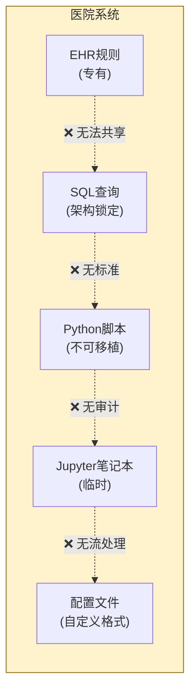
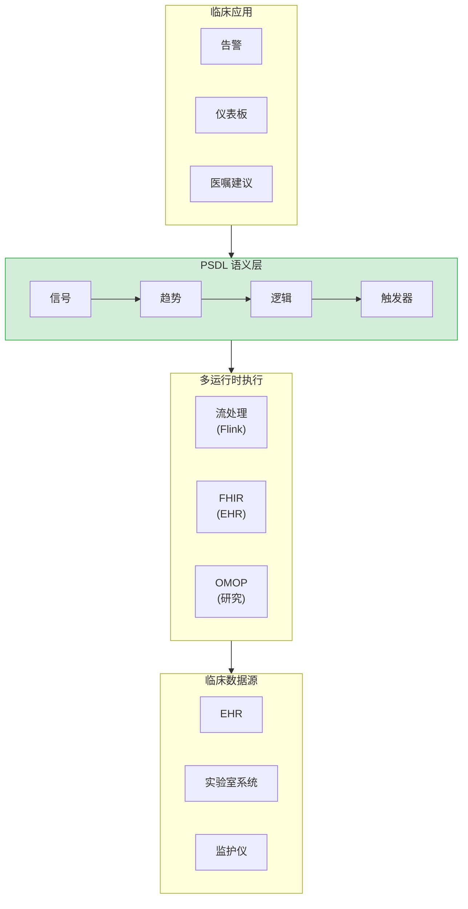
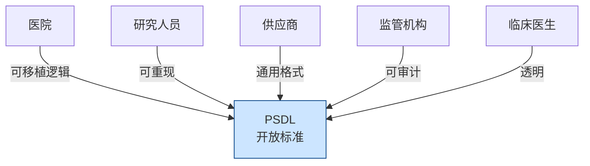

<p align="center">
  
</p>

<h1 align="center">PSDL 白皮书</h1>
<h3 align="center">患者场景定义语言</h3>
<h4 align="center">版本 0.1 | 2025年12月</h4>

<p align="center">
  <em>医疗AI临床逻辑的开放标准</em>
</p>

---

<p align="center">
  <strong>正如 SQL 成为数据查询的标准，ONNX 成为机器学习模型的标准 —<br/>
  PSDL 致力于成为临床场景逻辑的标准。</strong>
</p>

---

## 执行摘要

医疗AI面临部署难题。尽管预测模型取得了显著进展，但绝大多数临床AI系统从未真正应用于床旁。障碍不在于模型准确性，而在于缺乏一种标准方式来表达这些模型*何时*、*在哪里*以及*如何*在临床工作流程中运行。

**PSDL（患者场景定义语言）**是一个开放的、厂商中立的标准，填补了这一关键空白。它提供了一种声明式语言来表达临床场景——连接患者数据与临床行动的逻辑。

### 核心价值主张

| 利益相关方 | 价值 |
|------------|------|
| **医院** | 可跨EHR系统使用的可移植临床逻辑 |
| **研究人员** | 可共享和验证的可重现场景 |
| **供应商** | 降低集成复杂性的通用格式 |
| **监管机构** | 可审计、版本控制的决策逻辑 |
| **临床医生** | 可审查和理解的透明规则 |

---

## 问题：为什么临床AI无法部署


*机器学习模型与临床工作流程之间的鸿沟 — PSDL 架起这座桥梁*

### 场景语义鸿沟

一家医院开发了一个预测患者恶化的机器学习模型，准确率达90%。令人印象深刻。但随后问题来了：

- **何时**运行这个模型？每小时？当有新的实验室结果时？
- **针对哪些患者？**所有ICU患者？只有满足特定条件的患者？
- **基于什么信号？**哪些生命体征？哪些实验室检查？什么时间窗口？
- **什么阈值触发行动？**评分 > 0.7？结合其他因素？
- **触发后会发生什么？**呼叫医生？生成医嘱？

这些就是**场景语义** — 而医疗行业没有标准的方式来表达它们。

### 当前状态：碎片化的临床逻辑


*当今的临床逻辑分散在不兼容的系统中*

如今，临床决策逻辑分散在：

| 实现方式 | 问题 |
|----------|------|
| Python脚本 | 不可移植、隐式依赖、难以审计 |
| SQL查询 | 没有时序语义、与数据库结构紧密耦合 |
| EHR规则编辑器 | 专有、厂商锁定、不可导出 |
| Jupyter笔记本 | 不可重现、没有版本控制语义 |
| 配置文件 | 临时格式、没有标准化 |

**结果：**每家医院都从头开始重新发明相同的临床逻辑。研究无法重现。监管审计需要手动编写文档。供应商迁移意味着重写一切。

---

## 解决方案：PSDL


*PSDL作为医疗AI技术栈中的语义层*

PSDL引入了一个临床场景的**语义层** — 一种结构化的、声明式的格式，将*检测什么*与*如何计算*分离。

### 核心概念

```
场景 = 人群 + 信号 + 趋势 + 逻辑 + 触发器
```

| 组件 | 描述 | 示例 |
|------|------|------|
| **人群** | 场景适用于哪些患者 | `age >= 18 AND unit == "ICU"` |
| **信号** | 时间序列数据绑定 | `Cr: creatinine (mg/dL)` |
| **趋势** | 时间计算 | `delta(Cr, 6h) > 0.3` |
| **逻辑** | 布尔组合 | `cr_rising AND cr_high` |
| **触发器** | 逻辑触发时的操作 | `notify_team("ICU")` |

### 示例：早期AKI检测

```yaml
scenario: AKI_Early_Detection
version: "0.1.0"
description: "基于肌酐趋势检测早期急性肾损伤"

population:
  include:
    - age >= 18
    - unit == "ICU"

signals:
  Cr:
    source: creatinine
    concept_id: 3016723    # OMOP标准概念
    unit: mg/dL

trends:
  cr_rising:
    expr: delta(Cr, 6h) > 0.3
    description: "6小时内肌酐增加>0.3 mg/dL"

  cr_elevated:
    expr: last(Cr) > 1.5
    description: "当前肌酐高于正常值"

logic:
  aki_stage1:
    expr: cr_rising AND cr_elevated
    severity: high
    description: "早期AKI - KDIGO 1期标准"

triggers:
  - when: aki_stage1
    actions:
      - type: notify_team
        target: nephrology_consult
        priority: high
```

这个单一的YAML文件取代了数百行分散的Python、SQL和配置代码 — 而且它是可移植的、可审计的、版本控制的。

---

## 为什么是开放标准？

PSDL遵循成功开放标准的先例：

| 标准 | 领域 | 标准化内容 |
|------|------|-----------|
| **SQL** | 数据 | 数据库查询语言 |
| **ONNX** | 机器学习 | 模型交换格式 |
| **FHIR** | 医疗 | 临床数据交换 |
| **CQL** | 质量 | 临床质量指标 |
| **PSDL** | 场景 | 临床决策逻辑 |

### 开放的好处


*PSDL连接临床AI生态系统中的所有利益相关方*

| 原则 | 好处 |
|------|------|
| **厂商中立** | 无锁定；任何医院都可以自由采用 |
| **社区治理** | 由真实临床需求驱动演进 |
| **实现自由** | 多种运行时可以符合标准 |
| **可重现性** | 研究人员可以共享精确的场景定义 |
| **监管清晰** | 标准格式支持系统性审计 |

---

## 定位

PSDL填补了医疗技术栈中的特定空白。理解它的定位——以及它不适用的领域——至关重要。

### 医疗AI技术栈

| 层级 | 现有解决方案 | PSDL角色 |
|------|-------------|----------|
| **队列研究** | ATLAS / OMOP | 兼容 — PSDL使用OMOP数据 |
| **质量指标** | CQL (HL7) | 互补 — 不同关注点 |
| **实时检测** | ❌ 无开放标准 | **PSDL填补此空白** |
| **AI模型部署** | 每家医院自定义代码 | **PSDL实现标准化** |

### PSDL是什么

**PSDL = 实时临床场景检测 + AI模型部署桥梁**

- 流处理原生的时序算子（`delta`、`slope`、`ema`）
- 厂商中立的场景定义
- 连接ML模型与临床触发器的标准方式

### PSDL不是什么

| PSDL不会... | 请使用 |
|-------------|--------|
| 替代OMOP/FHIR数据标准 | PSDL消费这些数据 |
| 与ATLAS竞争研究功能 | 使用ATLAS，用PSDL部署 |
| 替代CQL进行质量指标 | CQL用于报告，PSDL用于实时 |
| 训练ML模型 | PSDL部署已训练的模型 |
| 定义治疗路径 | 从PSDL触发路径系统 |

### 历史背景

PSDL建立在[Arden Syntax](https://en.wikipedia.org/wiki/Arden_syntax)（HL7，1992）的基础上，后者开创了可共享的临床规则。Arden的医学逻辑模块（MLM）引入了至今仍然适用的事件-触发-动作模式。

**PSDL的演进：** Arden处理单个规则；PSDL处理**组合场景**，具有一流的时序算子和流处理执行。

### 与CQL的关系

[临床质量语言](https://cql.hl7.org/)（HL7）擅长质量测量和队列定义。PSDL与CQL互补：

| 方面 | CQL | PSDL |
|------|-----|------|
| 关注点 | 质量报告 | 实时检测 |
| 执行方式 | 基于查询 | 事件驱动流处理 |
| 时序支持 | 支持 | 一流的流处理原生 |
| 语法 | 冗长 | 简洁的YAML |

**结合使用：** 在CQL/ATLAS中定义队列 → 用PSDL部署实时检测。

---

## 愿景

PSDL采用专注的两层架构：

```
┌─────────────────────────────────────────────────────────────────┐
│  PSDL.Model   │  AI/ML模型集成（predict, forecast）              │
├───────────────┼─────────────────────────────────────────────────┤
│  PSDL.Core    │  实时场景 ← 当前重点                              │
└───────────────┴─────────────────────────────────────────────────┘
        ▲                           ▲
        │                           │
   ┌────┴────┐                 ┌────┴────┐
   │  FHIR   │                 │  ONNX   │
   │  OMOP   │                 │ (模型)  │
   └─────────┘                 └─────────┘
```

### v1.0目标：实时场景检测

流处理后端（RFC-0002）支持：
- 亚秒级临床事件处理
- 有状态时序算子
- 与Kafka/Flink基础设施集成

### v1.x目标：AI模型部署桥梁

RFC-0001支持：
- 在场景中声明模型依赖
- 标准的`predict()`、`forecast()`算子
- 实时推理的超时和降级处理

### 核心理念

> **"使用ATLAS进行队列发现。使用PSDL将该逻辑与AI模型一起实时部署。"**

---

## 技术架构

### PSDL技术栈

```
┌─────────────────────────────────────────────────────────────┐
│                      临床应用                                │
│            （警报、仪表板、医嘱建议）                          │
└─────────────────────────────────────────────────────────────┘
                              ▲
                              │
┌─────────────────────────────────────────────────────────────┐
│                     PSDL语义层                               │
│  ┌─────────┐  ┌─────────┐  ┌─────────┐  ┌─────────┐        │
│  │  信号   │→ │  趋势   │→ │  逻辑   │→ │ 触发器  │        │
│  └─────────┘  └─────────┘  └─────────┘  └─────────┘        │
└─────────────────────────────────────────────────────────────┘
                              ▲
          ┌───────────────────┼───────────────────┐
          ▼                   ▼                   ▼
    ┌──────────┐        ┌──────────┐        ┌──────────┐
    │   OMOP   │        │   FHIR   │        │   流式   │
    │   运行时  │        │   运行时  │        │   运行时  │
    └──────────┘        └──────────┘        └──────────┘
          ▲                   ▲                   ▲
          │                   │                   │
┌─────────────────────────────────────────────────────────────┐
│                        临床数据                              │
│            （EHR、实验室系统、监护设备）                       │
└─────────────────────────────────────────────────────────────┘
```

### 时序运算符

PSDL为时间序列临床数据提供一流支持：

| 运算符 | 描述 | 示例 |
|--------|------|------|
| `delta(signal, window)` | 时间窗口内的变化 | `delta(Cr, 6h) > 0.3` |
| `slope(signal, window)` | 线性趋势 | `slope(lactate, 3h) > 0` |
| `ema(signal, window)` | 指数移动平均 | `ema(MAP, 30m) < 65` |
| `sma(signal, window)` | 简单移动平均 | `sma(HR, 1h) > 100` |
| `min/max(signal, window)` | 窗口内的极值 | `max(temp, 24h) > 38.5` |
| `last(signal)` | 最近值 | `last(SpO2) < 92` |
| `count(signal, window)` | 观测次数 | `count(Cr, 24h) >= 2` |

### 多运行时支持

PSDL场景与运行时无关。同一场景可以在以下环境执行：

| 运行时 | 用例 | 数据源 |
|--------|------|--------|
| **OMOP SQL** | 回顾性研究 | CDM数据库 |
| **FHIR** | 实时EHR集成 | FHIR服务器 |
| **Python** | 开发与测试 | DataFrames |
| **流式** | 实时监控 | Kafka/Flink |

---

## 对比：使用PSDL前后


*PSDL显著简化了临床逻辑管理*

| 方面 | 使用PSDL之前 | 使用PSDL之后 |
|------|-------------|--------------|
| **代码行数** | ~300+ Python/SQL | ~50行 YAML |
| **可移植性** | 绑定到特定系统 | 通过映射可在任何地方运行 |
| **可审计性** | 手动文档 | 内置、版本控制 |
| **可重现性** | "在我机器上能运行" | 确定性执行 |
| **共享** | 复制粘贴后修改 | 发布精确定义 |
| **监管** | 临时合规 | 系统性审计支持 |

---

## 监管对齐

PSDL的设计考虑了监管要求：

| 要求 | FDA | EU MDR | NIST AI RMF | PSDL支持 |
|------|:---:|:------:|:-----------:|:--------:|
| 确定性执行 | ✓ | ✓ | ✓ | 内置 |
| 可解释性 | ✓ | ✓ | ✓ | 声明式逻辑 |
| 可审计性 | ✓ | ✓ | ✓ | 版本控制 |
| 可追溯性 | ✓ | ✓ | ✓ | 审计原语 |
| 可重现性 | ✓ | ✓ | ✓ | 可移植定义 |

---

## 路线图


*PSDL发展阶段*

### 第一阶段：语义基础 [当前]
- 类型系统和运算符规范
- YAML模式定义
- Python参考实现
- 示例临床场景
- 一致性测试套件

### 第二阶段：增强运行时
- OMOP CDM SQL后端
- FHIR R4运行时
- 触发器/操作系统 (v0.2)
- 性能优化

### 第三阶段：社区建设
- 技术文档
- 会议演讲
- 社区基础设施（Discord、论坛）
- 第三方实现

### 第四阶段：采用
- 医院试点项目
- 标准机构参与（OHDSI、HL7）
- 供应商合作
- 认证项目

---

## 参与其中

PSDL是一个开放的、社区驱动的项目。我们欢迎以下贡献：

- **临床信息学家** — 定义真实世界的场景和需求
- **软件工程师** — 构建运行时、工具和集成
- **研究人员** — 验证可移植性和可重现性
- **医疗机构** — 试点实施并提供反馈
- **标准机构** — 帮助与现有医疗标准对齐

### 快速链接

| 资源 | 链接 |
|------|------|
| GitHub仓库 | [github.com/Chesterguan/PSDL](https://github.com/Chesterguan/PSDL) |
| 文档 | [入门指南](./getting-started.md) |
| 示例 | [示例场景](../examples/) |
| RFCs | [提案](../rfcs/) |

---

## 结论

医疗AI部署被阻碍不是因为模型质量，而是因为缺乏场景语义。PSDL通过以下方式填补这一空白：

- **声明式语言**用于表达临床场景
- **厂商中立的可移植性**跨机构和系统
- **内置可审计性**用于监管合规
- **社区治理**确保标准随真实需求演进

从机器学习模型到床旁影响的路径需要一个语义层。PSDL提供了它。

---

<p align="center">
  <strong>临床AI失败不是因为模型弱。<br/>
  而是因为场景语义没有被形式化。</strong>
</p>

<p align="center">
  <em>PSDL改变了这一点。</em>
</p>

---

<p align="center">
  <strong>加入我们，共同建设临床决策逻辑的标准。</strong>
  <br/><br/>
  <a href="https://github.com/Chesterguan/PSDL">GitHub</a> ·
  <a href="./getting-started.md">入门</a> ·
  <a href="../CONTRIBUTING.md">贡献</a>
</p>

---

## 附录A：术语表

| 术语 | 定义 |
|------|------|
| **信号** | 逻辑名称与临床数据源之间的绑定 |
| **趋势** | 对信号的时序计算（如delta、slope） |
| **逻辑** | 组合趋势的布尔表达式 |
| **触发器** | 事件-条件-操作规则 |
| **场景** | 组合所有组件的完整PSDL定义 |
| **运行时** | 评估PSDL场景的执行环境 |
| **映射** | 将场景适配到特定数据源的配置 |

---

*PSDL白皮书 v0.1 | 2025年12月 | Apache 2.0许可证*
