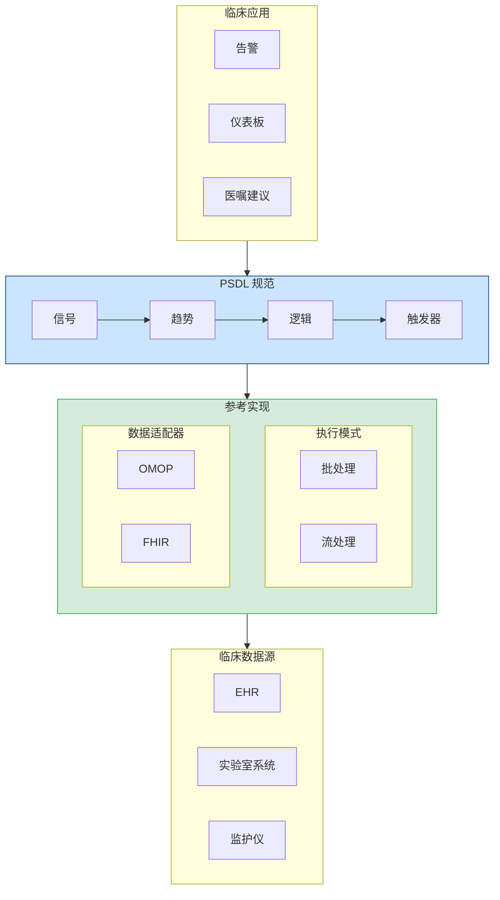

<p align="center">
  
</p>

<h1 align="center">PSDL 白皮书</h1>
<h3 align="center">患者场景定义语言</h3>
<h4 align="center">版本 0.1 | 2025年12月</h4>

<p align="center">
  <em>医疗AI临床逻辑的开放标准</em>
</p>

---

<p align="center">
  <strong>正如 SQL 成为数据查询的标准，ONNX 成为机器学习模型的标准，GraphQL 成为API的标准 —<br/>
  PSDL 正在成为临床AI的<em>语义层</em>。</strong>
</p>

---

## 执行摘要

医疗AI面临部署难题。尽管预测模型取得了显著进展，但绝大多数临床AI系统从未真正应用于床旁。障碍不在于模型准确性，而在于缺乏一种标准方式来表达这些模型*何时*、*在哪里*以及*如何*在临床工作流程中运行。

**PSDL（患者场景定义语言）**是一个开放的、厂商中立的标准，填补了这一关键空白。它提供了一种声明式语言来表达临床场景——连接患者数据与临床行动的逻辑。

### 核心价值主张

| 利益相关方 | 价值 |
|------------|------|
| **医院** | 可跨EHR系统使用的可移植临床逻辑 |
| **研究人员** | 可共享和验证的可重现场景 |
| **供应商** | 降低集成复杂性的通用格式 |
| **监管机构** | 可审计、版本控制的决策逻辑 |
| **临床医生** | 可审查和理解的透明规则 |

---

## PSDL 原则

> 完整权威参考请见 [PRINCIPLES.md](../PRINCIPLES.md)

### 核心法则

**PSDL 定义检测什么，而非如何收集或执行。**

### 首要原则

| # | 原则 | 声明 |
|---|------|------|
| **P1** | 规范优先 | PSDL 是一个规范，不是软件。参考实现只是演示规范。 |
| **P2** | 数据已存在 | PSDL 操作已存在的数据。它不创建或收集数据。 |
| **P3** | 意图与实现分离 | 场景表达临床意图（检测什么）。运行时处理执行（如何计算）。 |
| **P4** | 确定性 | 相同场景 + 相同数据 = 相同结果。始终如此。 |
| **P5** | 厂商中立 | 无专有依赖。社区治理。 |

### 范围法则

| PSDL 做什么 | PSDL 不做什么 |
|-------------|---------------|
| **S1** 定义信号（数据绑定） | **N1** 从患者处收集数据 |
| **S2** 定义趋势（时序计算） | **N2** 执行机器学习/AI模型 |
| **S3** 定义逻辑（布尔组合） | **N3** 编排临床工作流程 |
| **S4** 定义触发器（什么行动） | **N4** 定义数据存储 |
| **S5** 定义人群（患者标准） | **N5** 替代 OMOP 或 FHIR |
| **S6** 定义算子语义 | **N6** 定义触发器如何执行 |

---

## 问题：为什么临床AI无法部署


*机器学习模型与临床工作流程之间的鸿沟 — PSDL 架起这座桥梁*

### 场景语义鸿沟

一家医院开发了一个预测患者恶化的机器学习模型，准确率达90%。令人印象深刻。但随后问题来了：

- **何时**运行这个模型？每小时？当有新的实验室结果时？
- **针对哪些患者？**所有ICU患者？只有满足特定条件的患者？
- **基于什么信号？**哪些生命体征？哪些实验室检查？什么时间窗口？
- **什么阈值触发行动？**评分 > 0.7？结合其他因素？
- **触发后会发生什么？**呼叫医生？生成医嘱？

这些就是**场景语义** — 而医疗行业没有标准的方式来表达它们。

### 当前状态：碎片化的临床逻辑


*当今的临床逻辑分散在不兼容的系统中*

如今，临床决策逻辑分散在：

| 实现方式 | 问题 |
|----------|------|
| Python脚本 | 不可移植、隐式依赖、难以审计 |
| SQL查询 | 没有时序语义、与数据库结构紧密耦合 |
| EHR规则编辑器 | 专有、厂商锁定、不可导出 |
| Jupyter笔记本 | 不可重现、没有版本控制语义 |
| 配置文件 | 临时格式、没有标准化 |

**结果：**每家医院都从头开始重新发明相同的临床逻辑。研究无法重现。监管审计需要手动编写文档。供应商迁移意味着重写一切。

---

## 解决方案：PSDL


*PSDL规范 + 参考实现架构*

PSDL引入了临床AI的**语义层** — 正如SQL之于数据库、GraphQL之于API、dbt之于数据转换。它提供了一种结构化的、声明式的格式，将*检测什么*与*如何计算*分离。支持批处理分析和基于Apache Flink等引擎的实时流处理。

> **语义层模式**：正如SQL抽象了数据库实现细节，GraphQL抽象了API复杂性，PSDL抽象了临床场景检测的复杂性。一次编写，随处执行 — 从Jupyter笔记本到生产流处理系统。

### 核心概念

```
场景 = 人群 + 信号 + 趋势 + 逻辑 + 触发器
```

| 组件 | 描述 | 示例 |
|------|------|------|
| **人群** | 场景适用于哪些患者 | `age >= 18 AND unit == "ICU"` |
| **信号** | 时间序列数据绑定 | `Cr: creatinine (mg/dL)` |
| **趋势** | 时间计算 | `delta(Cr, 6h) > 0.3` |
| **逻辑** | 布尔组合 | `cr_rising AND cr_high` |
| **触发器** | 逻辑触发时的操作 | `notify_team("ICU")` |

### 示例：早期AKI检测

```yaml
scenario: AKI_Early_Detection
version: "0.1.0"
description: "基于肌酐趋势检测早期急性肾损伤"

population:
  include:
    - age >= 18
    - unit == "ICU"

signals:
  Cr:
    source: creatinine
    concept_id: 3016723    # OMOP标准概念
    unit: mg/dL

trends:
  cr_rising:
    expr: delta(Cr, 6h) > 0.3
    description: "6小时内肌酐增加>0.3 mg/dL"

  cr_elevated:
    expr: last(Cr) > 1.5
    description: "当前肌酐高于正常值"

logic:
  aki_stage1:
    expr: cr_rising AND cr_elevated
    severity: high
    description: "早期AKI - KDIGO 1期标准"

triggers:
  - when: aki_stage1
    actions:
      - type: notify_team
        target: nephrology_consult
        priority: high
```

这个单一的YAML文件取代了数百行分散的Python、SQL和配置代码 — 而且它是可移植的、可审计的、版本控制的。

---

## 为什么是开放标准？

PSDL遵循成功开放标准的先例：

| 标准 | 领域 | 标准化内容 |
|------|------|-----------|
| **SQL** | 数据 | 数据库查询语言 |
| **ONNX** | 机器学习 | 模型交换格式 |
| **FHIR** | 医疗 | 临床数据交换 |
| **CQL** | 质量 | 临床质量指标 |
| **PSDL** | 场景 | 临床决策逻辑 |

### 开放的好处


*PSDL连接临床AI生态系统中的所有利益相关方*

| 原则 | 好处 |
|------|------|
| **厂商中立** | 无锁定；任何医院都可以自由采用 |
| **社区治理** | 由真实临床需求驱动演进 |
| **实现自由** | 多种运行时可以符合标准 |
| **可重现性** | 研究人员可以共享精确的场景定义 |
| **监管清晰** | 标准格式支持系统性审计 |

---

## 定位：PSDL作为语义层

每个成熟的技术栈都会发展出语义层 — 一种将*意图*与*实现*分离的抽象：

```
┌─────────────────────────────────────────────────────────────────┐
│                       语义层模式                                  │
├─────────────────────────────────────────────────────────────────┤
│                                                                 │
│   数据        SQL         "我需要什么数据？"                      │
│   查询        ────→       （而不是：如何遍历B树？）               │
│                                                                 │
│   API         GraphQL     "我想要什么形状的数据？"                │
│   访问        ────→       （而不是：如何发起REST调用？）          │
│                                                                 │
│   数据        dbt/        "数据应该如何转换？"                    │
│   转换        Metrics     （而不是：如何编写ETL管道？）           │
│                                                                 │
│   ML          ONNX        "我的模型计算什么？"                    │
│   模型        ────→       （而不是：如何在GPU/CPU上运行？）       │
│                                                                 │
│   临床        PSDL        "应该应用什么临床逻辑？"                │
│   场景        ────→       （而不是：如何查询OMOP/FHIR？）         │
│                                                                 │
└─────────────────────────────────────────────────────────────────┘
```

**PSDL是临床AI缺失的语义层。** 它使临床医生和信息学专家能够表达*他们想要检测什么*，而无需担心*如何*查询数据库、处理流数据或与特定EHR系统集成。

### 为什么语义层会获胜

| 优势 | 没有语义层 | 使用PSDL |
|------|------------|----------|
| **可移植性** | 为每个数据库/EHR重写 | 一次编写，随处部署 |
| **协作** | 只有工程师能修改 | 临床医生可以阅读和验证 |
| **测试** | 针对生产系统测试 | 使用模拟数据针对规范测试 |
| **版本控制** | 隐藏在应用代码中 | 一流的、可审计的定义 |
| **优化** | 每个系统手动调优 | 执行引擎自动优化 |

PSDL填补了医疗技术栈中的特定空白。理解它的定位——以及它不适用的领域——至关重要。

### 医疗AI技术栈

| 层级 | 现有解决方案 | PSDL角色 |
|------|-------------|----------|
| **队列研究** | ATLAS / OMOP | 兼容 — PSDL使用OMOP数据 |
| **质量指标** | CQL (HL7) | 互补 — 不同关注点 |
| **实时检测** | ❌ 无开放标准 | **PSDL填补此空白** |
| **AI模型部署** | 每家医院自定义代码 | **PSDL实现标准化** |

### PSDL是什么

**PSDL = 实时临床场景检测 + AI模型部署桥梁**

- 流处理原生的时序算子（`delta`、`slope`、`ema`）
- 厂商中立的场景定义
- 连接ML模型与临床触发器的标准方式

### PSDL不是什么

| PSDL不会... | 请使用 |
|-------------|--------|
| 替代OMOP/FHIR数据标准 | PSDL消费这些数据 |
| 与ATLAS竞争研究功能 | 使用ATLAS，用PSDL部署 |
| 替代CQL进行质量指标 | CQL用于报告，PSDL用于实时 |
| 训练ML模型 | PSDL部署已训练的模型 |
| 定义治疗路径 | 从PSDL触发路径系统 |

---

## 范围与限制

> 简明的法则版本请见 [PRINCIPLES.md](../PRINCIPLES.md)

**坦诚地说明PSDL能做什么和不能做什么。** PSDL是用于表达临床检测逻辑的规范——理解其边界至关重要。

### 核心原则：定义"什么"而非"如何"

PSDL遵循与SQL、GraphQL和ONNX相同的关注点分离：

```
┌─────────────────────────────────────────────────────────────────┐
│                        关注点分离                                 │
├─────────────────────────────────────────────────────────────────┤
│                                                                  │
│   标准        │  定义"什么"            │  不定义"如何"           │
│   ──────────  │  ────────────          │  ───────                │
│   SQL         │  查询什么数据          │  数据库如何存储         │
│   GraphQL     │  响应什么格式          │  服务器如何获取         │
│   ONNX        │  模型计算什么          │  运行时如何执行         │
│   PSDL        │  检测什么模式          │  数据如何收集           │
│                                                                  │
└─────────────────────────────────────────────────────────────────┘
```

**PSDL定义检测"什么"，而非数据收集的"如何"。**

### PSDL定义什么（规范）

PSDL作为语言规定：

| 组件 | 目的 | 示例 |
|------|------|------|
| **信号** | 绑定什么数据 | `Cr: creatinine (mg/dL)` |
| **趋势** | 计算什么时序模式 | `delta(Cr, 6h) > 0.3` |
| **逻辑** | 检测什么条件 | `cr_rising AND cr_elevated` |
| **触发器** | 检测到时执行什么动作 | `notify_team("nephrology")` |

### PSDL不定义什么

PSDL不规定：

| PSDL范围之外 | 原因 | 由谁处理 |
|-------------|------|----------|
| 如何收集疼痛评分 | 数据收集，非检测 | 护理应用、平板 |
| 如何轮询API | 实现细节 | 参考实现 |
| 如何运行ML模型 | 运行时关注点 | ONNX运行时、模型服务器 |
| 工作流如何执行 | 运行时的职责 | 工作流引擎 |

### 关键洞察：数据可用性

**一旦数据存在，PSDL就可以使用它——无论来源如何。**

| 场景 | PSDL能处理？ | 原因 |
|------|-------------|------|
| 检验趋势 → 告警 | **是** | 检验数据存在于EHR |
| ML模型输出 → 告警 | **是** | 模型输出即数据 |
| 疼痛评分（记录后）→ 告警 | **是** | 已成为结构化数据 |
| 从患者收集疼痛评分 | **否** | 这是数据收集 |
| 精神状态检查（记录后）→ 告警 | **是** | 已成为文档数据 |
| 执行精神状态检查 | **否** | 这是数据收集 |

### 规范与参考实现

这一区分很重要：

| 方面 | PSDL规范 | 参考实现 |
|------|---------|----------|
| **目的** | 定义语言 | 演示运行方式之一 |
| **范围** | 仅检测逻辑 | 可包含便利功能 |
| **可移植性** | 必须可移植 | Python特定 |
| **触发器** | 声明"什么"动作 | "如何"执行是运行时的事 |

参考实现可以做很多事（API调用、复杂集成），但**PSDL规范保持优雅和专注**于表达检测逻辑。

### 设计哲学

> **PSDL操作已存在的数据——它不协调数据收集。**

这种清晰的分离使得：
- **确定性执行** — 相同数据始终产生相同结果
- **监管清晰** — 审计人员能准确看到什么触发告警
- **可移植性** — 场景在任何有数据的系统上都能工作
- **优雅** — 规范保持简洁和专注

### 历史背景

PSDL建立在[Arden Syntax](https://en.wikipedia.org/wiki/Arden_syntax)（HL7，1992）的基础上，后者开创了可共享的临床规则。Arden的医学逻辑模块（MLM）引入了至今仍然适用的事件-触发-动作模式。

**PSDL的演进：** Arden处理单个规则；PSDL处理**组合场景**，具有一流的时序算子和流处理执行。

### 与CQL的关系

[临床质量语言](https://cql.hl7.org/)（HL7）擅长质量测量和队列定义。PSDL与CQL互补：

| 方面 | CQL | PSDL |
|------|-----|------|
| 关注点 | 质量报告 | 实时检测 |
| 执行方式 | 基于查询 | 事件驱动流处理 |
| 时序支持 | 支持 | 一流的流处理原生 |
| 语法 | 冗长 | 简洁的YAML |

**结合使用：** 在CQL/ATLAS中定义队列 → 用PSDL部署实时检测。

---

## 愿景

PSDL采用专注的两层架构：

```
┌─────────────────────────────────────────────────────────────────┐
│  PSDL.Model   │  AI/ML模型集成（predict, forecast）              │
├───────────────┼─────────────────────────────────────────────────┤
│  PSDL.Core    │  实时场景 ← 当前重点                              │
└───────────────┴─────────────────────────────────────────────────┘
        ▲                           ▲
        │                           │
   ┌────┴────┐                 ┌────┴────┐
   │  FHIR   │                 │  ONNX   │
   │  OMOP   │                 │ (模型)  │
   └─────────┘                 └─────────┘
```

### v1.0目标：实时场景检测

流处理后端（RFC-0002）支持：
- 亚秒级临床事件处理
- 有状态时序算子
- 与Kafka/Flink基础设施集成

### v1.x目标：AI模型部署桥梁

RFC-0001支持：
- 在场景中声明模型依赖
- 标准的`predict()`、`forecast()`算子
- 实时推理的超时和降级处理

### 核心理念

> **"使用ATLAS进行队列发现。使用PSDL将该逻辑与AI模型一起实时部署。"**

---

## 技术架构

PSDL遵循GraphQL、CQL和ONNX建立的行业标准模式：**规范**与**参考实现**的清晰分离。

### 规范与实现

| 项目 | 规范 | 参考实现 |
|------|------|----------|
| GraphQL | SDL（模式定义语言） | Apollo、GraphQL-Java等 |
| CQL | CQL规范 + ELM | cql-execution（JavaScript） |
| ONNX | ONNX IR（中间表示） | ONNX Runtime（独立项目） |
| **PSDL** | **YAML模式 + 算子语义** | **Python参考实现** |

### PSDL架构

```
┌─────────────────────────────────────────────────────────────────┐
│                      PSDL 规范                                   │
│               （语言定义）                                        │
│                                                                  │
│  ┌──────────────────────────────────────────────────────────┐  │
│  │                    YAML 模式                              │  │
│  │                                                           │  │
│  │  信号      - 时间序列数据绑定                              │  │
│  │  趋势      - 时序计算                                      │  │
│  │  逻辑      - 布尔组合                                      │  │
│  │  人群      - 患者条件                                      │  │
│  │  触发器    - 事件-条件-动作（v0.2）                        │  │
│  └──────────────────────────────────────────────────────────┘  │
│                                                                  │
│  ┌──────────────────────────────────────────────────────────┐  │
│  │              算子语义                                      │  │
│  │                                                           │  │
│  │  delta, slope, ema, sma, min, max, count, last, first    │  │
│  │  （数学定义，非代码）                                       │  │
│  └──────────────────────────────────────────────────────────┘  │
│                                                                  │
│  平台无关。实现独立。                                            │
└─────────────────────────────────────────────────────────────────┘
                              │
                              ▼
┌─────────────────────────────────────────────────────────────────┐
│              参考实现（Python）                                   │
│                                                                  │
│  核心组件：                                                       │
│  ┌────────────┐  ┌────────────┐  ┌────────────┐                │
│  │   解析器   │  │   算子    │  │   求值器   │                 │
│  │            │  │            │  │            │                │
│  │ YAML → AST │  │ 数学实现   │  │   执行    │                 │
│  └────────────┘  └────────────┘  └────────────┘                │
│                                                                  │
│  执行模式：                                                       │
│  ┌─────────────────┐    ┌─────────────────┐                    │
│  │     批处理      │    │     流处理      │                     │
│  │   （求值器）    │    │    （Flink）    │                     │
│  └─────────────────┘    └─────────────────┘                    │
│                                                                  │
│  数据适配器：                                                     │
│  ┌─────────────────┐    ┌─────────────────┐                    │
│  │      OMOP       │    │      FHIR       │                    │
│  │    （SQL）      │    │    （REST）     │                    │
│  └─────────────────┘    └─────────────────┘                    │
│                                                                  │
│  这是一种实现。其他实现可以存在（Java、Rust等）                     │
└─────────────────────────────────────────────────────────────────┘
```

### 关键术语

| 术语 | 定义 |
|------|------|
| **规范** | PSDL语言定义（YAML模式 + 算子语义） |
| **参考实现** | 展示规范的Python实现 |
| **解析器** | 将PSDL YAML解析为内部表示 |
| **算子** | 时序算子的实现 |
| **求值器** | 执行已解析的场景 |
| **执行模式** | 场景如何运行（批处理 vs 流处理） |
| **数据适配器** | 临床数据接口（OMOP、FHIR） |

### 时序运算符

PSDL为时间序列临床数据提供一流支持：

| 运算符 | 描述 | 示例 |
|--------|------|------|
| `delta(signal, window)` | 时间窗口内的变化 | `delta(Cr, 6h) > 0.3` |
| `slope(signal, window)` | 线性趋势 | `slope(lactate, 3h) > 0` |
| `ema(signal, window)` | 指数移动平均 | `ema(MAP, 30m) < 65` |
| `sma(signal, window)` | 简单移动平均 | `sma(HR, 1h) > 100` |
| `min/max(signal, window)` | 窗口内的极值 | `max(temp, 24h) > 38.5` |
| `last(signal)` | 最近值 | `last(SpO2) < 92` |
| `count(signal, window)` | 观测次数 | `count(Cr, 24h) >= 2` |

### 执行模式与数据适配器

同一PSDL场景可以在不同模式下执行并连接到不同的数据源：

| 执行模式 | 描述 | 用例 |
|----------|------|------|
| **批处理** | 求值器处理历史数据 | 开发、验证 |
| **流处理** | Flink处理实时事件 | 生产部署 |

| 数据适配器 | 协议 | 用例 |
|------------|------|------|
| **OMOP** | SQL | 研究数据库、回顾性分析 |
| **FHIR** | REST | EHR集成、临床系统 |
| **内存** | 直接 | 测试、开发 |

**一次编写，在历史数据上验证，实时部署。**

---

## 对比：使用PSDL前后


*PSDL显著简化了临床逻辑管理*

| 方面 | 使用PSDL之前 | 使用PSDL之后 |
|------|-------------|--------------|
| **代码行数** | ~300+ Python/SQL | ~50行 YAML |
| **可移植性** | 绑定到特定系统 | 通过映射可在任何地方运行 |
| **可审计性** | 手动文档 | 内置、版本控制 |
| **可重现性** | "在我机器上能运行" | 确定性执行 |
| **共享** | 复制粘贴后修改 | 发布精确定义 |
| **监管** | 临时合规 | 系统性审计支持 |

---

## 监管对齐

PSDL的设计考虑了监管要求：

| 要求 | FDA | EU MDR | NIST AI RMF | PSDL支持 |
|------|:---:|:------:|:-----------:|:--------:|
| 确定性执行 | ✓ | ✓ | ✓ | 内置 |
| 可解释性 | ✓ | ✓ | ✓ | 声明式逻辑 |
| 可审计性 | ✓ | ✓ | ✓ | 版本控制 |
| 可追溯性 | ✓ | ✓ | ✓ | 审计原语 |
| 可重现性 | ✓ | ✓ | ✓ | 可移植定义 |

---

## 路线图


*PSDL发展阶段*

### 第一阶段：语义基础 [当前]
- 类型系统和运算符规范
- YAML模式定义
- Python参考实现
- 示例临床场景
- 一致性测试套件

### 第二阶段：增强运行时
- OMOP CDM SQL后端
- FHIR R4运行时
- 触发器/操作系统 (v0.2)
- 性能优化

### 第三阶段：社区建设
- 技术文档
- 会议演讲
- 社区基础设施（Discord、论坛）
- 第三方实现

### 第四阶段：采用
- 医院试点项目
- 标准机构参与（OHDSI、HL7）
- 供应商合作
- 认证项目

---

## 参与其中

PSDL是一个开放的、社区驱动的项目。我们欢迎以下贡献：

- **临床信息学家** — 定义真实世界的场景和需求
- **软件工程师** — 构建运行时、工具和集成
- **研究人员** — 验证可移植性和可重现性
- **医疗机构** — 试点实施并提供反馈
- **标准机构** — 帮助与现有医疗标准对齐

### 快速链接

| 资源 | 链接 |
|------|------|
| GitHub仓库 | [github.com/Chesterguan/PSDL](https://github.com/Chesterguan/PSDL) |
| 文档 | [入门指南](./getting-started.md) |
| 示例 | [示例场景](../examples/) |
| RFCs | [提案](../rfcs/) |

---

## 结论

医疗AI部署被阻碍不是因为模型质量，而是因为临床逻辑缺乏**语义层**。正如SQL解锁了数据库可移植性，GraphQL简化了API集成，PSDL解锁了临床AI的可移植性。

PSDL提供：

- **真正的语义层** — 将临床逻辑从实现细节中抽象出来
- **一次编写，随处运行** — 批处理开发，流处理生产
- **厂商中立的可移植性** — 跨机构、EHR和数据格式
- **内置可审计性** — 版本控制、可追溯的决策
- **AI模型集成** — 从研究到实时部署的桥梁

现代AI技术栈有数据的语义层（SQL）、API的语义层（GraphQL）、ML模型的语义层（ONNX）和数据转换的语义层（dbt）。临床AI也应该拥有同样的标准。**PSDL就是那个语义层。**

---

<p align="center">
  <strong>临床AI失败不是因为模型弱。<br/>
  而是因为没有语义层来可移植地表达临床逻辑。</strong>
</p>

<p align="center">
  <em>PSDL是临床AI的语义层 — 正如SQL之于数据库。</em>
</p>

---

<p align="center">
  <strong>加入我们，共同建设临床决策逻辑的标准。</strong>
  <br/><br/>
  <a href="https://github.com/Chesterguan/PSDL">GitHub</a> ·
  <a href="./getting-started.md">入门</a> ·
  <a href="../CONTRIBUTING.md">贡献</a>
</p>

---

## 附录A：术语表

| 术语 | 定义 |
|------|------|
| **规范** | PSDL语言定义（YAML模式 + 算子语义） |
| **参考实现** | 展示规范的符合性实现（Python） |
| **信号** | 逻辑名称与临床数据源之间的绑定 |
| **趋势** | 对信号的时序计算（如delta、slope） |
| **逻辑** | 组合趋势的布尔表达式 |
| **触发器** | 事件-条件-操作规则 |
| **场景** | 组合所有组件的完整PSDL定义 |
| **解析器** | 将PSDL YAML解析为内部表示的组件 |
| **求值器** | 执行已解析场景的组件 |
| **执行模式** | 场景如何运行（批处理 vs 流处理） |
| **数据适配器** | 临床数据源接口（OMOP、FHIR） |
| **映射** | 将场景适配到特定数据源的配置 |

---

*PSDL白皮书 v0.1 | 2025年12月 | Apache 2.0许可证*
